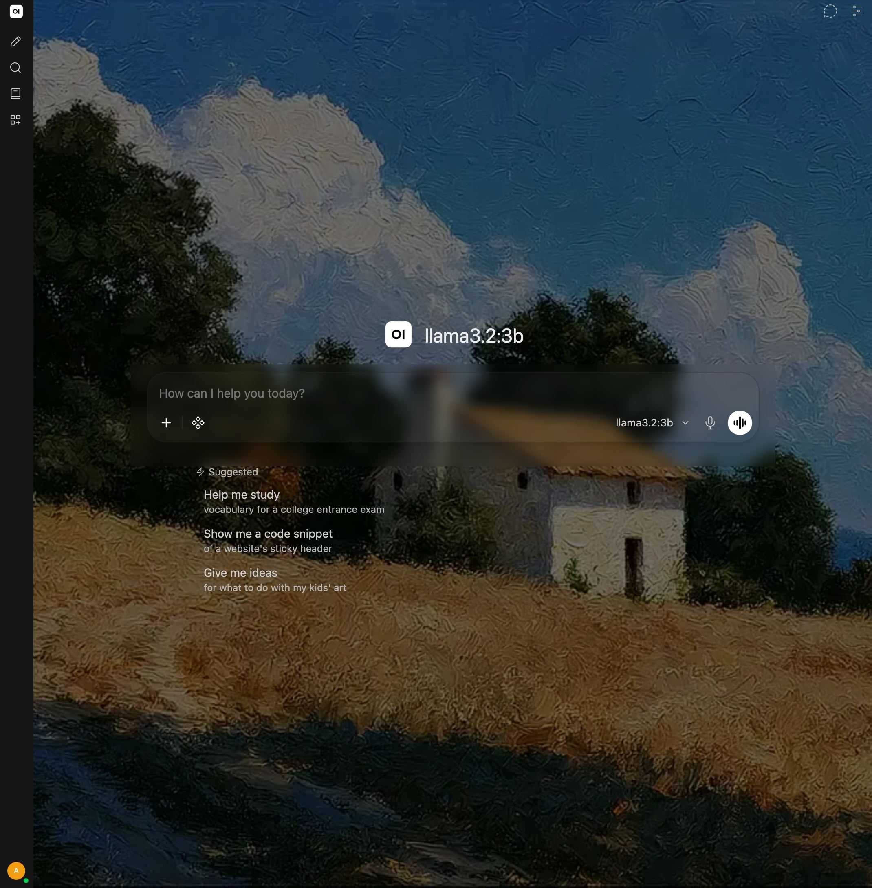
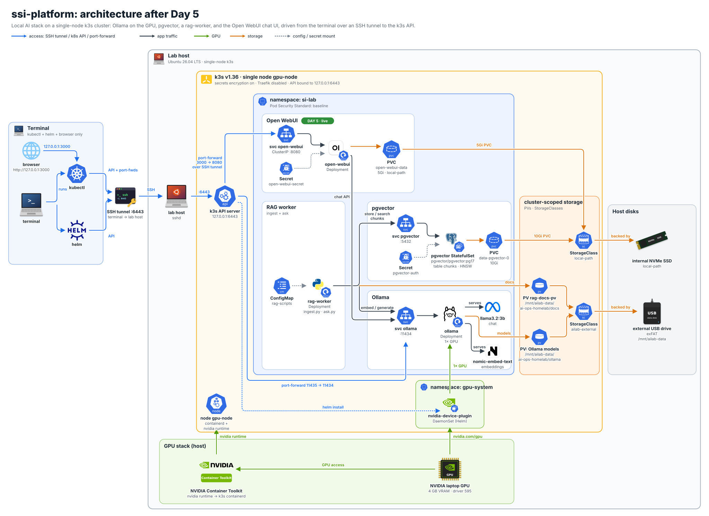

# Day 5 — A chat UI for my local models: Open WebUI on k3s

Yesterday I finished with a small RAG pipeline running entirely inside k3s: Ollama serving `llama3.2:3b` and `nomic-embed-text` on the GPU, Postgres with pgvector holding my notes as embeddings, and a worker pod that answers questions from them. Everything so far has been driven with `kubectl exec` and small Python scripts. Today's goal was a proper chat interface on top of the same Ollama endpoint.

I deployed Open WebUI into the `si-lab` namespace as a Deployment with its own volume, pointed it at the in-cluster Ollama Service, and opened it in the browser on my terminal through a `kubectl port-forward` that rides the same SSH tunnel as every other command. The UI loaded and connected. Nothing new is exposed on my home network, and there's still no ingress. Two small gotchas came up along the way, one in zsh and one in the browser, and both are written up below.

## The lab at a glance

- **My terminal:** where I edit manifests, run `kubectl`, and now open a browser tab. The Kubernetes API reaches it through the same SSH tunnel on port 6443 as on days 2 to 4, open in its own tab.
- **Lab host:** a laptop running Ubuntu 26.04 and single-node k3s `v1.36.4+k3s1` (node `gpu-node`). The GPU is an NVIDIA laptop GPU with 4 GB of video memory. The `si-lab` namespace enforces the baseline Pod Security level.
- **Already running from days 3 and 4:** Ollama as a Deployment behind the ClusterIP Service `ollama` on port 11434, serving `llama3.2:3b` and `nomic-embed-text` with the models on the external drive, and Postgres with pgvector behind the Service `pgvector` on port 5432.
- **Storage:** the internal NVMe drive, which backs k3s' default `local-path` storage class, and the external USB drive, formatted exFAT and mounted at `/mnt/ailab-data`.

## Design decisions before deploying anything

**Open WebUI's data on the internal NVMe, not the external drive.** Open WebUI keeps its users, chats, and settings in a SQLite database under `/app/backend/data`. SQLite depends on file locking and reliable writes, and the external drive is exFAT, which also has no Linux file ownership or permissions. It's the same reasoning as the Postgres volume on day 4. So the claim `open-webui-data` asks the `local-path` storage class for 5Gi, which lands on the lab host's NVMe drive. The models stay on the external drive, where large, mostly-read files are fine.

**A Deployment with the Recreate strategy.** The volume is ReadWriteOnce, and SQLite should only ever have one writer. The default rolling update would start a new pod before stopping the old one, so for a moment two pods would want the same volume and the same database file. `Recreate` stops the old pod first, then starts the new one. That means a few seconds of downtime on every update, which is fine for a lab UI. It also means one replica only.

**Point it at the in-cluster Ollama by DNS name.** `OLLAMA_BASE_URL` is `http://ollama.si-lab.svc.cluster.local:11434`, the Service from day 3. Open WebUI talks to Ollama inside the cluster, so the day 3 port-forward on 11435 isn't involved, and Ollama stays a ClusterIP Service.

**Embeddings through the same Ollama.** Open WebUI has its own document features, and by default it would compute embeddings with a local model inside its own container. I set `RAG_EMBEDDING_ENGINE=ollama` and `RAG_EMBEDDING_MODEL=nomic-embed-text` so it uses the embedding model I already pulled on day 4, on the GPU, instead of downloading another model into the pod. According to the [environment variable reference](https://docs.openwebui.com/reference/env-configuration/), settings like these are persistent config: Open WebUI reads them on first start and stores them in its database, and after that the Admin Panel is where you change them.

**Telemetry off.** `ANONYMIZED_TELEMETRY=false`, `DO_NOT_TRACK=true`, and `SCARF_NO_ANALYTICS=true` opt out of anonymous usage reporting. A lab that's meant to keep everything local shouldn't phone home by default.

**The secret key lives in a Kubernetes Secret.** Open WebUI uses `WEBUI_SECRET_KEY` to sign login tokens (JWTs) and to encrypt some sensitive data at rest. If the key changes, everyone is logged out ([FAQ](https://docs.openwebui.com/faq/)). Open WebUI can generate one on its own, but I wanted it stable, generated by me, and stored the same way as the database password on day 4: in a Secret that k3s encrypts at rest because of the `--secrets-encryption` flag from day 2.

**A readiness probe on `/health`.** Open WebUI serves a `/health` endpoint. Until it answers, Kubernetes reports the pod as not ready (`0/1`) and the Service doesn't route traffic to it, so the `READY` column tells me when the app is actually up, not just when the container has started.

**ClusterIP only, no ingress.** The Service is `ClusterIP`, so it has no port on the lab host's network interface. The only way in is `kubectl port-forward` from my terminal, which travels over the SSH tunnel to the k3s API. Nothing about this UI is reachable from my home network, let alone the internet.

## Step 1: Create the secret

Terminal:

```text
$ kubectl -n si-lab create secret generic open-webui-secret --from-literal=WEBUI_SECRET_KEY="$(openssl rand -hex 32)"
secret/open-webui-secret created
```

`openssl rand -hex 32` generates 32 random bytes as 64 hex characters, and `$(...)` passes them straight into the Secret. The value never appeared on screen, and it isn't in this post or in the manifest.

## Step 2: Write the manifest

I wrote `~/ssi-platform/k8s/day-05-open-webui.yaml` on my terminal with a heredoc. It has three objects: the PersistentVolumeClaim, the Deployment, and the Service. This is the whole file:

```yaml
apiVersion: v1
kind: PersistentVolumeClaim
metadata:
  name: open-webui-data
  namespace: si-lab
spec:
  accessModes: ["ReadWriteOnce"]
  storageClassName: local-path
  resources:
    requests:
      storage: 5Gi
---
apiVersion: apps/v1
kind: Deployment
metadata:
  name: open-webui
  namespace: si-lab
  labels:
    app: open-webui
spec:
  replicas: 1
  strategy:
    type: Recreate
  selector:
    matchLabels:
      app: open-webui
  template:
    metadata:
      labels:
        app: open-webui
    spec:
      securityContext:
        seccompProfile:
          type: RuntimeDefault
      containers:
        - name: open-webui
          image: ghcr.io/open-webui/open-webui:main
          ports:
            - name: http
              containerPort: 8080
          env:
            - name: OLLAMA_BASE_URL
              value: "http://ollama.si-lab.svc.cluster.local:11434"
            - name: RAG_EMBEDDING_ENGINE
              value: "ollama"
            - name: RAG_EMBEDDING_MODEL
              value: "nomic-embed-text"
            - name: ANONYMIZED_TELEMETRY
              value: "false"
            - name: DO_NOT_TRACK
              value: "true"
            - name: SCARF_NO_ANALYTICS
              value: "true"
            - name: WEBUI_SECRET_KEY
              valueFrom:
                secretKeyRef:
                  name: open-webui-secret
                  key: WEBUI_SECRET_KEY
          securityContext:
            allowPrivilegeEscalation: false
          resources:
            requests:
              cpu: 250m
              memory: 512Mi
            limits:
              memory: 2Gi
          readinessProbe:
            httpGet:
              path: /health
              port: 8080
            initialDelaySeconds: 20
            periodSeconds: 10
            failureThreshold: 30
          volumeMounts:
            - name: data
              mountPath: /app/backend/data
      volumes:
        - name: data
          persistentVolumeClaim:
            claimName: open-webui-data
---
apiVersion: v1
kind: Service
metadata:
  name: open-webui
  namespace: si-lab
spec:
  type: ClusterIP
  selector:
    app: open-webui
  ports:
    - name: http
      port: 8080
      targetPort: 8080
```

A few details worth calling out.

- **The claim.** `open-webui-data` asks `local-path` for 5Gi, ReadWriteOnce. The local-path provisioner creates the volume on the NVMe drive when the pod is first scheduled.
- **`strategy: Recreate` and `replicas: 1`.** One pod, one writer to the SQLite file, and the old pod is gone before the new one mounts the volume.
- **The image.** `ghcr.io/open-webui/open-webui:main` is the image from Open WebUI's [quick start](https://docs.openwebui.com/getting-started/quick-start/). `main` is a moving tag. Later the same evening, I pinned it to `v0.11.4` (see the theming section below).
- **The environment.** The Ollama URL uses the cluster DNS name, embeddings go through Ollama's `nomic-embed-text`, the three telemetry opt-outs are set, and `WEBUI_SECRET_KEY` comes from the Secret through `secretKeyRef`, so the manifest only holds the Secret's name.
- **Security context.** The pod uses the runtime's default seccomp profile, and the container can't gain more privileges than it starts with. The baseline Pod Security level doesn't require either one, but they're cheap to add.
- **Requests and limits.** A quarter of a CPU and 512 MiB of memory requested, a 2 GiB memory ceiling, no CPU limit. There's no runtime class and no GPU request, so it never competes with Ollama for the single GPU. The model work happens in Ollama.
- **The readiness probe.** An HTTP GET on `/health` every 10 seconds, starting 20 seconds after the container starts. `failureThreshold: 30` is deliberately generous: once the pod is ready, it has to fail 30 checks in a row, about five minutes, before it's taken out of the Service. There's no liveness probe, so nothing restarts the container automatically.
- **The volume mount.** The claim is mounted at `/app/backend/data`, where Open WebUI keeps its database and uploaded files, so they survive pod restarts and image updates.
- **The Service.** ClusterIP, port 8080 to container port 8080. No NodePort, no LoadBalancer, no ingress.

### Gotcha: `zsh: command not found: #`

I label my command blocks with a comment line such as `# terminal: ...`. When I pasted a block that started with one of those lines, zsh answered:

```text
zsh: command not found: #
```

In an interactive shell, zsh doesn't treat `#` as the start of a comment unless the `interactivecomments` option is set, so it tried to run `#` as a command. It was harmless here: that one line failed and the rest of the paste, including the heredoc, still ran. The fix is one line in my zsh config.

Terminal:

```bash
echo 'setopt interactivecomments' >> ~/.zshrc
```

It applies to new shells. In an already-open tab, running `setopt interactivecomments` once does the same thing.

## Step 3: Apply it and watch the pod

Terminal:

```text
$ kubectl apply -f ~/ssi-platform/k8s/day-05-open-webui.yaml
persistentvolumeclaim/open-webui-data created
deployment.apps/open-webui created
service/open-webui created
$ kubectl -n si-lab get pods -l app=open-webui -w
NAME                          READY   STATUS              RESTARTS   AGE
open-webui-7c95f85c9f-9xbk9   0/1     ContainerCreating   0          36s
open-webui-7c95f85c9f-9xbk9   0/1     Running             0          45s
open-webui-7c95f85c9f-9xbk9   1/1     Running             0          66s
```

All three objects were created. `-l app=open-webui` limits the watch to this app's pod. The pod was still in `ContainerCreating` at 36 seconds, most likely because the image was still downloading on this first run. It was `Running` at 45 seconds and ready (`1/1`) at 66 seconds. That's about 20 seconds after the container started, which lines up with the probe's `initialDelaySeconds: 20`, so the first `/health` check looks like it passed.

## Step 4: Open the UI through a port-forward

With the SSH tunnel still open in its own tab, I started a port-forward to the Service.

Terminal:

```bash
kubectl -n si-lab port-forward svc/open-webui 3000:8080
```

This listens on port 3000 on my terminal's loopback address and forwards to port 8080 of the Open WebUI pod. The traffic goes through the k3s API server, which my terminal only reaches through the SSH tunnel on 6443, so the UI needs no port of its own on the lab host. The command keeps running until I stop it with Ctrl+C, so it gets its own tab too.

### Gotcha: `ERR_SSL_PROTOCOL_ERROR`

My first attempt in Chrome failed with `ERR_SSL_PROTOCOL_ERROR` and "localhost sent an invalid response". The browser had tried to talk HTTPS to the port-forward, and the port-forward only carries plain HTTP, because Open WebUI itself serves HTTP on 8080 and there's no TLS anywhere in this path.

The fix was to type the full URL with the scheme and the loopback IP:

```text
http://127.0.0.1:3000
```

If a browser keeps upgrading `localhost` to HTTPS anyway, it may have an HSTS entry for `localhost` left over from some other local project. In Chrome, that entry can be removed at `chrome://net-internals/#hsts`. Using `127.0.0.1` instead of `localhost` sidesteps it.

After that, the Open WebUI page loaded and it worked.

Plain HTTP is acceptable here only because the whole path is private: browser to loopback on my terminal, then the SSH-encrypted tunnel to the lab host, then inside the cluster. It would not be acceptable once the UI is reachable over a real network. That's when TLS, an ingress, and a real identity provider come in.

## Step 5: First sign-in and locking it down

Three things to do right after the page loads:

1. **Create the first account.** On a fresh install, the first account that signs up becomes the admin.
2. **Turn off new sign-ups.** In **Admin Panel > Settings > General**, switch off new user sign-ups, so nobody else who reaches the port can make an account. Like the RAG settings, this is persistent config, stored in the SQLite database on the `open-webui-data` volume, so it survives pod restarts.
3. **Pick the model.** In a new chat, choose `llama3.2:3b` from the model selector. The list comes from the in-cluster Ollama through `OLLAMA_BASE_URL`.

> **[SCREENSHOT PLACEHOLDER — add before publishing]** A chat with `llama3.2:3b` in Open WebUI at `http://127.0.0.1:3000`, showing a model reply.

## What I noticed

- **The same Ollama now has three clients:** the `rag-worker` pod from day 4, the occasional port-forward on 11435 from day 3, and Open WebUI. Only one GPU and 4 GB of video memory sit behind all of them, so if the chat model and the embedding model are both in use, Ollama may swap them in and out. I haven't measured how that feels in the UI yet.
- **Two small gotchas, both on the terminal side.** zsh's handling of `#` and Chrome's HTTPS upgrade had nothing to do with Kubernetes. The cluster side went through on the first apply.
- **Open WebUI's documents are separate from my day 4 notes.** Open WebUI has its own vector store for files uploaded in the UI, and on this image the default is Chroma, not my pgvector `chunks` table. Its environment reference lists `VECTOR_DB=pgvector` as an option, but for now nothing connects the two. Day 6 is where my notes become reachable as a tool instead.
- **Where everything runs.** The UI and its SQLite database run on the lab host, on the NVMe drive. Chat and embeddings happen on the GPU through Ollama. The models sit on the external drive. My terminal only sent `kubectl` commands and opened a browser tab on a loopback address.

## Theming: reusing the welcome-screen background

On a fresh install, Open WebUI's welcome screen plays a painted landscape behind the "get started" button. The sign-in page and the chat screen that come after it are plain. Later the same evening, I made both of them reuse that background.

**How Open WebUI picks up custom CSS.** Every page loads `/static/custom.css`, which is linked from `src/app.html`. On startup, Open WebUI re-copies `/app/build/static` into the static folder it serves, so a file placed straight into the served folder wouldn't survive a restart. Instead, the CSS lives in a ConfigMap named `open-webui-theme` and is mounted over the copy source, `/app/build/static/custom.css`, with `subPath`, so only that one file is replaced. The catch with `subPath` is that the mounted file doesn't pick up ConfigMap edits, so every CSS change needs a `kubectl rollout restart`.

**A still image instead of the video.** The welcome screen plays `/assets/welcome.mp4`. CSS can't play video, so the pages use its poster frame, `/assets/welcome.webp`, with the same dark gradients the welcome screen draws over it. The chat-screen background only applies in the Dark and OLED Dark themes, because the light theme's dark text would be hard to read on the painting.

**The image is now pinned.** The CSS targets element IDs in Open WebUI's markup: `#auth-page`, `#auth-container`, `#auth-login-card`, `#chat-container`, and `#navbar-bg-gradient-to-b`. A future release could rename any of them, so I pinned the image from `:main` to `ghcr.io/open-webui/open-webui:v0.11.4`. After any upgrade, I'll check the selectors again.

The new file is `~/ssi-platform/k8s/day-05-open-webui-theme.yaml`. This is its ConfigMap:

```yaml
apiVersion: v1
kind: ConfigMap
metadata:
  name: open-webui-theme
  namespace: si-lab
data:
  custom.css: |
    /* Open WebUI custom.css, v0.11.4. CSS cannot play the welcome video, so this uses its
       poster frame (/assets/welcome.webp) plus the same dark gradients the welcome screen uses. */
    :root {
      --welcome-bg: url("/assets/welcome.webp");
    }

    /* ---------- /auth (sign-in / sign-up) ---------- */
    #auth-page {
      background: var(--welcome-bg) center / cover no-repeat;
    }
    /* the page's own solid layer (bg-white dark:bg-black) -> welcome-screen gradients */
    #auth-page > div:first-child {
      background:
        linear-gradient(to top, rgb(0 0 0 / 0.8), rgb(0 0 0 / 0.2), transparent),
        linear-gradient(to right, rgb(0 0 0 / 0.5), rgb(0 0 0 / 0.1), transparent) !important;
    }
    /* white text on the photo, in light theme too */
    #auth-container {
      color: #fff !important;
    }
    /* frosted panel behind the form so it stays readable (delete this block if unwanted) */
    #auth-login-card {
      background: rgb(0 0 0 / 0.35);
      -webkit-backdrop-filter: blur(12px);
      backdrop-filter: blur(12px);
      border-radius: 1.5rem;
      padding: 2rem 2rem 2.5rem;
    }

    /* ---------- chat view (new chat "/" and "/c/<id>") ----------
       Dark / OLED Dark themes only: light theme's dark text would be unreadable on the photo. */
    html.dark #chat-container {
      background:
        linear-gradient(rgb(0 0 0 / 0.55), rgb(0 0 0 / 0.55)),
        var(--welcome-bg) center / cover no-repeat;
    }
    /* the top fade in existing chats is painted in the solid theme colour; make it a black fade */
    html.dark #navbar-bg-gradient-to-b {
      background: linear-gradient(to bottom, rgb(0 0 0 / 0.6), transparent) !important;
    }
```

The same file also contains the Deployment. It's the day 5 Deployment from Step 2 with two changes: the image is `ghcr.io/open-webui/open-webui:v0.11.4` instead of `:main`, and a second volume, `theme`, comes from the ConfigMap `open-webui-theme`, mounted read-only at `/app/build/static/custom.css` with `subPath: custom.css`.

I applied it and waited for the rollout.

Terminal:

```text
$ kubectl apply -f ~/ssi-platform/k8s/day-05-open-webui-theme.yaml
configmap/open-webui-theme created
deployment.apps/open-webui configured
$ kubectl -n si-lab rollout status deploy/open-webui --timeout=300s
Waiting for deployment "open-webui" rollout to finish: 0 out of 1 new replicas have been updated...
Waiting for deployment "open-webui" rollout to finish: 0 out of 1 new replicas have been updated...
Waiting for deployment "open-webui" rollout to finish: 0 out of 1 new replicas have been updated...
Waiting for deployment "open-webui" rollout to finish: 0 of 1 updated replicas are available...
deployment "open-webui" successfully rolled out
```

The ConfigMap was new, and the Deployment was changed in place. With the `Recreate` strategy, the old pod is stopped before the new one starts. That's why the rollout first reports no updated replicas, then an updated replica that isn't available yet, which means it's waiting on the `/health` readiness probe.

The old port-forward was attached to the pod that `Recreate` just removed, so I started it again.

Terminal:

```bash
kubectl -n si-lab port-forward svc/open-webui 3000:8080
```

A normal reload of `http://127.0.0.1:3000` showed the new theme. I didn't need a hard reload.

For future CSS changes: edit the ConfigMap, apply it, then restart the Deployment so the pod reads the new file.

Terminal:

```bash
kubectl -n si-lab rollout restart deploy/open-webui
```



*Open WebUI chat screen with the welcome-screen background (Dark theme)*

In the Open WebUI sidebar, New Chat, Search, and Notes are configured. Workspace is not configured yet.

### Gotchas: a dropped tunnel and a tab without a kubeconfig

**The SSH tunnel had dropped.** My first `kubectl` command failed with `dial tcp 127.0.0.1:6443: connect: connection refused`. Nothing was listening on 6443 on my terminal, because the SSH tunnel had closed. I restarted it in its own tab.

Terminal:

```bash
ssh -N -L 6443:127.0.0.1:6443 <lab-user>@192.0.2.71
```

With `-N`, SSH runs no remote command. When it's connected, it just sits at a blank cursor, and that's the healthy state.

**A new tab tried `localhost:8080`.** In a new tab, `kubectl` tried to reach `localhost:8080`. That's where it falls back when it has no kubeconfig, and I had only exported `KUBECONFIG` in the old tab. The fix was to add this line to `~/.zshrc` on my terminal:

```bash
export KUBECONFIG=~/.kube/si-lab.yaml
```

New tabs now point at the lab cluster straight away.

## Where the lab stands

- Open WebUI `v0.11.4` in `si-lab` as the Deployment `open-webui` (one replica, `Recreate`), behind the ClusterIP Service `open-webui` on port 8080
- A custom theme from the ConfigMap `open-webui-theme`, which puts the welcome-screen background behind the sign-in page and the chat screen
- Its data on the internal NVMe drive through the 5Gi `local-path` claim `open-webui-data`
- Its secret key in the Secret `open-webui-secret`, referenced by name and never written into a manifest
- Chat and embeddings going to the in-cluster Ollama at `ollama.si-lab.svc.cluster.local:11434`, with telemetry turned off
- Reachable only at `http://127.0.0.1:3000` on my terminal, through `kubectl port-forward` 3000 to 8080 over the SSH tunnel
- Still running from earlier days: Ollama with `llama3.2:3b` and `nomic-embed-text` on the GPU, pgvector with 32 chunks of my notes, and the `rag-worker` pod
- Everything under the baseline Pod Security level, with nothing new exposed on my home network

The architecture diagram now shows Open WebUI as live, next to Ollama, pgvector, and the RAG worker.



## Next: Day 6

Day 6 is an MCP server running in `si-lab` that exposes two tools:

- **A notes-search tool** backed by the pgvector `chunks` table from day 4, embedding the question with `nomic-embed-text` and returning the closest chunks with their sources.
- **A mock Dynamics 365 Finance & Operations OData tool** that serves made-up lab data in the shape of an OData entity endpoint. Always lab data, never production.

That turns the retrieval I built on day 4 into something an agent can call. Two loose ends from today go on the list as well: set up Workspace in Open WebUI, and put the manifests in Git.

## How this maps to Azure (AKS)

- **The data volume.** On AKS, the same PersistentVolumeClaim would use an Azure managed disk through the [Azure Disks CSI driver](https://learn.microsoft.com/en-us/azure/aks/azure-disk-csi) instead of `local-path`. Azure Disks are mounted ReadWriteOnce and attach to one node at a time, so the `Recreate` strategy and single replica carry over unchanged.
- **The secret.** Azure Key Vault with the [Secrets Store CSI driver](https://learn.microsoft.com/en-us/azure/aks/csi-secrets-store-driver) replaces the `kubectl create secret` step, so the key is created and rotated in Key Vault rather than typed into a terminal.
- **Access.** The ClusterIP Service and `kubectl port-forward` work the same way against an AKS API server. Nothing about the UI needs a public IP.
- **Sign-in, later.** Open WebUI has [built-in Microsoft sign-in among its SSO options](https://docs.openwebui.com/features/authentication-access/auth/sso/). The Azure side of that is an [app registration in Microsoft Entra ID](https://learn.microsoft.com/en-us/entra/identity-platform/quickstart-register-app). That's the step that would replace local accounts once the UI is shared with anyone else.
- **Models.** Ollama can move to an AKS GPU node pool as described on day 3, or Open WebUI can use Azure OpenAI instead. Its environment reference lists `azure_openai` as an embedding engine option.

## AWS delta

On EKS, the claim would use an EBS gp3 volume through the [Amazon EBS CSI driver](https://docs.aws.amazon.com/eks/latest/userguide/ebs-csi.html) (see [EBS General Purpose volumes](https://docs.aws.amazon.com/ebs/latest/userguide/general-purpose.html)). EBS volumes are also single-node, so `Recreate` still applies. The key could come from AWS Secrets Manager through the [Secrets Store CSI driver provider](https://docs.aws.amazon.com/secretsmanager/latest/userguide/integrating_csi_driver.html). Access stays ClusterIP plus `kubectl port-forward`, or, for a private cluster, [Session Manager port forwarding](https://docs.aws.amazon.com/systems-manager/latest/userguide/session-manager-working-with-sessions-start.html) through a bastion instance.
