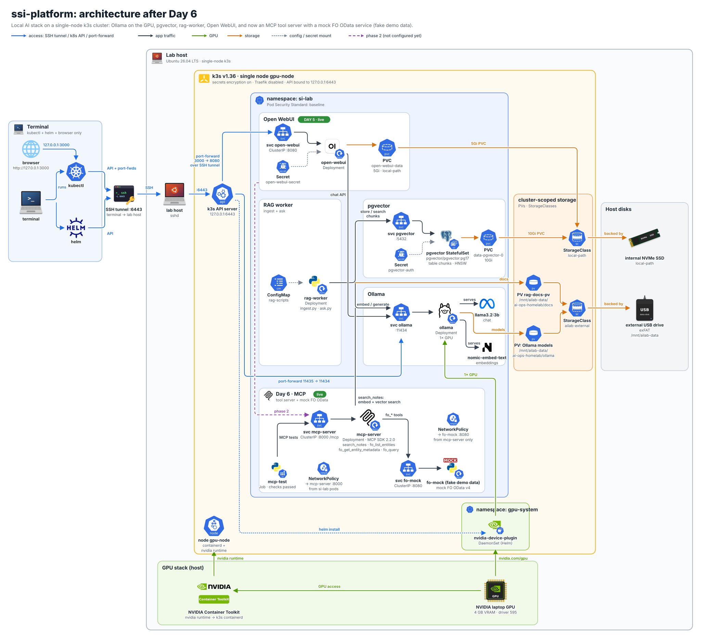

# Day 6 — An MCP server for my lab: notes search and a mock FO OData tool on k3s

Yesterday ended with Open WebUI in front of the in-cluster Ollama, and a note that my day 4 notes weren't reachable from it yet. Today's goal was to turn the lab's data into tools an agent can call. The standard way to do that now is the Model Context Protocol (MCP): a server describes its tools, and any MCP client, whether a chat UI, an IDE, or an agent framework, can list and call them over one protocol.

I deployed a small MCP server into the `si-lab` namespace with four tools. One searches my notes in pgvector, exactly the way `ask.py` did on day 4. The other three talk to a mock of a Dynamics 365 Finance & Operations OData endpoint that I also deployed today, filled with **fake demo data**. A one-shot test Job then called every tool over MCP, including the older handshake that Open WebUI uses, and checked that the new NetworkPolicies are enforced. Everything passed. The part that plugs the server into Open WebUI's chat is phase 2, listed near the end.

## The lab at a glance

- **My terminal:** where I edit manifests and run `kubectl`. It reaches the k3s API through the SSH tunnel on port 6443, open in its own tab, as on every day since day 2.
- **Lab host:** Ubuntu 26.04 with single-node k3s `v1.36.4+k3s1` (node `gpu-node`) and one NVIDIA GPU with 4 GB of video memory. The `si-lab` namespace enforces the baseline Pod Security level.
- **Already running:** Ollama with `llama3.2:3b` and `nomic-embed-text` on the GPU (day 3), Postgres with pgvector holding 32 chunks of my notes plus the `rag-worker` pod (day 4), and Open WebUI (day 5).
- **New today:** the `mcp-server` Deployment and Service, the `fo-mock` Deployment and Service, two NetworkPolicies, and the `mcp-test` Job. All of it comes from one manifest, `day-06-mcp.yaml`.

## Design decisions before deploying anything

**MCP over Streamable HTTP, stateless.** The server is built on the official MCP Python SDK (`mcp==2.2.0`, where the class formerly known as FastMCP is now `MCPServer`). It listens on port 8000 at the path `/mcp` and speaks the Streamable HTTP transport, the one meant for remote servers, instead of stdio, which only works when the client launches the server as a local process. I run it stateless with plain JSON responses. Every request stands on its own, so a restart or a second replica needs no session affinity. My tools don't need server-side sessions anyway.

**Four tools, each a thin wrapper.**
- `search_notes(query, k)` embeds the question with `nomic-embed-text` (with the `search_query:` prefix), then runs the same `<=>` cosine-distance query against the `chunks` table as day 4's `ask.py`. It returns the chunks, their source files and their distances, and leaves the answer to whichever model called the tool.
- `fo_list_entities` lists the entity sets the OData service offers.
- `fo_get_entity_metadata(entity)` returns an entity's key and fields, read from the service's `/data/$metadata` document.
- `fo_query(entity, filter, top, select, cross_company)` runs a read-only OData query, capped at 50 rows.

Failures come back as MCP tool errors with a readable message, not as a crash, so a model can see what went wrong and try again. Every FO result carries `"source": "fo-mock (fake demo data)"`.

**A mock FO OData service, with fake data, instead of a real environment.** `fo-mock` is a small read-only web service written with only the Python standard library. It mimics the shape of the Finance & Operations OData v4 endpoint: `/data/<EntitySet>` and `/data/$metadata`, a handful of query options (`$filter` with `eq` joined by `and`, `$select`, `$top`, `$skip`, `$count`), a default company (`usmf`), and `cross-company=true`. Anything else gets an OData-style 400 error, and writes get 405.
- **The data is made up:** 15 rows across four entity sets (customers, vendors, released products, and sales order headers). Every account starts with `DEMO-`, every name ends with "(demo)", and emails use `example.com`.
- **Only the names follow the real product.** The entity set names (`CustomersV3`, `VendorsV2`, `ReleasedProductsV2`, `SalesOrderHeadersV2`) and field names follow Microsoft's published entity reference, for example [CustomersV3](https://learn.microsoft.com/en-us/dynamics365/fin-ops-core/dev-itpro/data-entities/entity-customers-v3-customerv3).
- **It's not Dynamics 365.** It has no authentication, no business logic, and nothing but demo data.

The real service is documented in [Open Data Protocol (OData)](https://learn.microsoft.com/en-us/dynamics365/fin-ops-core/dev-itpro/data-entities/odata): data entities under `/data`, with sign-in through Microsoft Entra ID OAuth ([Service endpoints overview](https://learn.microsoft.com/en-us/dynamics365/fin-ops-core/dev-itpro/data-entities/services-home-page)).

**A shape that mirrors Microsoft's own ERP MCP server.** Microsoft now ships a [Dynamics 365 ERP MCP server](https://learn.microsoft.com/en-us/dynamics365/fin-ops-core/dev-itpro/copilot/copilot-mcp) for finance and operations apps. Its data tools follow a "find the entity, read its metadata, then query" pattern (`data_find_entity_type`, `data_get_entity_metadata`, and friends). My `fo_list_entities`, `fo_get_entity_metadata`, `fo_query` trio copies that pattern on purpose. If this lab ever points at a real sandbox, the agent side should feel familiar. According to that page, the real server needs a recent platform version, an admin-maintained list of allowed MCP clients, and a Tier 2 or higher sandbox (or a unified developer environment), and it enforces the calling user's security roles. None of that is simulated here.

**NetworkPolicies from day one.** This is the first time the lab uses NetworkPolicies. k3s ships an embedded network policy controller, so they're enforced without installing anything.
- `fo-mock-allow-mcp-server`: only pods labeled `app=mcp-server` may reach `fo-mock` on 8080.
- `mcp-server-allow-si-lab`: any pod in `si-lab` may reach `mcp-server` on 8000, and nothing from outside the namespace.

A third, optional policy for pgvector is in phase 2.

**Pods that would pass "restricted".** The namespace still enforces baseline, but all three new pods are written to the stricter restricted level:
- non-root UID and GID 10001
- no privilege escalation, all Linux capabilities dropped
- the runtime's default seccomp profile
- a read-only root filesystem
- no service account token mounted, and no Service environment variables injected

None of them talks to the Kubernetes API, so there's no reason to hand them credentials for it.

**Pinned libraries, installed by an init container.** Like the day 4 `rag-worker`, the pods use the stock `python:3.12-slim` image. An init container pip-installs pinned versions (`mcp==2.2.0`, `psycopg[binary]==3.3.6`, `requests==2.34.2`) into a scratch volume before the app starts. That keeps the whole setup in one manifest with no image to build, at the price of a PyPI dependency on every pod start. A custom image replaces this on day 8. `fo-mock` uses only the standard library, so it installs nothing.

**The database password stays in the day 4 Secret.** `mcp-server` reads `PGPASSWORD` from the existing `pgvector-auth` Secret by reference. No password is in the manifest or in this post.

**Host-header checks.** The SDK's DNS-rebinding protection is on. The server only answers requests whose `Host` header is `127.0.0.1`, `localhost`, or one of the `mcp-server` Service names, and anything else gets `421`. That matters for any MCP server reachable over HTTP, even a private one.

## Step 1: Bring the SSH tunnel back, this time with keepalives

My first `kubectl apply` failed because nothing was listening on port 6443 on my terminal. The SSH tunnel to the k3s API had dropped. I restarted it in its own tab, this time with keepalive options.

Terminal:

```bash
ssh -N -o ServerAliveInterval=30 -o ServerAliveCountMax=3 -o ExitOnForwardFailure=yes -L 6443:127.0.0.1:6443 <lab-user>@192.0.2.71
```

- `ServerAliveInterval=30` sends a small keepalive through the encrypted connection every 30 seconds. That also stops idle connections from being silently dropped by a router or Wi-Fi power saving.
- `ServerAliveCountMax=3` means that after three unanswered keepalives, about 90 seconds, SSH gives up and exits. Without it, a dead connection can sit there looking alive while every `kubectl` command fails.
- `ExitOnForwardFailure=yes` makes SSH exit right away if it can't open the local port 6443 (for example, if an old tunnel still holds it), instead of connecting without the forward.

As before, a blank cursor is the healthy state. To check the tunnel from another tab:

Terminal:

```bash
lsof -nP -iTCP:6443 -sTCP:LISTEN
```

A line for `ssh` listening on `127.0.0.1:6443` means the tunnel is up. No output means it's down.

## Step 2: Write the manifest and check it

The manifest is a single file, `~/ssi-platform/k8s/day-06-mcp.yaml`, about 45 KB. It holds the three Python programs as ConfigMaps (`mcp-server-code`, `fo-mock-code`, `mcp-test-code`), the two Deployments and Services, the two NetworkPolicies, and the Job. It's too long to reproduce here, so I pasted it into a heredoc on my terminal and then checked that the paste arrived intact.

Terminal:

```bash
wc -c ~/ssi-platform/k8s/day-06-mcp.yaml
shasum -a 256 ~/ssi-platform/k8s/day-06-mcp.yaml
```

The file should be 44,859 bytes, with the SHA-256 hash `a69b9d17c8b79d6ad267e7de5d910b5c0b0a04104150852154561df9a2bbfc9a`. A different number means the paste was cut short or changed.

The details worth calling out:

- **`mcp-server`** gets its settings from environment variables: the in-cluster Ollama URL, a Postgres connection string for the `rag` database, the password from `pgvector-auth`, and `FO_BASE_URL=http://fo-mock.si-lab.svc.cluster.local:8080`. Readiness and liveness probes hit `/healthz`. It requests 50m of CPU and 128 MiB of memory, with a 512 MiB memory limit.
- **`fo-mock`** is a ClusterIP Service on 8080 and has no port on the lab host.
- **`mcp-test`** is a Job with `backoffLimit: 0` (fail once, don't retry), a 10-minute deadline, and `ttlSecondsAfterFinished: 3600`, so Kubernetes deletes it an hour after it finishes.

A `kubectl apply --dry-run=server -f ...` first is a cheap extra check. The API server validates every object and runs Pod Security admission without creating anything.

## Step 3: Apply it and watch the pods

With the tunnel back, the apply went through.

Terminal:

```bash
kubectl apply -f ~/ssi-platform/k8s/day-06-mcp.yaml
```

To follow the three new pods:

Terminal:

```bash
kubectl -n si-lab get pods -l 'app in (fo-mock,mcp-server,mcp-test)' -w
```

`Init:0/1` means the init container is still pip-installing the pinned libraries. `fo-mock` has no init container, so it is usually ready first. If the test Job starts before `mcp-server` is ready, it waits and retries for up to five minutes, so the order doesn't matter. Once `mcp-test` shows `Completed`, Ctrl+C stops the watch.

## Step 4: Read the test results

Terminal:

```text
$ kubectl -n si-lab logs job/mcp-test -c test
=== connecting to http://mcp-server.si-lab.svc.cluster.local:8000/mcp (mode=auto)
tools: fo_get_entity_metadata, fo_list_entities, fo_query, search_notes

--- search_notes: 'What GPU is in the lab host and how much VRAM does it have?'
  0.260  day-03-model-serving.md  `PROCESSOR` is the column that matters, and `100% GPU` is the proof. A...
  0.261  day-02-secure-k3s.md  One real constraint shapes what comes next. This GPU has 4 GB of memor...
  0.281  day-02-secure-k3s.md  # Day 2: A secure single-node k3s cluster with a working GPU Yesterday...

--- fo_list_entities
  CustomersV3, ReleasedProductsV2, SalesOrderHeadersV2, VendorsV2

--- fo_get_entity_metadata: CustomersV3
  keys: ['dataAreaId', 'CustomerAccount']  fields: 17

--- fo_query: CustomersV3 where CustomerGroupId eq '30'
  matched=2 returned=2
   {'CustomerAccount': 'DEMO-C0001', 'OrganizationName': 'Lakeside Bike Shop (demo)', 'AddressCity': 'Chicago'}
   {'CustomerAccount': 'DEMO-C0002', 'OrganizationName': 'Prairie Outfitters (demo)', 'AddressCity': 'Milwaukee'}

--- fo_query: SalesOrderHeadersV2 backorders for DEMO-C0001
   {'SalesOrderNumber': 'DEMO-SO-0001', 'RequestedShippingDate': '2026-10-05T12:00:00Z', 'OrderTotalAmount': 1780.0}
   {'SalesOrderNumber': 'DEMO-SO-0004', 'RequestedShippingDate': '2026-10-12T12:00:00Z', 'OrderTotalAmount': 3400.0}

--- fo_query with an unsupported filter (expect a clean tool error)
  is_error = True | Error executing tool fo_query: OData error 400: The mock only supports $filter clauses like Field eq 'value' joined by 'and'. Could not parse: CreditLimit gt 10

=== connecting to http://mcp-server.si-lab.svc.cluster.local:8000/mcp (mode=legacy)
tools: fo_get_entity_metadata, fo_list_entities, fo_query, search_notes
  fo_query VendorsV2 over the legacy handshake: returned=1

=== NetworkPolicy checks (direct TCP from this test pod)
  fo-mock  fo-mock.si-lab.svc.cluster.local:8080: blocked as expected (ConnectionRefusedError)
  pgvector pgvector.si-lab.svc.cluster.local:5432: reachable (expected unless the optional pgvector policy is applied)

ALL MCP CHECKS PASSED
```

Reading it from the top:

- **All four tools were discovered** over MCP, through the Service's cluster DNS name.
- **`search_notes` returned the same three chunks, with the same distances (0.260, 0.261, 0.281), as `ask.py` did on day 4** for the same question. It's the same embedding model and the same SQL, now behind a protocol any client can call.
- **The FO tools work end to end against the mock:** four entity sets, the `CustomersV3` key (`dataAreaId` plus `CustomerAccount`) from `$metadata`, a filtered customer query, and a two-condition query for backorders. Every account, name, date, and amount here is **fake demo data**.
- **An unsupported filter gives a clean error.** `CreditLimit gt 1000` isn't something the mock understands, so the OData 400 came back as an MCP tool error (`is_error = True`) with a message a model can act on. The server didn't crash. The test prints only the first 160 characters, which is why the message ends at `gt 10`.
- **The older handshake works too.** `mode=auto` uses the SDK's newer protocol negotiation. `mode=legacy` uses the older `initialize` handshake, which is what clients like Open WebUI still send. Both listed the tools and ran a query.
- **The fo-mock NetworkPolicy is enforced.** The test pod isn't `mcp-server`, so its direct connection to `fo-mock` was refused, while `mcp-server`'s own calls went through. pgvector is still reachable from any pod in the namespace, which is expected until the optional policy is applied.

The server side can be checked too:

Terminal:

```bash
kubectl -n si-lab logs deploy/mcp-server --tail=5
```

It shows Uvicorn's access log, with `POST /mcp` for tool calls and `GET /healthz` for the kubelet's probes.

## What I noticed

- **The tunnel lives only as long as its SSH session.** It's not a service. It's one `ssh` process in one terminal tab, and when the Wi-Fi hiccups, the laptop sleeps, or the tab closes, port 6443 on my terminal simply stops existing. The keepalive options don't make it permanent. They make a dead tunnel exit quickly instead of hanging. When `kubectl` suddenly can't connect, the first check is `lsof -nP -iTCP:6443 -sTCP:LISTEN`. Permanent access is on the day 8 list.
- **Day 4's retrieval moved behind a protocol unchanged.** Identical hits and distances were the best possible regression test. Nothing was lost by wrapping `ask.py`'s logic in a tool.
- **Error messages are part of the tool interface.** For a model, a tool error is just more context. "Only `eq` joined by `and` is supported" gives a small model a chance to rewrite its filter. A stack trace would give it nothing.
- **A mock only stays honest if it's loud about it.** The `DEMO-` prefixes, the "(demo)" names, and the `source` field on every result are there so nobody, human or model, mistakes this for a real ERP.
- **Tested with a client, not yet with a chat.** The legacy handshake passing is a good sign for Open WebUI, but I haven't added the server there yet. That's phase 2.

## Also today: Open WebUI from my phone

Until now, Open WebUI was only reachable from my terminal's loopback address. I also wanted it on my phone and other devices at home, still without an ingress. It takes two commands on the lab host, over the usual SSH session.

First, a firewall rule that opens port 3000 to my home subnet only:

Lab host:

```bash
sudo ufw allow from 192.0.2.0/24 to any port 3000 proto tcp
```

Then a port-forward bound to the lab host's LAN address instead of loopback, running in the background:

Lab host:

```bash
sudo -v
```

Lab host:

```bash
sudo nohup k3s kubectl -n si-lab port-forward --address 192.0.2.71 svc/open-webui 3000:8080 > /tmp/owui-pf.log 2>&1 &
```

- **`sudo -v`** asks for my password up front and caches it, so the backgrounded `sudo` in the next command doesn't stop to prompt for one.
- **`nohup`** makes the process ignore the hangup signal (SIGHUP) that's sent when the SSH session ends. Without it, logging out would kill the port-forward.
- **`&`** puts it in the background, and its output goes to `/tmp/owui-pf.log`.

It doesn't survive a reboot of the lab host, or a restart of the Open WebUI pod, which ends the port-forward's connection.

The phone's browser opens the lab host's address on port 3000, and it works. Sign-ups stay off. New people only get in when I add them myself in **Admin Panel > Users**.

This is plain HTTP across my home Wi-Fi. That's acceptable for a lab on a trusted home network, but it's a step away from day 5's "loopback only". A permanent and properly secured way in (a NodePort or a systemd unit, or Tailscale, with TLS) is on the day 8 list.

## Where the lab stands

- **`mcp-server`** (MCP Python SDK 2.2.0, Streamable HTTP, stateless) in `si-lab`, behind the ClusterIP Service `mcp-server` at `:8000/mcp`, with four tools: `search_notes`, `fo_list_entities`, `fo_get_entity_metadata`, `fo_query`
- **`fo-mock`**, a read-only mock FO OData v4 service with **fake demo data**, behind the ClusterIP Service `fo-mock` on 8080, reachable only from `mcp-server`
- **Two NetworkPolicies** enforced by k3s' embedded controller: `fo-mock-allow-mcp-server` and `mcp-server-allow-si-lab`
- **The `mcp-test` Job:** all MCP checks passed, over both the new and the legacy handshake
- **Restricted-ready new pods** in a namespace that still enforces baseline, with the database password from the day 4 Secret
- **Still running from earlier days:** Ollama on the GPU, pgvector with 32 chunks of my notes, `rag-worker`, and Open WebUI, which is now also reachable from my home devices through a LAN port-forward on the lab host

The architecture diagram adds the MCP band inside `si-lab`. The dashed line from Open WebUI to `mcp-server` is the connection that's still phase 2.



## Phase 2

In my words at the end of today: "Okay, let's finish this lab. I'll configure the remainder phase 2." Day 6 closes with what's deployed and tested above. These are deliberately left for phase 2:

- **Add the MCP server to Open WebUI and call a tool from chat.** In **Settings > Admin > Integrations > External Tool Servers**, **+ Add Connection**:
  - **Type:** MCP (Streamable HTTP), not OpenAPI
  - **URL:** `http://mcp-server.si-lab.svc.cluster.local:8000/mcp`
  - **Auth:** None

  Then enable it in a chat under **+ > Integrations > Tools**. Open WebUI has supported MCP over Streamable HTTP natively since v0.6.31, so no `mcpo` proxy is needed ([Open WebUI MCP docs](https://docs.openwebui.com/features/extensibility/mcp)). The same docs warn that weak models may ignore tools or pass wrong arguments, so with `llama3.2:3b` I expect to ask very directly ("Use fo_query to list VendorsV2").
- **The optional pgvector NetworkPolicy** (`day-06-netpol-pgvector.yaml`, policy `pgvector-allow-clients`). It lets only `mcp-server` and `rag-worker` connect to pgvector on 5432. `kubectl exec` into `pgvector-0` and port-forwards aren't affected, and Open WebUI doesn't use pgvector. After applying it, the test's pgvector line should flip to blocked while `search_notes` keeps passing.
- **Optional: use the MCP server from Cursor on my terminal**, through `kubectl port-forward svc/mcp-server 8000:8000` and an `~/.cursor/mcp.json` entry pointing at `http://127.0.0.1:8000/mcp`. The server's Host-header allow-list already includes `127.0.0.1`.

## What's next

- **Day 6b, the monitoring node join:** add the monitoring node to the cluster as a CPU-only k3s agent, labeled and tainted for observability workloads, so the lab host keeps its RAM and GPU for the models.
- **Day 7, observability:** Prometheus and Grafana for metrics, OpenTelemetry traces into Langfuse and Tempo, Loki for logs, and a Prompt Guard classifier, so every tool call, including `tools/call search_notes`, shows up as a trace.
- **Day 8, ALM:** custom images instead of pip-at-start, the manifests in Git with a proper deploy flow, and permanent, secured access to Open WebUI instead of hand-started port-forwards.

## How this maps to Azure (AKS)

- **The MCP server itself.** The same container and manifest run on AKS unchanged. It's a plain Deployment and ClusterIP Service. To share it beyond the cluster, [Azure API Management can expose and govern an existing MCP server](https://learn.microsoft.com/en-us/azure/api-management/expose-existing-mcp-server) (Streamable HTTP or SSE), adding authentication, rate limits, and monitoring in front of it. API Management can also [turn a REST API into an MCP server](https://learn.microsoft.com/en-us/azure/api-management/export-rest-mcp-server), which would be one way to expose an OData-style API as tools without writing a server.
- **Real finance and operations data.** Instead of `fo-mock`, there are two documented paths: call the [OData endpoint](https://learn.microsoft.com/en-us/dynamics365/fin-ops-core/dev-itpro/data-entities/odata) with an Entra ID app registration ([Service endpoints overview](https://learn.microsoft.com/en-us/dynamics365/fin-ops-core/dev-itpro/data-entities/services-home-page)), or connect an MCP client directly to Microsoft's [Dynamics 365 ERP MCP server](https://learn.microsoft.com/en-us/dynamics365/fin-ops-core/dev-itpro/copilot/copilot-mcp), which runs under the calling user's security roles. Per that page, the older static ERP MCP server is being retired on October 1, 2026, in favor of the dynamic one.
- **NetworkPolicies.** The same two policies work on AKS once a [network policy engine](https://learn.microsoft.com/en-us/azure/aks/use-network-policies) is enabled. Microsoft recommends Azure CNI powered by Cilium. Azure Network Policy Manager and Calico are the other options.
- **The database password.** As on day 5, Azure Key Vault with the [Secrets Store CSI driver](https://learn.microsoft.com/en-us/azure/aks/csi-secrets-store-driver) would replace the hand-made `pgvector-auth` Secret.

## AWS delta

On EKS, the same manifests need network policy support turned on in the Amazon VPC CNI ([EKS network policies](https://docs.aws.amazon.com/eks/latest/userguide/cni-network-policy.html)). The database password could come from AWS Secrets Manager through the [Secrets Store CSI driver provider](https://docs.aws.amazon.com/secretsmanager/latest/userguide/integrating_csi_driver.html). The closest managed counterpart to API Management's MCP features is [Amazon Bedrock AgentCore Gateway](https://docs.aws.amazon.com/bedrock-agentcore/latest/devguide/gateway.html). It turns APIs, Lambda functions, and existing services into MCP tools behind a managed endpoint with OAuth on both sides.
