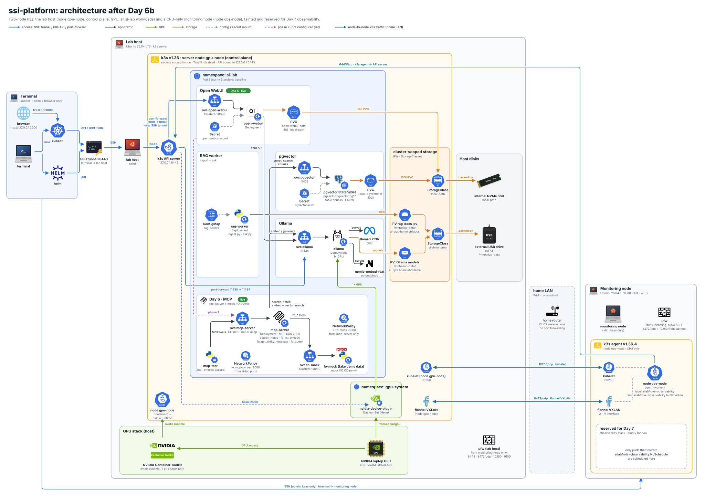

# Day 6b: Adding a second node to the k3s homelab

Until today, the lab was a single-node k3s cluster: one machine, the lab host, running the control plane, the GPU, and every workload. Day 7 adds an observability stack (Prometheus, Grafana, Loki, Tempo, Langfuse), and I don't want that competing with Ollama and pgvector for the lab host's memory. So today I joined a spare laptop to the cluster as a second node. I call it the monitoring node.

It joined as a CPU-only k3s **agent** (a worker), named `obs-node` in Kubernetes. It has a label and a taint, so nothing gets scheduled on it unless it explicitly asks to be. The lab host is still the only server (control plane) and keeps the GPU, the models, and every `si-lab` workload. By the end, both nodes were `Ready` on the same k3s version, a test pod on the new node resolved cluster DNS through CoreDNS on the lab host, and nothing in `si-lab` had moved.

## The lab at a glance

- **My terminal:** where I run `kubectl` through the SSH tunnel to the k3s API, and where I start SSH sessions to both machines.
- **Lab host:** Ubuntu 26.04.1 with k3s `v1.36.4+k3s1`, node `gpu-node`. It's the control plane and has the GPU. Ollama, pgvector, `rag-worker`, Open WebUI, `mcp-server`, and `fo-mock` all run here.
- **Monitoring node (new):** a spare laptop with 16 GB of RAM, running Ubuntu 26.04.1 with kernel `7.0.0-34-generic`. It connects over Wi-Fi only (interface `<wifi-iface>`). It joins as k3s agent `obs-node` and is reserved for day 7.
- **Network:** both machines are on the same home subnet, and the router has a DHCP reservation for each. There's no port forwarding on the router, so nothing is reachable from the internet.

## Design decisions before touching anything

**An agent, not a second server.** A second k3s server would mean a second control plane and an HA datastore, and two servers can't give etcd a quorum anyway (that takes three). The goal here is extra capacity, not high availability, so the monitoring node runs only the agent: kubelet, containerd, and flannel. The API server, the scheduler, and the datastore stay on the lab host.

**A label and a taint, set at registration.** The node gets the label `ailab/role=observability` and the taint `ailab/role=observability:NoSchedule`. The label lets day 7 workloads target the node with a `nodeSelector`. The taint keeps everything else off it. k3s applies `node-label` and `node-taint` only when the node first registers ([k3s agent options](https://docs.k3s.io/cli/agent)), so both go into the config file before the first start.

**Why the taint isn't optional here.** None of the existing `si-lab` workloads is pinned to a node. With only one node, that never mattered. With two, the scheduler is free to place a restarted pod on the new node. `rag-worker` mounts a `hostPath` volume that exists only on the lab host, so on the monitoring node it would fail. `mcp-server` and `fo-mock` would work there, but they'd move away from the database and Ollama for no reason. With the taint, only pods that carry the matching toleration can land on the new node.

**Same k3s version as the server.** The install is pinned with `INSTALL_K3S_VERSION='v1.36.4+k3s1'`, the version the lab host runs. The agent's kubelet shouldn't be newer than the API server.

**A short-lived bootstrap token instead of the server token.** The server token in `/var/lib/rancher/k3s/server/token` is effectively a cluster-admin credential. Instead, I created an agent bootstrap token with `k3s token create --ttl 1h`. The [k3s token docs](https://docs.k3s.io/cli/token) describe these as automatically expiring agent bootstrap tokens (24 hours by default, 1 hour here). The token never appears on screen, in shell history, or on my terminal's disk.

**Firewall rules scoped to the other node's IP.** Both machines run ufw. Each opens only the k3s ports listed on the [k3s requirements page](https://docs.k3s.io/installation/requirements), and only to the other machine's IP, plus the pod network (`10.42.0.0/16`) and the Service network (`10.43.0.0/16`), which the same page says to allow when ufw is on. The k3s API port stays closed to everything except the monitoring node. My terminal still reaches the API only through the SSH tunnel.

**Wi-Fi, made as reliable as it can be.** The laptop has no Ethernet port, and I didn't use an adapter. Wi-Fi works for a k3s node if the connection comes up at boot without anyone logging in and power saving is off. Otherwise the node goes `NotReady` whenever the radio naps. Ethernet would still be better for flannel's VXLAN traffic.

**The desktop stays.** With 16 GB of RAM, the GNOME session's roughly 1 GB is affordable, so I didn't switch the machine to text-only boot.

## Step 1: Prepare the monitoring node as a server

On the monitoring node's own console, I installed SSH and the same hardening packages as on day 1.

Monitoring node:

```bash
sudo apt update
sudo apt install -y openssh-server unattended-upgrades ufw fail2ban
sudo systemctl enable --now ssh fail2ban
```

Then I copied my key from the terminal.

Terminal:

```bash
ssh-copy-id <obs-node-user>@192.0.2.94
```

With key login working, I disabled password logins with the same drop-in file as on day 1. `sshd -t` checks the configuration before the reload.

Monitoring node:

```bash
sudo dpkg-reconfigure -plow unattended-upgrades
sudo tee /etc/ssh/sshd_config.d/99-lab-hardening.conf >/dev/null <<'EOF'
PasswordAuthentication no
KbdInteractiveAuthentication no
PubkeyAuthentication yes
EOF
sudo sshd -t && sudo systemctl reload ssh
```

As on day 1, I kept the first session open and confirmed from a second terminal tab that key login still worked before closing it.

**Wi-Fi.** The connection was made system-wide: the password moves into the root-only system connection file, so it connects at boot without a login. It's set to autoconnect, and power saving is off (`powersave 2` means disabled).

Monitoring node:

```bash
nmcli -f NAME,DEVICE,TYPE connection show --active
```

Monitoring node:

```bash
sudo nmcli connection modify "WIFI-NAME" connection.permissions '' connection.autoconnect yes 802-11-wireless.powersave 2 802-11-wireless-security.psk-flags 0
```

`WIFI-NAME` stands for the connection name from the first command.

**Lid, idle, and sleep.** A laptop that suspends when the lid closes makes a bad node. I told logind to ignore the lid and idle, and masked every sleep target so nothing, including GNOME's idle settings, can suspend the machine.

Monitoring node:

```bash
sudo mkdir -p /etc/systemd/logind.conf.d
sudo tee /etc/systemd/logind.conf.d/10-lab-lid.conf >/dev/null <<'EOF'
[Login]
HandleLidSwitch=ignore
HandleLidSwitchExternalPower=ignore
HandleLidSwitchDocked=ignore
IdleAction=ignore
EOF
sudo systemctl mask sleep.target suspend.target hibernate.target hybrid-sleep.target
```

**Boot order and IP.** The laptop also has another operating system, so I made Ubuntu the first boot entry in the firmware and in GRUB, so an unattended reboot comes back into Ubuntu. On the home router, I reserved a fixed IP for the laptop. The node IP and the firewall rules below both depend on it.

## Step 2: Firewall rules on both machines

These are the ports k3s needs between the nodes, from the [k3s requirements page](https://docs.k3s.io/installation/requirements), plus one for day 7:

| Port | Protocol | Direction | Why |
|---|---|---|---|
| 6443 | TCP | monitoring node → lab host | Kubernetes API and the agent's supervisor connection |
| 8472 | UDP | both ways | Flannel VXLAN, which carries pod-to-pod traffic between nodes |
| 10250 | TCP | both ways | kubelet (metrics-server now, Prometheus on day 7) |
| 9100 | TCP | monitoring node → lab host | node-exporter on the lab host, scraped by Prometheus on day 7 |

On the lab host, I allowed those ports from the monitoring node only, plus the pod and Service networks.

Lab host:

```bash
sudo ufw allow from 192.0.2.94 to any port 6443 proto tcp comment 'k3s api from monitoring node'
sudo ufw allow from 192.0.2.94 to any port 8472 proto udp comment 'flannel vxlan from monitoring node'
sudo ufw allow from 192.0.2.94 to any port 10250 proto tcp comment 'kubelet from monitoring node'
sudo ufw allow from 192.0.2.94 to any port 9100 proto tcp comment 'node-exporter from monitoring node'
sudo ufw allow from 10.42.0.0/16 to any comment 'k3s pods'
sudo ufw allow from 10.43.0.0/16 to any comment 'k3s services'
```

On the monitoring node, I set incoming traffic to deny by default, then allowed SSH, and allowed VXLAN and the kubelet only from the lab host.

Monitoring node:

```bash
sudo ufw default deny incoming
sudo ufw default allow outgoing
sudo ufw allow OpenSSH
sudo ufw allow from 192.0.2.71 to any port 8472 proto udp comment 'flannel vxlan from lab host'
sudo ufw allow from 192.0.2.71 to any port 10250 proto tcp comment 'kubelet from lab host'
sudo ufw allow from 10.42.0.0/16 to any comment 'k3s pods'
sudo ufw allow from 10.43.0.0/16 to any comment 'k3s services'
sudo ufw --force enable
```

Then a reachability test from the monitoring node to the API port. `/ping` needs no credentials.

Monitoring node:

```bash
curl -sk -o /dev/null -w '%{http_code}\n' https://192.0.2.71:6443/ping
```

It returned `200`. A timeout or `000` would have meant the lab host rule or the IP was wrong.

## Step 3: Full upgrade and a test reboot

Before joining, I brought the monitoring node fully up to date and rebooted it. The reboot was also a test that the machine comes back on its own: into Ubuntu, on Wi-Fi, and without suspending.

Monitoring node:

```bash
sudo apt update && sudo apt full-upgrade -y
sudo reboot
```

After the reboot, three checks over SSH:

Monitoring node:

```bash
uname -r
ip -4 -br addr show <wifi-iface>
systemctl is-enabled suspend.target
```

The kernel was `7.0.0-34-generic`, `<wifi-iface>` was `UP` with the reserved address, and `suspend.target` was still `masked`.

## Step 4: Move the join token without printing it

First, I loaded my SSH key into the agent on my terminal. The next step chains two SSH sessions in one pipe, and without this, both would ask for the key's passphrase at the same moment.

Terminal:

```bash
ssh-add --apple-use-keychain ~/.ssh/id_ed25519
```

On the lab host, I created a one-hour bootstrap token and wrote it straight into a private file. `umask 077` makes the file readable only by me from the moment it's created.

Lab host:

```bash
(umask 077 && sudo k3s token create --ttl 1h --description obs-node-join > ~/.k3s-join-token)
```

Then I relayed it from the lab host to the monitoring node through an SSH pipe. The token passes through my terminal's memory but is never written to its disk, and the lab host copy is deleted in the same command.

Terminal:

```bash
ssh <lab-user>@192.0.2.71 'cat ~/.k3s-join-token && rm -f ~/.k3s-join-token' | ssh <obs-node-user>@192.0.2.94 'umask 077 && cat > ~/.k3s-join-token'
```

On the monitoring node, I moved it into a root-only file where the agent will look for it, then removed the temporary copy.

Monitoring node:

```bash
sudo install -D -m 600 -o root -g root ~/.k3s-join-token /etc/rancher/k3s/join-token
rm -f ~/.k3s-join-token
sudo ls -l /etc/rancher/k3s/join-token
```

```plain text
-rw------- 1 root root 93 ... /etc/rancher/k3s/join-token
```

Owner and group root, mode 600, 93 bytes. The content never appeared anywhere.

## Step 5: Write the agent config

The agent reads `/etc/rancher/k3s/config.yaml` at startup. The file holds the server URL, the path to the token file (not the token itself), the node name, the node IP, the interface for flannel, and the label and taint.

Monitoring node:

```bash
sudo tee /etc/rancher/k3s/config.yaml >/dev/null <<'EOF'
server: "https://192.0.2.71:6443"
token-file: "/etc/rancher/k3s/join-token"
node-name: "obs-node"
node-ip: "192.0.2.94"
flannel-iface: "<wifi-iface>"
node-label:
  - "ailab/role=observability"
node-taint:
  - "ailab/role=observability:NoSchedule"
EOF
sudo chmod 600 /etc/rancher/k3s/config.yaml
```

- **`node-ip` and `flannel-iface`** pin the node to the reserved Wi-Fi address. That way, the kubelet and the VXLAN tunnel never pick another interface, such as a Docker bridge or a VPN.
- **`node-label` and `node-taint`** are applied once, at registration. To change them later, I'd use `kubectl label` and `kubectl taint`, or delete the node and let it register again.
- **`chmod 600`** because the file describes how to join the cluster, even though it doesn't contain the token.

## Step 6: Install the k3s agent, pinned to the server's version

`sh -s - agent` tells the install script to set up the `k3s-agent` service. The server URL and the token file come from the config file, so no secret is passed on the command line or written into the service's environment file.

Monitoring node:

```bash
curl -sfL https://get.k3s.io | INSTALL_K3S_VERSION='v1.36.4+k3s1' sh -s - agent
systemctl is-active k3s-agent
```

It printed `active`. To see what the agent did at startup:

Monitoring node:

```bash
sudo journalctl -u k3s-agent --since '-5 min' --no-pager | tail -n 30
```

The log showed `k3s agent is up and running` and a pod CIDR of `10.42.1.0/24` for the new node. Each node gets its own `/24` slice of `10.42.0.0/16`.

### Gotcha: "no subnet found" warnings

The first seconds of the log also contained warnings about no subnet being found in `/run/flannel/subnet.env`. They're normal on a first start. Flannel writes that file once the node has its pod CIDR, and anything that looks for it earlier just retries.

## Step 7: Verify the node, its label, and its taint

I ran the checks on the lab host with `sudo k3s kubectl`. The same commands work from my terminal with plain `kubectl` through the tunnel.

Lab host:

```bash
sudo k3s kubectl get nodes -o wide
```

```plain text
NAME      STATUS   ROLES           AGE     VERSION        INTERNAL-IP    ...  OS-IMAGE             KERNEL-VERSION             CONTAINER-RUNTIME
d         Ready    control-plane   47h     v1.36.4+k3s1   192.0.2.71   ...  Ubuntu 26.04.1 LTS   7.0.0-34-generic (amd64)   containerd://2.3.4-k3s1.36
obs-node   Ready    <none>          2m47s   v1.36.4+k3s1   192.0.2.94   ...  Ubuntu 26.04.1 LTS   7.0.0-34-generic (amd64)   containerd://2.3.4-k3s1.36
```

Both nodes are `Ready` and run the same k3s version, OS, kernel, and container runtime. The new node's INTERNAL-IP is the reserved address from the config. `ROLES` shows `<none>` for agents, which is normal. That column only reflects `node-role.kubernetes.io/...` labels. My own label shows up with `-L`:

Lab host:

```bash
sudo k3s kubectl get node obs-node -L ailab/role
sudo k3s kubectl get node obs-node -o jsonpath='{.spec.taints}{"\n"}'
```

The `ROLE` column read `observability`, and the taint came back as:

```plain text
[{"effect":"NoSchedule","key":"ailab/role","value":"observability"}]
```

Finally, the check that matters most: nothing moved.

Lab host:

```bash
sudo k3s kubectl -n si-lab get pods -o wide
```

Every `si-lab` pod (`fo-mock`, `mcp-server`, `ollama`, `open-webui`, `pgvector-0`, `rag-worker`) was still on node `gpu-node`.

## Step 8: Test cross-node networking with a throwaway pod

This pod targets the monitoring node with a `nodeSelector` and tolerates its taint. It then looks up a Service name through CoreDNS, which runs on the lab host. An answer proves that pod traffic crosses between the nodes over flannel VXLAN in both directions.

Lab host:

```bash
sudo k3s kubectl run dnstest --image=busybox:1.36 --restart=Never --rm -i --overrides='{"apiVersion":"v1","spec":{"nodeSelector":{"ailab/role":"observability"},"tolerations":[{"key":"ailab/role","operator":"Equal","value":"observability","effect":"NoSchedule"}]}}' -- nslookup kubernetes.default.svc.cluster.local
```

The answer came from `Server: 10.43.0.10`, the CoreDNS Service, with `Address: 10.43.0.1`, the `kubernetes` Service. kubectl also printed a warning that it couldn't attach to the pod. That's harmless: `nslookup` finished before kubectl could attach, so it showed the pod's log instead, and `--rm` deleted the pod.

Then a check that metrics-server, which runs on the lab host, can reach the new node's kubelet on 10250:

Lab host:

```bash
sudo k3s kubectl top nodes
```

| Node | CPU | Memory |
|---|---|---|
| `gpu-node` | 146m | 4159Mi (27%) |
| `obs-node` | 25m | 1299Mi (8%) |

The monitoring node is idle: about 1.3 GB in use out of 16 GB.

## Step 9: Housekeeping

While looking at the pod list, I found two stale Ollama pods, one `Completed` and one `Unknown`. The running Ollama pod wasn't affected, so I deleted the two old ones by name with `kubectl -n si-lab delete pod`. The list now shows only live pods.

## What I noticed

- **Joining took four settings.** The server URL, a token, the node IP and interface, and the label and taint. Most of the work was making a laptop behave like a server: SSH keys, firewall, no sleep, Wi-Fi that comes up at boot, and the right boot order.
- **The taint is the safety net.** Without it, the first restart of `rag-worker` or `mcp-server` could have moved it to a machine without its `hostPath` data, or away from Ollama and pgvector.
- **Two harmless warnings.** The flannel "no subnet found" lines on first start and kubectl's "couldn't attach" on a short-lived pod both look like errors. Neither is.
- **The token question.** A one-hour bootstrap token, relayed over SSH and stored root-only, means nothing sensitive stayed on my terminal or on the lab host. If I ever delete the `obs-node` Node object and want to rejoin, I'll create a fresh token.
- **Wi-Fi is the weak link.** Everything is configured to survive reboots and idle time, but a Wi-Fi node is only as stable as the Wi-Fi. If the node starts flapping to `NotReady`, a USB Ethernet adapter is the fix, and it means changing `node-ip`, `flannel-iface`, and the firewall rules to match.

## Rollback

To remove the monitoring node from the cluster cleanly:

Terminal:

```bash
kubectl drain obs-node --ignore-daemonsets --delete-emptydir-data
kubectl delete node obs-node
```

Monitoring node:

```bash
sudo /usr/local/bin/k3s-agent-uninstall.sh
sudo rm -f /etc/rancher/k3s/join-token /etc/rancher/k3s/config.yaml
```

Lab host:

```bash
sudo ufw status numbered
```

Then delete the four rules that allow traffic from the monitoring node's IP by number with `sudo ufw delete` and the rule number, starting with the highest number so the others keep their numbers. Expect `node/obs-node drained`, `node "obs-node" deleted`, the uninstall script's cleanup messages, and a ufw list without those rules. The [k3s uninstall page](https://docs.k3s.io/installation/uninstall) describes what the uninstall script removes.

## Where the lab stands

- **A two-node k3s cluster** on `v1.36.4+k3s1`: node `gpu-node` (lab host, control plane, GPU) and node `obs-node` (monitoring node, agent, CPU only)
- **The monitoring node** is labeled `ailab/role=observability` and tainted `ailab/role=observability:NoSchedule`. It's empty for now and reserved for day 7.
- **All `si-lab` workloads still on node `gpu-node`:** Ollama, pgvector, `rag-worker`, Open WebUI, `mcp-server`, `fo-mock`
- **Cross-node pod networking over flannel VXLAN (8472/udp)** verified with a DNS lookup from the new node. metrics-server reports both nodes.
- **ufw on both machines**, opening the k3s ports only between the two node IPs. Key-only SSH, fail2ban, and unattended upgrades on both.
- **Nothing new exposed to the internet:** no router port forwarding, and the API still reached from my terminal only through the SSH tunnel

The diagram adds the monitoring node to the right of the lab host. The node-to-node links are 6443 from the agent to the API server, 8472/udp for VXLAN, and 10250 for the kubelets, all over the home LAN. The terminal reaches the new node over SSH.



## What's next

- **Day 7, observability on the monitoring node:** Prometheus and Grafana, OpenTelemetry into Langfuse and Tempo, Loki for logs, and node-exporter on both nodes. Each of these carries the `ailab/role=observability` toleration and node selector. Port 9100 on the lab host is already open to the monitoring node for node-exporter.
- **Still open from day 6 (phase 2):** Open WebUI's External Tool Server connection to `mcp-server`, and the optional pgvector NetworkPolicy.
- **Day 8, ALM:** custom images, manifests in Git with a deploy flow, and permanent access instead of hand-started tunnels and port-forwards.

## How this maps to Azure (AKS)

On AKS, you don't join individual machines. You add a **node pool**, and AKS creates, joins, and patches the VMs for you. There's no token to move and no firewall rule to write between nodes. The control plane is managed by Azure, so the "agent, not server" decision doesn't come up.

- **Label and taint on the pool.** The equivalent of today's config file is two parameters on `az aks nodepool add`. [Use labels in AKS](https://learn.microsoft.com/en-us/azure/aks/use-labels) documents `--labels`, and [Use node taints in AKS](https://learn.microsoft.com/en-us/azure/aks/use-node-taints) documents `--node-taints`. For this lab, it would look like this:

Terminal (Azure CLI):

```bash
az aks nodepool add --resource-group "$RESOURCE_GROUP" --cluster-name "$CLUSTER_NAME" --name monitoring --node-count 1 --labels ailab/role=observability --node-taints "ailab/role=observability:NoSchedule"
```

- **The taint lives in the pool definition.** Per the taints page, taints and labels applied through the AKS node pool API can't be modified through the Kubernetes API, and the reverse is also true. On k3s, I can `kubectl taint` the node. On AKS, the change goes through `az aks nodepool update`, and every node in the pool gets it, including nodes added later by scaling.
- **System and user pools.** AKS separates system node pools (CoreDNS, metrics-server) from user pools. Microsoft suggests the `CriticalAddonsOnly=true:NoSchedule` taint to keep application pods off a dedicated system pool ([system node pools](https://learn.microsoft.com/en-us/azure/aks/use-system-pools)). An observability pool like this one would be a user pool with its own taint.
- **Networking.** Node-to-node traffic stays inside the cluster's virtual network, and AKS manages the rules it needs. The lab's ufw rules correspond to the network security group that AKS maintains, not something I'd write by hand.

## AWS delta

On EKS, the equivalent is a **managed node group**: EKS provisions the EC2 instances in an Auto Scaling group and joins them to the cluster ([managed node groups](https://docs.aws.amazon.com/eks/latest/userguide/managed-node-groups.html)). `aws eks create-nodegroup` takes `--labels` and `--taints` ([CLI reference](https://docs.aws.amazon.com/cli/latest/reference/eks/create-nodegroup.html)). In the EKS API, the taint effect is written as `NO_SCHEDULE` rather than `NoSchedule`. Per the [EKS taints guide](https://docs.aws.amazon.com/eks/latest/userguide/node-taints-managed-node-groups.html), taints can be changed later with `aws eks update-nodegroup-config`, and a taint removed by hand from a node isn't added back by EKS.
