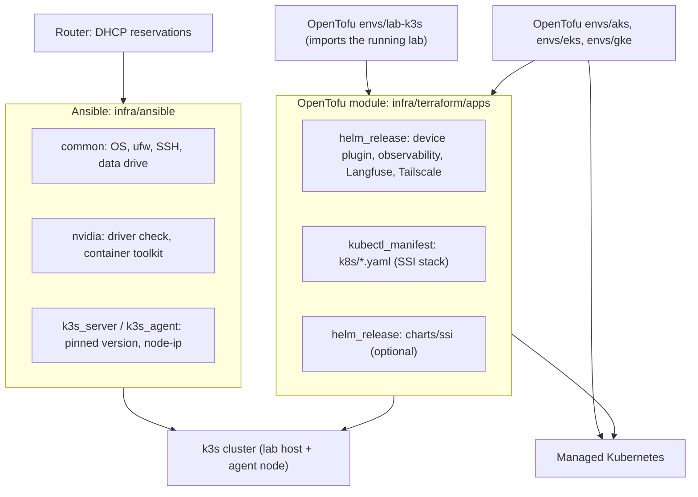

# Day 13: rebuild the whole SSI lab from code (Ansible + OpenTofu)

Goal: from the terminal, reproduce the physical lab exactly, and deploy the same **Sovereign Super Intelligence (SSI)** stack to AKS, EKS or GKE with the same module. Every version is pinned to what the lab runs today (2026-10-06).

The supported path is two steps:

1. **Ansible** (`infra/ansible/`) builds the nodes: OS baseline, NVIDIA driver and container toolkit, k3s server and agent with a pinned node IP.
2. **OpenTofu** (`infra/terraform/`) deploys everything that runs on the cluster: namespaces, Ollama, pgvector, RAG worker, Open WebUI, Prompt Guard, business MCP + FO mock, control layer, engineering MCP, ssi-gateway, the quiet observability lane (Prometheus, Grafana, Loki, Tempo, Langfuse) and private access.

How to read these steps:

- Every code block has a label above it: **Terminal**.
- Each block holds one command. No `#` comments inside fences. Quotes are zsh-safe.
- Nothing here applies anything on its own. You read every plan before you apply it.
- OpenTofu (`tofu`) is the only IaC CLI used.

## Who owns what

| Layer | Tool | Owns | Lives in |
| --- | --- | --- | --- |
| Network | Your router | DHCP reservations for the lab host (192.0.2.93) and the agent node (192.0.2.94) | router admin page |
| Nodes | Ansible | packages, SSH hardening, ufw, data drive mount, NVIDIA driver check + container toolkit 1.20.1-1, k3s v1.36.4+k3s1, node-ip pin, agent join, node label/taint | `infra/ansible/` |
| Cluster add-ons | OpenTofu `helm_release` | NVIDIA device plugin, kube-prometheus-stack, OpenTelemetry collectors, Loki, Tempo, cert-manager, ClickHouse operator, Langfuse, Tailscale operator (lab only) | `infra/terraform/apps/helm.tf` |
| SSI apps | OpenTofu `kubectl_manifest` over `k8s/*.yaml` | every Deployment, Service, ConfigMap, PVC, NetworkPolicy and Ingress from Days 3-11 (the YAML stays the single source of truth) | `infra/terraform/apps/manifests.tf` |
| SSI chart (optional) | OpenTofu `helm_release` of `charts/ssi` | gateway + control layer + MCP slots from published images | `infra/terraform/apps/ssi_chart.tf` |
| Cloud cluster | OpenTofu | AKS / EKS / GKE, VPC, node pools (GPU pool off by default) | `infra/terraform/envs/{aks,eks,gke}` |
| Secrets | You | values in a git-ignored `secrets.auto.tfvars`; on the lab they already exist and are referenced by name | never in git |

Bicep (`infra/bicep/`) stays in the repo as an optional Azure-native alternative for the Day 12 cluster. It is not the supported rebuild path.



## Prerequisites

- On the terminal: `brew install opentofu ansible`. Day 13 was validated with OpenTofu 1.13.1 and ansible-core 2.21.
- SSH to the lab host with your key (Day 1), and sudo on both nodes.
- `KUBECONFIG` exported for the lab cluster and the private path to the API (Day 2 / Day 8).
- For cloud envs: `az login`, `aws configure sso` or `gcloud auth application-default login`, plus GPU quota if you turn the GPU pool on.

## Pinned versions

| Component | Pin | Where |
| --- | --- | --- |
| k3s | v1.36.4+k3s1 | `infra/ansible/group_vars/all.yml`, `envs/lab-k3s/pins.tf` |
| NVIDIA driver | 595.91.07 (checked, installed only if missing) | `group_vars/all.yml` |
| NVIDIA Container Toolkit | 1.20.1-1 | `group_vars/all.yml` |
| NVIDIA device plugin chart | 0.20.1 | `apps/helm.tf` |
| kube-prometheus-stack | 91.5.3 | `apps/helm.tf` |
| opentelemetry-collector (collector + agent) | 0.173.1 | `apps/helm.tf` |
| Loki / Tempo | 18.13.5 / 3.0.0 | `apps/helm.tf` |
| cert-manager | v1.20.2 | `apps/helm.tf` |
| ClickHouse operator | 0.0.5 | `apps/helm.tf` |
| Langfuse chart | 2.1.2 | `apps/helm.tf` |
| Tailscale operator | 1.102.4 | `apps/helm.tf` |
| Ollama | 0.35.1 (`ollama/ollama:latest`, digest recorded) | `envs/lab-k3s/pins.tf` |
| Chat model | `llama3.2:3b` (ID a80c4f17acd5), Llama 3.2 is open-weight (Meta license) | `envs/lab-k3s/pins.tf` |
| Embeddings | `nomic-embed-text:latest` (ID 0a109f422b47) | `envs/lab-k3s/pins.tf` |
| Open WebUI | v0.11.4 (digest recorded) | `k8s/day-05-open-webui.yaml`, `pins.tf` |
| pgvector | pg17 (digest recorded) | `pins.tf` |
| Repo-built images | mcp-server 5144638, rag-worker 5144638, prompt-guard 6dfc885 (digests recorded) | `k8s/*.yaml`, `pins.tf` |
| Prompt Guard model | `meta-llama/Llama-Prompt-Guard-2-22M` on the `prompt-guard-cache` PVC, open-weight (Meta license, gated on Hugging Face) | `k8s/day-08a-prompt-guard.yaml` |
| vLLM (optional backend) | `vllm/vllm-openai:v0.31.0` | `apps/variables.tf` |

`pin_image_digests = false` (default on the live lab) keeps the tags exactly as written in `k8s/*.yaml`, so adopting the lab changes nothing. Set it to `true` for a from-scratch rebuild and every mutable tag (`latest`, `pg17`, `3.12-slim`) is replaced by the digest the lab runs today.

## Where secrets go

| Secret | Lab today | Fresh rebuild / cloud |
| --- | --- | --- |
| `pgvector-auth`, `open-webui-secret`, `ssi-gateway-auth`, `grafana-admin`, `langfuse-init`, `langfuse-otlp-auth` | already in the cluster, referenced by name, OpenTofu does not read them | `create_secrets = true` plus values in `secrets.auto.tfvars` |
| Tailscale OAuth client | stored in the operator's Helm release, reused on upgrade | `tailscale_oauth_client_id` / `_secret` in `secrets.auto.tfvars` (lab only) |
| Hugging Face token (`hf-token`: Prompt Guard download, vLLM weights) | already in the cluster | `hf_token` in `secrets.auto.tfvars` |
| k3s join token | read from the server at run time by Ansible, never written to git | same |
| sudo password | typed at `--ask-become-pass` | same |

`secrets.auto.tfvars`, `terraform.tfvars`, `inventory.ini`, `*.tfstate*`, `*.tfplan` and `.terraform/` are git-ignored. Each env has a `secrets.auto.tfvars.example` with placeholders. Generate values with `openssl rand`, never paste them into chat, and keep state local or in storage you own: state holds every value OpenTofu manages.

## 1. Fix the network first

DHCP moved the lab host from 192.0.2.71 to 192.0.2.93. k3s still advertises .71 and the agent node still dials .71, so the agent node is `NotReady`. On the router, reserve 192.0.2.93 for the lab host and 192.0.2.94 for the agent node. Ansible then pins those IPs into k3s.

## 2. Nodes with Ansible

Full details in `infra/ansible/README.md`.

Terminal

```bash
cd ~/ssi-platform/infra/ansible
```

Terminal

```bash
cp inventory.example.ini inventory.ini
```

Terminal

```bash
ansible-playbook playbooks/site.yml --syntax-check
```

Terminal

```bash
ansible-playbook playbooks/site.yml --check --diff --ask-become-pass
```

Expected today: the lab host reports one change (new `/etc/rancher/k3s/config.yaml` with `node-ip: 192.0.2.93`). The agent node reports its config (server URL .71 to .93) and firewall rules. That is the fix. Everything else is `ok`.

Terminal

```bash
ansible-playbook playbooks/site.yml --diff --ask-become-pass
```

The handlers restart k3s and k3s-agent once. A second `--check` run then reports `changed=0`.

Terminal

```bash
kubectl get nodes -o wide
```

Expected: both nodes `Ready`, INTERNAL-IP 192.0.2.93 and 192.0.2.94.

## 3. Cluster contents with OpenTofu (lab)

Terminal

```bash
cd ~/ssi-platform/infra/terraform/envs/lab-k3s
```

Terminal

```bash
cp terraform.tfvars.example terraform.tfvars
```

Edit `tailnet_domain` in `terraform.tfvars` (it only feeds the Langfuse login URL).

Terminal

```bash
export TF_VAR_kubeconfig_path="$KUBECONFIG"
```

Terminal

```bash
tofu init
```

Terminal

```bash
tofu plan
```

### How the imports work

`imports.tf` lists every object that already runs (8 namespaces, 49 manifests, 10 Helm releases). Each `import` block maps a live object to the address the apps module would create, so the first plan **adopts** the lab instead of recreating it: 0 to add, 0 to destroy.

What the first plan shows (2026-10-06): `Plan: 67 to import, 0 to add, 67 to change, 0 to destroy.` The 67 "changes" are how the Kubernetes and Helm providers adopt objects, not changes to the cluster:

- 52 manifests: no field differs from the repo YAML. The provider only records the YAML body and its own defaults (`field_manager`, `wait_for_rollout`) in state.
- 10 Helm releases: chart and version unchanged, and the values OpenTofu would send are identical to the live release values. The provider records `repository`, `values` and `timeout`, which import cannot read back. Applying runs one `helm upgrade` per release with the same chart and values (new revision number, same objects). The Tailscale operator reuses its stored OAuth values.
- 5 real differences where the repo is newer than the cluster: ConfigMaps `fo-mock-code`, `ollama-models`, `mcp-test-code`, `ollama-pull-script` and PVC `prompt-guard-cache` lack the repo's `app` labels, and `mcp-test-code` / `ollama-pull-script` still point at the pre-rename `ai-lab` namespace. Applying fixes them; none is mounted by a running pod.

When that matches what you see, apply once. After that, `tofu plan` reports no changes.

Terminal

```bash
tofu apply
```

Terminal

```bash
tofu plan
```

Expected: `No changes. Your infrastructure matches the configuration.`

### Full rebuild on an empty cluster

After Ansible built fresh nodes, nothing exists to import:

- `terraform.tfvars`: `adopt_existing = false`, `pin_image_digests = true`.
- `secrets.auto.tfvars`: copy `secrets.auto.tfvars.example`, set `create_secrets = true` and fill every value.
- The model pull Job (`llama3.2:3b`, `nomic-embed-text`) and the MCP smoke test run automatically when `adopt_existing = false`. Ollama tags are mutable upstream; `pins.tf` records the model IDs the lab serves so you can compare with `ollama list`.
- Prompt Guard downloads its gated model on first start, so `hf_token` must be set.
- The RAG ingest (Day 4) is still a one-time manual step.

Terminal

```bash
tofu plan
```

Terminal

```bash
tofu apply
```

## 4. The same module on AKS, EKS or GKE

Each env builds a cluster and then calls the same `infra/terraform/apps` module the lab uses. Differences are variables only: storage class instead of hostPath, a private (internal) load balancer for ssi-gateway instead of Tailscale, CPU Ollama unless the GPU pool is on.

| Env | Cluster | Defaults |
| --- | --- | --- |
| `envs/aks` | Day 12 AKS (moved into `modules/aks-cluster`, nothing lost) | `enable_tailscale_ingress = false`, gateway on an internal Azure LB |
| `envs/eks` | VPC + EKS + managed node group (terraform-aws-modules) | gateway on an internal NLB, gp3 default StorageClass |
| `envs/gke` | VPC + GKE Standard + node pool | gateway on an internal LB, `standard-rwo` storage |

All three: GPU pool off (`enable_gpu_pool = false`), 8xH100 defaults when you turn it on (`Standard_ND96isr_H100_v5`, `p5.48xlarge`, `a3-highgpu-8g`), tainted and labelled `sku=gpu` so only the model server lands there. GPU quota must be requested first (see each env's README).

Example for EKS (AKS and GKE are the same commands in their folders):

Terminal

```bash
cd ~/ssi-platform/infra/terraform/envs/eks
```

Terminal

```bash
cp terraform.tfvars.example terraform.tfvars
```

Terminal

```bash
cp secrets.auto.tfvars.example secrets.auto.tfvars
```

Terminal

```bash
tofu init
```

Terminal

```bash
tofu plan -var 'deploy_apps=false' -out=cluster.tfplan
```

Terminal

```bash
tofu apply cluster.tfplan
```

Terminal

```bash
tofu plan -out=apps.tfplan
```

Terminal

```bash
tofu apply apps.tfplan
```

The first pass builds only the cluster because the Kubernetes and Helm providers need its endpoint. Delete the `*.tfplan` files afterwards (they are git-ignored but contain values).

### Images on the cloud

Upstream images (Ollama, pgvector, Open WebUI, Python) are pulled as-is. Repo-built images default to `image_registry = "ghcr.io/mcs-bg"`. The lab overrides nothing, so it keeps its exact refs.

`ssi_control_plane_mode = "manifests"` (default everywhere) runs the control layer, engineering MCP and ssi-gateway code from ConfigMaps, so no extra images are needed. To use the `charts/ssi` Helm chart instead (`ssi_control_plane_mode = "helm"`), publish the images first. Either run the manual workflows on GitHub (Actions tab: "build control-layer", "build engineering-mcp", "build ssi-gateway"; mcp-server already builds on push), or build locally:

Terminal

```bash
docker buildx build --platform linux/amd64 -t ghcr.io/mcs-bg/ssi-gateway:latest --push apps/ssi-gateway
```

Repeat for `control-layer`, `engineering-mcp` and `mcp-server`, then set `ssi_image_tag` (prefer the short commit SHA the workflow pushes over `latest`).

## 5. Model backend: Ollama or vLLM

`model_backend = "ollama"` (default, the lab) serves Llama 3.2 3B. `model_backend = "vllm"` deploys the official `vllm/vllm-openai` image as a Deployment + Service `vllm:8000` with variables for the model ID, tensor parallel size, GPU count, quantization (`fp8`, `awq`, `none`), max context, a Hugging Face token Secret and a weights volume (PVC or node-local hostPath). The control layer's model URL then points at vLLM. Big open-weight models such as Reflection AI Beam need the GPU pool; see `docs/models/beam.md` for sizing.

Known gap: the control layer code speaks the Ollama API today. OpenTofu sets `MODEL_API=openai` and the vLLM URL, and `apps/control-layer/server.py` needs a small OpenAI-compatible branch before answers flow through it.

## Verify

Terminal

```bash
kubectl get pods -A
```

Terminal

```bash
kubectl -n si-lab get deploy,sts,svc
```

Terminal

```bash
tofu output chart_versions
```

Then the Day 11 checks: `/healthz` on ssi-gateway and an SSI Connector **Connect**.

## What NOT to apply

- Do not apply `envs/lab-k3s` with `adopt_existing = false` against the live lab: it would try to create objects that exist.
- Do not set `create_secrets = true` on the live lab: the Secrets exist and would be overwritten with new values (breaking pgvector and Langfuse logins).
- Do not apply a cloud env with `enable_gpu_pool = true` until quota is granted and you mean to pay for it.
- Do not apply `infra/bicep` and `envs/aks` to the same subscription with the same names; pick one.
- Do not commit `terraform.tfvars`, `secrets.auto.tfvars`, `inventory.ini`, state or plan files.

## Source map

| Path | Purpose |
| --- | --- |
| `infra/README.md` | One-page map of the IaC folders |
| `infra/ansible/` | Node rebuild: roles `common`, `nvidia`, `k3s_server`, `k3s_agent` |
| `infra/terraform/apps/` | Reusable SSI stack module |
| `infra/terraform/envs/lab-k3s/` | The live lab, adopted with import blocks |
| `infra/terraform/envs/{aks,eks,gke}/` | Cloud clusters + the same apps module |
| `infra/terraform/modules/aks-cluster/` | Day 12 AKS infrastructure as a module |
| `k8s/day-13-namespaces.yaml` | si-lab and gpu-system namespaces as code |
| `k8s/day-13-vllm.yaml.tftpl` | vLLM backend template |
| `docs/models/beam.md` | Reflection AI Beam sizing (official vs estimated) |
