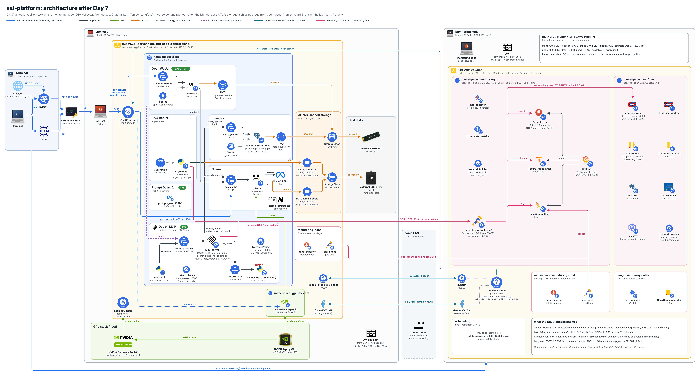

# ssi-platform: Tech study guide (what I built, and how I'd build it on Azure and AWS)

Last updated: Day 8 complete (2026-10-05); app namespace si-lab

The lab runs on three machines. The terminal is where I run kubectl, helm, git and the browser. The lab host has the GPU and is the k3s control plane. The monitoring node is a CPU-only k3s agent that runs the observability stack. Together they serve a local RAG pipeline and an MCP server (notes search plus a mock Dynamics 365 Finance and Operations OData tool). Metrics, traces, logs and LLM traces are collected for every request, and a Prompt Guard 2 classifier is deployed as the prompt-injection guardrail.

How to use this page: the inventory answers "what is running where". Each deep dive gives a 30-second answer, what I actually configured, the concepts people probe, and how I would build the same thing on Azure and AWS, with a link to the official documentation for each mapping. Day 8 is deployed: Tailscale private Ingress, Prompt Guard in the Open WebUI and mcp-server path, and GHCR-pinned app images. The app namespace is `si-lab`.

## Architecture summary



- **Terminal.** kubectl and helm reach the k3s API through an SSH local port forward. Browser UIs (Open WebUI, Grafana, Langfuse) are reached through `kubectl port-forward`. Day 8b replaced port-forward UIs with Tailscale private Ingress.
- **Lab host (node `gpu-node`).** k3s server, NVIDIA driver, Container Toolkit and device plugin. Namespace `si-lab` runs Ollama (GPU), pgvector, `rag-worker`, Open WebUI, `mcp-server`, `fo-mock` and `prompt-guard` (CPU).
- **Monitoring node (node `obs-node`).** k3s agent, labelled and tainted `ailab/role=observability:NoSchedule`. Runs kube-prometheus-stack, Grafana, the OpenTelemetry Collector gateway, Langfuse (with ClickHouse, Postgres, Valkey, SeaweedFS), Loki and Tempo. About 3 GiB of RAM for the whole stack, measured.
- **Request path.** Open WebUI or `ask.py` embeds the question with `nomic-embed-text` in Ollama, retrieves the top chunks from pgvector, and generates the answer with `llama3.2:3b`. MCP clients call `mcp-server`, which runs the same retrieval (`search_notes`) or queries `fo-mock` over OData. Every service exports OTLP to the collector, which fans out to Prometheus, Tempo, Loki and Langfuse.

## Inventory

Status values: **deployed** (running on the cluster), **planned** (named in the docs as a later step).

### Host and GPU

| Software | What it does | Runs on (machine, namespace) | Version | Added (Day N) | Status |
|---|---|---|---|---|---|
| Ubuntu LTS | Operating system for both nodes | Lab host, monitoring node | 26.04.1 LTS, kernel 7.0.0-34-generic | Day 1 (lab host), Day 6b (monitoring node) | deployed |
| OpenSSH server | Key-only SSH (Ed25519), password and keyboard-interactive auth off | Lab host, monitoring node | not recorded | Day 1, Day 6b | deployed |
| ufw | Host firewall: deny incoming, allow SSH, k3s ports only between the two nodes | Lab host, monitoring node | not recorded | Day 1, rules extended Day 6b | deployed |
| fail2ban | Bans IPs after repeated SSH failures (sshd jail) | Lab host, monitoring node | not recorded | Day 1, Day 6b | deployed |
| unattended-upgrades | Automatic security updates | Lab host, monitoring node | not recorded | Day 1, Day 6b | deployed |
| NVIDIA driver | GPU kernel driver (4 GB laptop GPU) | Lab host | 595.91.07 (CUDA 13.2) | Day 2 | deployed |
| NVIDIA Container Toolkit | Adds the `nvidia` runtime to k3s containerd | Lab host | not recorded | Day 2 | deployed |
| NVIDIA device plugin | Advertises `nvidia.com/gpu` to the kubelet | Lab host, `gpu-system` | Helm chart `nvdp/nvidia-device-plugin`, version not recorded | Day 2 | deployed |

### Kubernetes platform

| Software | What it does | Runs on (machine, namespace) | Version | Added (Day N) | Status |
|---|---|---|---|---|---|
| k3s server | Kubernetes distribution: API server, scheduler, datastore, kubelet | Lab host (node `gpu-node`, control plane) | v1.36.4+k3s1 | Day 2 | deployed |
| k3s agent | Worker node (kubelet, containerd, flannel) | Monitoring node (node `obs-node`) | v1.36.4+k3s1 | Day 6b | deployed |
| containerd | Container runtime (bundled with k3s) | Both nodes | 2.3.4-k3s1.36 | Day 2 | deployed |
| flannel (VXLAN) | Pod network between nodes (bundled with k3s) | Both nodes | bundled, not recorded separately | Day 2, cross-node Day 6b | deployed |
| CoreDNS, metrics-server, local-path provisioner | Cluster DNS, resource metrics, node-local dynamic volumes (bundled with k3s) | Lab host, `kube-system` | bundled, not recorded separately | Day 2 | deployed |
| k3s network policy controller | Enforces Kubernetes NetworkPolicy (embedded in k3s) | Both nodes | bundled | Day 6 (first policies) | deployed |
| Pod Security Admission | Namespace-level pod security levels (`baseline`, `privileged`) | All app namespaces | built into Kubernetes | Day 2 | deployed |
| Helm | Package manager for all Day 2 and Day 7 charts | Terminal | not recorded (Day 7 requires v3.17 or newer) | Day 2 | deployed |

### AI and data

| Software | What it does | Runs on (machine, namespace) | Version | Added (Day N) | Status |
|---|---|---|---|---|---|
| Ollama | Local LLM and embedding server on the GPU | Lab host, `si-lab` | image `ollama/ollama:latest` (moving tag); 0.34.4 used for the Day 8a keep-alive tests | Day 3 | deployed |
| llama3.2:3b | Chat model (2.6 GB loaded, 100 % GPU, about 72 tokens/s) | Lab host, `si-lab` (inside Ollama) | model tag `llama3.2:3b` | Day 3 | deployed |
| nomic-embed-text | Embedding model, 768 dimensions (274 MB) | Lab host, `si-lab` (inside Ollama) | model tag `nomic-embed-text` | Day 4 | deployed |
| PostgreSQL + pgvector | Vector store for the RAG chunks | Lab host, `si-lab` (StatefulSet `pgvector`) | Postgres 17 (`pgvector/pgvector:pg17`), extension `vector` 0.8.6 | Day 4 | deployed |
| rag-worker (`ingest.py`, `ask.py`) | Chunks, embeds and loads notes; answers questions with retrieval | Lab host, `si-lab` | `python:3.12-slim` (Day 4); image on `python:3.12.14-slim-trixie` deployeda | Day 4 | deployed |
| Open WebUI | Chat UI over Ollama, with its own document RAG | Lab host, `si-lab` | v0.11.4 (pinned on Day 5; the Day 8b steps still name `:main`, confirm on the cluster) | Day 5 | deployed |
| mcp-server | MCP server (Streamable HTTP, `/mcp` on port 8000): `search_notes` and three read-only F&O tools | Lab host, `si-lab` | MCP Python SDK `mcp` 2.2.0, psycopg 3.3.6, requests 2.34.2 | Day 6 | deployed |
| fo-mock | Standard-library OData v4 mock of four F&O entities with fake demo data | Lab host, `si-lab` | Python standard library, no version recorded | Day 6 | deployed |

### AI safety

| Software | What it does | Runs on (machine, namespace) | Version | Added (Day N) | Status |
|---|---|---|---|---|---|
| Prompt Guard 2 (22M) service | Classifies text as benign or malicious (prompt injection, jailbreak); `POST /classify` on port 8080 | Lab host, `si-lab` (CPU only) | model `meta-llama/Llama-Prompt-Guard-2-22M`; torch 2.14.0+cpu, transformers 5.17.0, FastAPI 0.141.1, uvicorn 0.54.0 | Day 7 | deployed |
| Prompt Guard check in mcp-server | Classifies tool arguments before the tool runs and retrieved chunks before they are returned; fails closed | Lab host, `si-lab` | threshold 0.5 | Day 8b | deployed |
| Open WebUI Prompt Guard filter | Filter function (inlet) that classifies the user message before it reaches the model | Lab host, `si-lab` (inside Open WebUI) | `openwebui/prompt_guard_filter.py`, standard library only | Day 8b | deployed |

### Observability

| Software | What it does | Runs on (machine, namespace) | Version | Added (Day N) | Status |
|---|---|---|---|---|---|
| kube-prometheus-stack | Prometheus Operator, Prometheus, kube-state-metrics, node-exporter (Alertmanager disabled) | Monitoring node, `monitoring`; node-exporter on both nodes in `monitoring-host` | chart 91.5.3, Prometheus Operator v0.94.1; Prometheus version not recorded | Day 7 | deployed |
| Grafana | Dashboards and Explore over Prometheus, Loki and Tempo | Monitoring node, `monitoring` | Grafana 13.2.2 (subchart 13.2.5) | Day 7 | deployed |
| OpenTelemetry Collector (gateway) | Receives OTLP, batches and routes metrics, traces and logs | Monitoring node, `monitoring` | chart 0.173.1, `otel/opentelemetry-collector-k8s` 0.160.0 | Day 7 | deployed |
| otel-agent (collector DaemonSet) | Tails pod logs from `/var/log/pods` on each node and forwards them to the gateway | Both nodes, `monitoring-host` (privileged) | chart 0.173.1, collector 0.160.0 | Day 7 | deployed |
| OpenTelemetry Python zero-code instrumentation | Auto-instruments `mcp-server` and `rag-worker` (Starlette, requests, psycopg) | Lab host, `si-lab` (inside the apps) | opentelemetry-distro 0.65b0, OTLP/HTTP exporter 1.44.0 | Day 7 | deployed |
| Langfuse | LLM tracing: traces, generations, token usage, guardrail observations | Monitoring node, `langfuse` | chart 2.1.2, Langfuse 4.38.0 | Day 7 | deployed |
| Langfuse dependencies | ClickHouse (with Keeper), PostgreSQL, Valkey, SeaweedFS (S3-compatible) | Monitoring node, `langfuse` | ClickHouse 26.4, Postgres 18, Valkey 8.0, SeaweedFS not recorded | Day 7 | deployed |
| cert-manager | Issues the certificates the ClickHouse operator's webhook needs | Monitoring node, `cert-manager` | v1.20.2 | Day 7 | deployed |
| ClickHouse operator | Runs ClickHouse and Keeper for Langfuse | Monitoring node, `clickhouse-operator` | 0.0.5 | Day 7 | deployed |
| Loki | Log store (monolithic, filesystem, 48 h) | Monitoring node, `monitoring` | chart 18.13.5 (grafana-community), Loki 3.7.8 | Day 7 | deployed |
| Tempo | Trace store (monolithic, 48 h) | Monitoring node, `monitoring` | chart 3.0.0 (grafana-community), Tempo 3.0.3 | Day 7 | deployed |
| Langfuse generation attributes and `rag-ask` root span | `gen_ai.*` attributes so Langfuse shows generations; one root span per `ask.py` run | Lab host, `si-lab` | same OpenTelemetry versions | Day 8b | deployed |

### Delivery (ALM)

| Software | What it does | Runs on (machine, namespace) | Version | Added (Day N) | Status |
|---|---|---|---|---|---|
| Git and a GitHub repository | Source of truth for manifests, app code and docs (MIT license) | Terminal, GitHub | Git not recorded | Day 8a | deployed |
| GitHub Actions | Reusable workflow `_build-image.yml` plus one caller per app (`rag-worker`, `mcp-server`, `prompt-guard`) | GitHub-hosted runners | actions/checkout v7, docker/setup-buildx-action v4, docker/login-action v4, docker/metadata-action v6, docker/build-push-action v7 | Day 8a | deployed |
| GitHub Container Registry (GHCR) | Stores the three app images, tagged with the 7-character commit SHA and `latest` | GitHub | n/a (service) | Day 8a | deployed |
| Dockerfiles for the three apps | Images on `python:3.12.14-slim-trixie`, UID 10001, packages installed at build time | GitHub Actions | base `python:3.12.14-slim-trixie` | Day 8a | deployed |
| `scripts/pin-images.sh` | Writes the SHA tag of each image into the Day 8 manifests after an anonymous pull check | Terminal | repo script | Day 8a | deployed |
| gitleaks | Secret scan of the repository before the first commit | Terminal | 8.30.1 (trufflehog 3.97.9 was also used for the pre-publication scan) | Day 8a | deployed |

### Access

| Software | What it does | Runs on (machine, namespace) | Version | Added (Day N) | Status |
|---|---|---|---|---|---|
| SSH local port forward | Carries kubectl and helm traffic from the terminal to the k3s API (port 6443 is not opened on the network) | Terminal to lab host | OpenSSH, not recorded | Day 2 | deployed |
| `kubectl port-forward` | Opens Open WebUI, Grafana, Langfuse (and optionally `mcp-server`) on the terminal | Terminal | kubectl 1.37 client | Day 5 | deployed |
| Tailscale clients | WireGuard-based tailnet for the terminal, phone and both nodes (`--accept-dns=false`) | Terminal, phone, lab host, monitoring node | not recorded | Day 8b | deployed |
| Tailscale Kubernetes operator | Publishes Open WebUI, Grafana and Langfuse as tailnet-only HTTPS Ingresses with Let's Encrypt certificates | Lab host, `tailscale` (privileged) | Helm chart `tailscale/tailscale-operator` 1.102.4 | Day 8b | deployed |

### Terminal tools

| Software | What it does | Runs on (machine, namespace) | Version | Added (Day N) | Status |
|---|---|---|---|---|---|
| kubectl | Kubernetes CLI (1.37 client against a 1.36 server is within the supported skew) | Terminal | 1.37 | Day 2 | deployed |
| helm | See the Kubernetes platform table | Terminal | not recorded | Day 2 | deployed |
| GitHub CLI (`gh`) | Creates the repository, sets package visibility, watches workflow runs | Terminal | 2.101.0 | Day 8a | deployed |
| Homebrew | Package manager on the terminal: kubectl and helm (Day 2), `gh` and `gitleaks` (Day 8a), the Tailscale app (Day 8b) | Terminal | not recorded | Day 2 | deployed |
| zsh | Shell on the terminal; `setopt interactivecomments` added on Day 5 so pasted blocks with comments run cleanly | Terminal | not recorded | Day 1 (option added Day 5) | deployed |
| Cursor | Optional MCP client for `mcp-server` through a port-forward | Terminal | not recorded | Day 6 (optional) | planned |

## Deep dives

Each section follows the same order: in 30 seconds, what I configured and why, key concepts, on Azure, on AWS, questions you might get, production differences.

## Layer 1: Host and GPU

### 1. Host hardening (Ubuntu, OpenSSH, ufw, fail2ban, unattended-upgrades)

**In 30 seconds.** Before installing Kubernetes I set a host baseline on both nodes: automatic security updates, a default-deny firewall, fail2ban on SSH, and key-only SSH. Kubernetes security sits on top of the host, so a weak host undoes everything above it. The same baseline was repeated on the monitoring node when it joined on Day 6b.

**What I configured and why.**
- unattended-upgrades enabled through `dpkg-reconfigure`, so security patches install without me.
- ufw: deny incoming, allow outgoing, allow OpenSSH. On Day 6b I opened only the k3s ports between the two nodes (6443/tcp API, 8472/udp flannel VXLAN, 10250/tcp kubelet, 9100/tcp node-exporter), scoped to the two node addresses. On Day 6, port 3000 for the Open WebUI LAN port-forward was limited to the home subnet.
- fail2ban with the sshd jail.
- SSH: Ed25519 keys only. A drop-in file, `/etc/ssh/sshd_config.d/99-lab-hardening.conf`, sets `PasswordAuthentication no` and `KbdInteractiveAuthentication no`. A drop-in survives package upgrades of the main config file.
- The "two-window rule": keep one SSH session open while testing the new config in a second window, so a mistake cannot lock me out.

**Key concepts to know.**
- Order of `sshd_config` processing: the first value obtained for a keyword wins, which is why a drop-in included at the top of the main file takes effect.
- ufw is a front end for nftables/iptables. Kubernetes and flannel also write rules, so host-firewall changes on a node need testing against pod traffic.
- fail2ban reads auth logs and adds temporary ban rules; with key-only SSH it mostly reduces log noise and brute-force load.
- Unattended upgrades patch packages but do not reboot by default, so a kernel fix is not active until the next reboot.

**On Azure.** For VMs: network security groups for L3/L4 filtering ([NSG](https://learn.microsoft.com/en-us/azure/virtual-network/network-security-groups-overview)), Azure Firewall for central egress control ([Azure Firewall](https://learn.microsoft.com/en-us/azure/firewall/overview)), Azure Bastion instead of public SSH ([Bastion](https://learn.microsoft.com/en-us/azure/bastion/bastion-overview)), and Azure Update Manager for patching ([Update Manager](https://learn.microsoft.com/en-us/azure/update-manager/overview)). For AKS nodes, the node OS image auto-upgrade channel replaces unattended-upgrades ([node OS auto-upgrade](https://learn.microsoft.com/en-us/azure/aks/auto-upgrade-node-os-image)), and node access is through `kubectl debug` or Bastion rather than open SSH ([connect to AKS nodes](https://learn.microsoft.com/en-us/azure/aks/node-access)). IaC: NSGs, Bastion and maintenance configurations in Bicep or Terraform.

**On AWS.** Security groups ([security groups](https://docs.aws.amazon.com/vpc/latest/userguide/vpc-security-groups.html)), AWS Network Firewall for egress ([Network Firewall](https://docs.aws.amazon.com/network-firewall/latest/developerguide/what-is-aws-network-firewall.html)), Systems Manager Session Manager instead of SSH ([Session Manager](https://docs.aws.amazon.com/systems-manager/latest/userguide/session-manager.html)) and Patch Manager ([Patch Manager](https://docs.aws.amazon.com/systems-manager/latest/userguide/patch-manager.html)). EKS managed node groups are replaced by new AMIs rather than patched in place ([managed node groups](https://docs.aws.amazon.com/eks/latest/userguide/managed-node-groups.html)).

**Questions you might get.**
- *Why harden the host if Kubernetes has its own security?* Pod isolation depends on the kernel, containerd and the kubelet. An attacker with a shell on the node bypasses PSA and NetworkPolicy, so the host is the first boundary.
- *How do you avoid locking yourself out when changing SSH?* Validate with `sshd -t`, keep an existing session open, test in a second session, and only then close the first.
- *What replaces SSH in the cloud?* Bastion or Session Manager, with identity-based access and session logging, and no inbound port 22.

**Production differences.**
- Node images are immutable and rebuilt, not patched by hand; drift is detected by policy (for example Microsoft Defender for Cloud or AWS Systems Manager compliance).
- SSH keys give way to short-lived, identity-based access (Entra ID or IAM), with audit logs.

### 2. GPU stack (NVIDIA driver, Container Toolkit, device plugin, RuntimeClass)

**In 30 seconds.** Three pieces make a GPU usable from a pod. The driver runs on the host. The NVIDIA Container Toolkit gives containerd an `nvidia` runtime that injects the driver libraries and device files into containers. The device plugin tells the kubelet how many GPUs the node has, so the scheduler can place pods that request `nvidia.com/gpu: 1`.

**What I configured and why.**
- NVIDIA driver 595.91.07 (CUDA 13.2) on a 4 GB laptop GPU in the lab host.
- NVIDIA Container Toolkit installed on the host. Restarting k3s makes k3s detect the toolkit and add the `nvidia` runtime to its own containerd config; I did not edit containerd by hand. A RuntimeClass named `nvidia` selects that runtime per pod.
- NVIDIA device plugin from the Helm chart `nvdp/nvidia-device-plugin` in namespace `gpu-system`, with `runtimeClassName=nvidia`. Chart version not recorded.
- The plugin's DaemonSet only schedules on nodes labelled `nvidia.com/gpu.present=true`. That label normally comes from GPU Feature Discovery, which I did not install, so I added it by hand.
- Smoke test: a pod with `nvidia/cuda:12.4.1-base-ubuntu22.04`, `runtimeClassName: nvidia` and one GPU ran `nvidia-smi` successfully.
- One GPU means one GPU pod at a time. The Ollama Deployment uses the `Recreate` strategy so a rollout never needs two GPUs.

**Key concepts to know.**
- Device plugins are the Kubernetes extension point for hardware; GPUs are extended resources, requested in `limits`, and not overcommitted.
- The container image carries the CUDA user-space libraries; the host driver must be new enough for that CUDA version (the CUDA 12.4 image ran on a CUDA 13.2 driver).
- RuntimeClass selects a runtime handler per pod; without it, the default runc runtime has no GPU access.
- The NVIDIA GPU Operator automates driver, toolkit, device plugin, feature discovery and DCGM exporter; I installed the pieces by hand to learn them.
- Sharing options when one GPU is not enough: time-slicing, MIG on data-center GPUs, or multiple models inside one server process (what Ollama does).

**On Azure.** An AKS-managed GPU node pool with an N-series VM size. Microsoft recommends this mode: AKS installs and maintains the NVIDIA driver, the device plugin and the DCGM metrics exporter. A self-managed mode (device plugin DaemonSet or the GPU Operator) exists for when you need control over those versions ([Use GPUs on AKS](https://learn.microsoft.com/en-us/azure/aks/use-nvidia-gpu)). MIG node pools split supported GPUs ([multi-instance GPU](https://learn.microsoft.com/en-us/azure/aks/gpu-multi-instance)). KAITO provisions GPU nodes automatically for model workspaces ([AI toolchain operator](https://learn.microsoft.com/en-us/azure/aks/ai-toolchain-operator)). Serverless option without node management: Azure Container Apps serverless GPUs, NVIDIA T4 or A100 ([serverless GPUs](https://learn.microsoft.com/en-us/azure/container-apps/gpu-serverless-overview)). IaC: the node pool (VM size, taint `sku=gpu:NoSchedule`, autoscaler bounds) in Bicep or Terraform; check GPU quota per region first.

**On AWS.** EKS with the EKS-optimized accelerated AMI, which includes the NVIDIA driver and container toolkit ([accelerated AMIs](https://docs.aws.amazon.com/eks/latest/userguide/ml-eks-optimized-ami.html)); the device plugin is installed separately or by the GPU Operator. EKS Auto Mode can provision GPU instances on demand ([EKS Auto Mode](https://docs.aws.amazon.com/eks/latest/userguide/automode.html)). See the EKS AI/ML best practices ([AI/ML best practices](https://docs.aws.amazon.com/eks/latest/best-practices/aiml.html)).

**Questions you might get.**
- *A pod requests a GPU and stays Pending. Where do you look?* `kubectl describe node` for `nvidia.com/gpu` under Allocatable. If it is missing, the device plugin is not running on that node (in my case, the missing `nvidia.com/gpu.present` label) or the runtime is not configured.
- *Why not put the GPU runtime as the default for all pods?* Only GPU pods need it; a RuntimeClass keeps the blast radius small and makes the dependency explicit in the manifest.
- *How do you share one GPU?* Time-slicing (no memory isolation), MIG (hardware isolation, specific GPUs only), or one inference server hosting several models, which is what I do with Ollama.

**Production differences.**
- Use the GPU Operator or the managed add-on, so driver and toolkit versions are upgraded together with the node image.
- Taint GPU pools so only GPU workloads land there, and scale them to zero when idle; GPU hours dominate cost.
- Export GPU metrics with the DCGM exporter to Prometheus; the lab does not collect GPU metrics yet.

## Layer 2: Kubernetes platform

### 3. k3s (control plane, containerd, flannel, bundled add-ons)

**In 30 seconds.** k3s is a CNCF-certified Kubernetes distribution packaged as one binary and one systemd service. It bundles containerd, flannel, CoreDNS, metrics-server, the local-path provisioner and a network policy controller. I chose it because it is conformant Kubernetes with a small footprint on a 16 GB machine, and everything I learn transfers to AKS and EKS.

**What I configured and why.**
- k3s v1.36.4+k3s1 installed with `--write-kubeconfig-mode 600` (kubeconfig readable only by root), `--secrets-encryption` (Secrets encrypted at rest in the datastore) and `--disable traefik` (no ingress controller until I need one).
- kube-system runs CoreDNS, the local-path provisioner and metrics-server.
- Namespaces: `si-lab` for the apps (PSA `baseline`) and `gpu-system` for the device plugin.
- The API is reached from the terminal through an SSH local port forward to the API server's loopback port, so port 6443 is never exposed to the network. kubectl 1.37 against a 1.36 server is within the one-minor-version client skew.
- Day 6b added the monitoring node as a k3s agent, not a second server (see section 4).

Lab host

```bash
curl -sfL https://get.k3s.io | sh -s - --write-kubeconfig-mode 600 --secrets-encryption --disable traefik
```

**Key concepts to know.**
- Control plane components (API server, scheduler, controller manager) and the datastore run inside the k3s server process. A single server has no control-plane HA; HA needs three servers with embedded etcd, or an external datastore.
- The kubelet and containerd run on every node; flannel VXLAN encapsulates pod traffic between nodes (UDP 8472).
- Secrets encryption at rest protects the datastore file and backups; it does not protect Secrets from anyone with RBAC read access.
- Version skew rules: kubectl within one minor version of the API server; kubelets may be older than the API server, never newer.
- Tradeoff against kubeadm: kubeadm gives you the upstream components as separate static pods and more control over each; k3s trades that for one binary and bundled defaults. The lab docs record the k3s choice, not a formal kubeadm comparison.

**On Azure.** AKS: Microsoft runs the control plane; you manage node pools ([What is AKS?](https://learn.microsoft.com/en-us/azure/aks/what-is-aks)). Private cluster so the API server has no public endpoint ([private AKS](https://learn.microsoft.com/en-us/azure/aks/private-clusters)), Entra ID integration with Kubernetes RBAC, Azure CNI Overlay for pod networking ([CNI Overlay](https://learn.microsoft.com/en-us/azure/aks/azure-cni-overlay)). Follow the AKS baseline architecture ([AKS baseline](https://learn.microsoft.com/en-us/azure/architecture/reference-architectures/containers/aks/baseline-aks)). IaC: Bicep (AVM modules) or Terraform `azurerm_kubernetes_cluster`. Identity: cluster managed identity for Azure resources, workload identity for pods.

**On AWS.** EKS ([What is EKS?](https://docs.aws.amazon.com/eks/latest/userguide/what-is-eks.html)) with a private API endpoint ([cluster endpoint access](https://docs.aws.amazon.com/eks/latest/userguide/cluster-endpoint.html)), managed node groups or Auto Mode, the VPC CNI for pod networking. IaC: Terraform, CloudFormation ([CloudFormation](https://docs.aws.amazon.com/AWSCloudFormation/latest/UserGuide/Welcome.html)) or CDK ([CDK](https://docs.aws.amazon.com/cdk/v2/guide/home.html)).

**Questions you might get.**
- *Why k3s and not kubeadm or a managed service?* It is conformant Kubernetes in one service with low memory use, which matters on a 16 GB lab host that also runs a GPU workload. Manifests and Helm charts run unchanged on AKS or EKS.
- *Is a single k3s server production-ready?* No. It is a single point of failure for the API and datastore. Running pods keep running if the server stops, but nothing can be scheduled or changed.
- *Why disable Traefik?* Nothing needed ingress on Day 2, and fewer components means less to patch. Day 8b uses the Tailscale operator for ingress instead.

**Production differences.**
- Managed control plane with an SLA, or three k3s servers with embedded etcd and backups of the datastore.
- API server private, access through Entra ID or IAM with short-lived credentials, not a copied kubeconfig.
- Cluster upgrades on a schedule with maintenance windows and surge node pools.

### 4. Second node, labels and taints (monitoring node)

**In 30 seconds.** The monitoring node is a CPU-only k3s agent. I labelled and tainted it `ailab/role=observability:NoSchedule`, so only pods that tolerate the taint and select the label run there. That keeps the observability stack off the GPU node, and keeps application pods off the monitoring node.

**What I configured and why.**
- Joined as an agent with a one-hour bootstrap token (`k3s token create --ttl 1h`) instead of the permanent server token, so a leaked join command expires.
- Agent, not a second server: two servers cannot form an etcd quorum (that takes three), and the goal was capacity, not HA.
- The node connects over Wi-Fi; flannel VXLAN runs over it. ufw on both nodes opens 6443, 8472/udp, 10250 and 9100 only between the two node addresses.
- Label and taint `ailab/role=observability:NoSchedule`. Every Day 7 chart sets a `nodeSelector` for the label and a matching toleration. node-exporter and otel-agent are DaemonSets that run on both nodes.
- Result: about 3 GiB of RAM used by the whole observability stack on a 16 GB node, measured with `kubectl top` and `free -m`.

Terminal

```bash
kubectl label node obs-node ailab/role=observability
kubectl taint node obs-node ailab/role=observability:NoSchedule
```

**Key concepts to know.**
- A taint repels pods; a toleration only permits scheduling there. To also attract pods, add a `nodeSelector` or node affinity. You need both to dedicate a node.
- `NoSchedule` affects new pods; `NoExecute` also evicts running pods without a toleration.
- DaemonSets that must run everywhere (log agents, node-exporter) need tolerations for every taint in use.
- Node labels under `node-role.kubernetes.io/` drive the ROLES column; custom labels show with `kubectl get nodes -L`.

**On Azure.** A dedicated AKS user node pool with `--labels` and `--node-taints` ([node taints](https://learn.microsoft.com/en-us/azure/aks/use-node-taints)); in Bicep, `nodeLabels` and `nodeTaints` on the agent pool. If you use managed Prometheus and Grafana, most of this node's workload moves out of the cluster.

**On AWS.** A managed node group with labels and taints ([taints on managed node groups](https://docs.aws.amazon.com/eks/latest/userguide/node-taints-managed-node-groups.html)), or a Karpenter NodePool with taints in Auto Mode.

**Questions you might get.**
- *Taint or nodeSelector?* Both. The taint keeps other pods off; the selector keeps the observability pods on. Either alone leaks.
- *Why a bootstrap token with a TTL?* The server token grants join rights forever. A one-hour token limits the window if the join command is copied somewhere.
- *What happens to monitoring if the monitoring node dies?* The apps keep running; telemetry is lost for that period because nothing buffers it outside the node. In production the collector would queue to persistent storage or send to a managed backend.

**Production differences.**
- System and user node pools separated, with the system pool tainted `CriticalAddonsOnly`.
- Monitoring backends moved to managed services, so the cluster only runs agents.

### 5. Workload security (Pod Security Admission, NetworkPolicy, restricted pods)

**In 30 seconds.** Three controls limit what a compromised pod can do. Pod Security Admission rejects pods that ask for host access or privileges beyond the namespace level. NetworkPolicies allow only the pod-to-pod connections the design needs. My own pods run as a non-root UID with a read-only root filesystem, no Linux capabilities and no service account token.

**What I configured and why.**
- PSA `baseline` on `si-lab` (since Day 2), `monitoring`, `langfuse`, `cert-manager` and `clickhouse-operator`. `privileged` on `monitoring-host` (node-exporter and otel-agent need host paths) and, for Day 8b, `tailscale` (deployed). `gpu-system` has no PSA label because the device plugin needs host access.
- Baseline rejects inline `hostPath` volumes. That is why the Ollama models and RAG notes use static PersistentVolumes bound through PVCs (section 6).
- NetworkPolicies, enforced by the network policy controller embedded in k3s: `fo-mock-allow-mcp-server` (only `mcp-server` can reach the mock), `mcp-server-allow-si-lab`, `prompt-guard-allow-si-lab`, and for Day 7 `otel-collector-ingress`, `loki-ingress`, `tempo-ingress`, `langfuse-same-namespace`, `langfuse-web-ingress`. Day 8b adds `langfuse-web-from-tailscale` (deployed). `pgvector-allow-clients` is written but left for phase 2.
- Pods I wrote (`mcp-server`, `fo-mock`, the Day 8a images) meet the `restricted` standard: UID 10001, `readOnlyRootFilesystem: true`, all capabilities dropped, `seccompProfile: RuntimeDefault`, `automountServiceAccountToken: false`.
- Secrets are generated inside the cluster or with `openssl rand` piped into `kubectl create secret`, never printed. The Hugging Face token Secret was deleted after the model download on Day 7.

**Key concepts to know.**
- PSA levels: `privileged`, `baseline` (blocks known privilege escalations: hostPath, hostNetwork, privileged containers), `restricted` (adds non-root, dropped capabilities, seccomp). Modes: `enforce`, `audit`, `warn`.
- NetworkPolicy is additive allow-lists: once any policy selects a pod for ingress, all other ingress to that pod is denied. Egress is only restricted if a policy lists `Egress`.
- A NetworkPolicy object does nothing without a CNI or controller that enforces it; k3s embeds one, AKS and EKS require you to enable one.
- `kubectl port-forward` goes through the kubelet, so it is not subject to NetworkPolicy in the same way as pod traffic.

**On Azure.** PSA works the same on AKS ([PSA on AKS](https://learn.microsoft.com/en-us/azure/aks/use-psa)); Azure Policy for AKS adds organization-wide guardrails. Network policy engines: Azure Network Policy Manager, Calico, or Cilium ([network policies on AKS](https://learn.microsoft.com/en-us/azure/aks/use-network-policies)). Secrets: Key Vault through the Secrets Store CSI driver with workload identity ([Key Vault CSI](https://learn.microsoft.com/en-us/azure/aks/csi-secrets-store-driver), [workload identity](https://learn.microsoft.com/en-us/azure/aks/workload-identity-overview)). Runtime threat detection: Defender for Containers ([Defender for Containers](https://learn.microsoft.com/en-us/azure/defender-for-cloud/defender-for-containers-introduction)).

**On AWS.** PSA is upstream Kubernetes and works on EKS. Network policies through the VPC CNI ([EKS network policies](https://docs.aws.amazon.com/eks/latest/userguide/cni-network-policy.html)). Secrets Manager through the ASCP CSI provider ([ASCP](https://docs.aws.amazon.com/secretsmanager/latest/userguide/integrating_ascp_irsa.html)) with EKS Pod Identity or IRSA ([Pod Identity](https://docs.aws.amazon.com/eks/latest/userguide/pod-identities.html)). Runtime detection: GuardDuty Runtime Monitoring ([GuardDuty](https://docs.aws.amazon.com/guardduty/latest/ug/runtime-monitoring.html)).

**Questions you might get.**
- *Why not `restricted` on `si-lab`?* The namespace was set to `baseline` on Day 2, before the workloads existed. The pods I wrote from Day 6 on meet `restricted`. The next step is to add `warn=restricted` to see which upstream pods (Ollama, pgvector, Open WebUI) would fail, then decide whether to fix or keep them at `baseline`.
- *How do you know a NetworkPolicy works?* Test the denied path: a pod without the allowed label tries to reach `fo-mock` and times out, while `mcp-server` succeeds.
- *Where do secrets live?* In Kubernetes Secrets, encrypted at rest by k3s, created without echoing them. In the cloud, the source of truth is Key Vault or Secrets Manager and pods read them through the CSI driver.

**Production differences.**
- Default-deny ingress and egress per namespace, then explicit allows, including egress to DNS.
- Admission policy (Azure Policy, Kyverno or Gatekeeper) to require resource limits, signed images and approved registries.
- Secrets from a vault with rotation, never stored as Kubernetes Secrets in Git.

### 6. Storage (local-path, static hostPath PersistentVolumes)

**In 30 seconds.** Two kinds of storage are used. The k3s local-path provisioner creates a directory on the node's NVMe disk for each PVC; it is dynamic but node-bound. For data that already exists on an external USB drive (models and notes), I created static PersistentVolumes pointing at that path and bound them through PVCs.

**What I configured and why.**
- `ollama-models-pv`: static hostPath PV, 200Gi, `Retain`, storage class name `ailab-external`, type `Directory`, on the exFAT external drive. `Retain` means deleting the PVC never deletes the models.
- `rag-docs-pv`: static hostPath PV for the notes that `ingest.py` reads.
- pgvector uses a 10Gi local-path PVC on the NVMe disk, not the exFAT drive, because Postgres needs working `fsync` and POSIX file ownership, which exFAT does not provide.
- Open WebUI keeps its SQLite database on a 5Gi local-path PVC. Prompt Guard caches the model on a 3Gi PVC.
- The observability PVCs add up to about 41 GiB on the monitoring node. local-path does not enforce PVC sizes, so disk use is watched with `df -h`. Grafana has no PVC.

**Key concepts to know.**
- Static vs dynamic provisioning; `storageClassName` as the binding key; reclaim policies `Retain` and `Delete`.
- Access modes (`ReadWriteOnce` binds to one node). local-path volumes pin the pod to the node that holds the data.
- Filesystem semantics matter for databases: fsync, ownership and permissions.
- A StatefulSet gives stable identity and one PVC per replica through `volumeClaimTemplates`.

**On Azure.** Azure Disk CSI (Premium SSD v2 for databases) and Azure Files CSI for shared read-only content ([AKS storage concepts](https://learn.microsoft.com/en-us/azure/aks/concepts-storage), [Azure Disk PVs](https://learn.microsoft.com/en-us/azure/aks/create-volume-azure-disk)). Model files: bake into the image, pull from Blob storage at start, or let KAITO manage model images; artifact streaming reduces pull time for large images ([artifact streaming](https://learn.microsoft.com/en-us/azure/aks/artifact-streaming)).

**On AWS.** EBS CSI for block volumes ([EBS CSI](https://docs.aws.amazon.com/eks/latest/userguide/ebs-csi.html)), EFS for shared files, S3 for model artifacts.

**Questions you might get.**
- *Why not keep Postgres on the USB drive with the models?* exFAT has no Unix ownership and weak fsync guarantees; Postgres needs both for durability.
- *Why a PV and PVC instead of an inline hostPath?* PSA `baseline` rejects inline hostPath. A PV created by an admin keeps the host path out of the application manifest.
- *What happens if the lab host dies?* Local volumes are lost with the node. Backups would need `pg_dump` or volume snapshots, which the lab does not do yet.

**Production differences.**
- Managed databases instead of in-cluster Postgres for anything stateful that matters.
- Zone-redundant disks or storage, snapshots and tested restores.

### 7. Helm

**In 30 seconds.** Helm packages Kubernetes manifests as versioned charts with a values file. Every third-party component in the lab is a Helm release: the device plugin (Day 2), kube-prometheus-stack, OpenTelemetry Collector, cert-manager, ClickHouse operator, Langfuse, Loki and Tempo (Day 7), and the Tailscale operator (Day 8b, deployed).

**What I configured and why.**
- From Day 7 on, every install is `helm upgrade -i` with a pinned `--version` and a values file kept in `k8s/`, so it is reproducible. The Day 2 device plugin chart version was not recorded, which is the gap this fixed.
- Day 7 required Helm v3.17 or newer (Langfuse chart requirement); Helm 4 is accepted.
- cert-manager and the ClickHouse operator come from OCI registries; the Grafana community charts moved to the `grafana-community` repository in 2026, so Loki and Tempo come from there.
- The collector is upgraded in stages by layering values files (`-f base -f stage-b` or `-f stage-c`).
- Before the Day 7 installs, the charts were rendered with `helm template` and the output checked with `kubeconform -strict`.

**Key concepts to know.**
- Release, revision, `helm rollback`; values precedence (later `-f` files override earlier ones).
- Hooks (pre-install Jobs) and CRDs: CRDs are installed once and not upgraded by default in Helm 3.
- `helm upgrade -i --wait` for idempotent installs; `helm diff` or `helm template` for review in CI.

**On Azure.** Helm works unchanged on AKS ([Helm on AKS](https://learn.microsoft.com/en-us/azure/aks/kubernetes-helm)); for GitOps, the Flux v2 cluster extension reconciles charts from Git ([GitOps with Flux v2](https://learn.microsoft.com/en-us/azure/azure-arc/kubernetes/conceptual-gitops-flux2)).

**On AWS.** Helm on EKS ([Helm on EKS](https://docs.aws.amazon.com/eks/latest/userguide/helm.html)); Argo CD is available as a managed EKS capability ([Argo CD on EKS](https://docs.aws.amazon.com/eks/latest/userguide/argocd.html)).

**Questions you might get.**
- *How do you keep Helm installs reproducible?* Pin the chart version, commit the values file, and install from CI or a GitOps controller.
- *Helm or Kustomize?* Helm for third-party software with many options; plain manifests or Kustomize for my own apps. The lab uses Helm for vendors and plain YAML for its own services.

**Production differences.**
- Helm releases reconciled by Flux or Argo CD from Git, not run by hand from a laptop.
- Chart and image versions bumped by pull requests (for example Renovate or Dependabot) with a rendered diff.

## Layer 3: AI and data

### 8. Ollama (model serving on the GPU)

**In 30 seconds.** Ollama is an inference server for open-weight models. It loads GGUF model files onto the GPU, serves a REST API for chat, generate and embeddings, and loads and unloads models on demand. In the lab it serves both the chat model `llama3.2:3b` and the embedding model `nomic-embed-text` from one pod on a 4 GB GPU.

**What I configured and why.**
- Deployment in `si-lab`, image `ollama/ollama:latest`, `runtimeClassName: nvidia`, `nvidia.com/gpu: 1`, strategy `Recreate` (one GPU cannot hold two pods during a rolling update).
- Environment: `OLLAMA_HOST` set to listen on all interfaces on port 11434 inside the pod, `OLLAMA_MODELS=/models`, `OLLAMA_KEEP_ALIVE=10m`.
- Models on the static PV `ollama-models-pv` (external drive, `Retain`), so a pod restart does not download them again.
- ClusterIP Service on port 11434; nothing outside the cluster can call it.
- Measured on Day 3: `llama3.2:3b` 2.6 GB loaded, 100 % on the GPU, about 72 tokens per second. With `nomic-embed-text` loaded too, about 3.2 GB of the 4 GB VRAM is used.
- Day 7 finding: the p95 latency of Ollama calls was about 4.3 s while p50 was about 9 ms. The cause was one cold reload of the embedding model after the 10-minute keep-alive expired, in a small sample.
- Day 8a fix (deployed): embedding calls send `keep_alive: "-1m"` (setting `EMBED_KEEP_ALIVE`), which pins `nomic-embed-text` in memory. Chat models keep the 10-minute default. A global `OLLAMA_KEEP_ALIVE=-1` was rejected because it would pin a 2.6 to 3.5 GB chat model on a 4 GB card. Tested with Ollama 0.34.4: when a chat model needs room, Ollama still unloads the pinned embedding model, and the next embedding call pins it again. The string `"-1"` without a unit is rejected.

Terminal

```bash
kubectl -n si-lab exec deploy/rag-worker -- python -c 'import requests; r = requests.post("http://ollama.si-lab.svc.cluster.local:11434/api/embed", json={"model": "nomic-embed-text", "input": [], "keep_alive": "-1m"}, timeout=120); print(r.status_code, r.json().get("model"))'
```

**Key concepts to know.**
- Quantization (GGUF, 4-bit and 8-bit variants) trades a little quality for a much smaller memory footprint; VRAM, not compute, is usually the limit.
- KV cache and context length consume VRAM on top of the weights; a larger context window can push a model partly onto the CPU.
- Cold start: loading weights from disk to VRAM takes seconds. Keep-alive and pre-warming trade memory for latency.
- Ollama serves one GPU per pod well; for high-throughput multi-user serving, vLLM (continuous batching, paged attention) is the usual choice, and it is what KAITO uses.
- The `:latest` tag moves. For reproducibility, pin a version tag or digest.

**On Azure.** Managed route: Microsoft Foundry (formerly Azure AI Foundry; Azure OpenAI resources can be upgraded to Foundry resources) with models sold by Azure, including Azure OpenAI models and open models such as Llama ([What is Microsoft Foundry?](https://learn.microsoft.com/en-us/azure/foundry/what-is-foundry), [Foundry Models](https://learn.microsoft.com/en-us/azure/foundry/concepts/foundry-models-overview), [models sold by Azure](https://learn.microsoft.com/en-us/azure/foundry/foundry-models/concepts/models-sold-directly-by-azure)). Embeddings from an Azure OpenAI embedding deployment. Self-host route: AKS with the AI toolchain operator add-on (KAITO), which provisions GPU nodes from a Workspace custom resource and serves models through vLLM with an OpenAI-compatible API ([KAITO on AKS](https://learn.microsoft.com/en-us/azure/aks/ai-toolchain-operator)); or Ollama itself on a GPU node pool or Azure Container Apps serverless GPUs ([serverless GPUs](https://learn.microsoft.com/en-us/azure/container-apps/gpu-serverless-overview)). IaC: Foundry account, project and model deployments in Bicep or Terraform (Microsoft's KAITO Terraform sample enables the add-on through the AzAPI provider). Identity: apps call Foundry with workload identity or managed identity and the Foundry User role, with key-based auth disabled.

**On AWS.** Managed: Amazon Bedrock for chat and embedding models ([Bedrock](https://docs.aws.amazon.com/bedrock/latest/userguide/what-is-bedrock.html)); SageMaker AI real-time endpoints for custom or open models ([real-time inference](https://docs.aws.amazon.com/sagemaker/latest/dg/realtime-endpoints.html)). Self-host: EKS GPU nodes with vLLM or Ollama. Identity: IAM role through EKS Pod Identity.

**Questions you might get.**
- *Why did p95 look bad when the service was fast?* p95 on a handful of requests is set by one outlier. The outlier was a cold model load; p50 was 9 ms. Fix the cause (keep-alive) and read percentiles with the sample count.
- *Ollama or vLLM?* Ollama for a single user and easy model management on small GPUs. vLLM for concurrent users and throughput. On AKS, KAITO wraps vLLM.
- *When would you self-host instead of using Foundry or Bedrock?* Data residency or network isolation requirements that a managed endpoint with private networking cannot meet, specific open models, or predictable high volume where reserved GPU capacity is cheaper. Otherwise the managed endpoint avoids GPU operations entirely.

**Production differences.**
- Pinned image and model versions; model files in object storage or images, not a USB drive.
- Horizontal scaling across GPU nodes with a gateway in front (APIM AI gateway or Application Gateway for Containers inference gateway on Azure).
- Token-level metrics and quotas per client.

### 9. PostgreSQL with pgvector (vector store)

**In 30 seconds.** pgvector adds a `vector` column type, distance operators and approximate nearest-neighbour indexes to PostgreSQL. The RAG chunks and their embeddings live in one table, so retrieval is a SQL query. Keeping vectors in Postgres means one database for text, metadata and embeddings, with normal backups and access control.

**What I configured and why.**
- StatefulSet `pgvector` with image `pgvector/pgvector:pg17` (Postgres 17, extension `vector` 0.8.6) in `si-lab`.
- PVC `data-pgvector-0`, 10Gi on local-path (NVMe), not on the exFAT drive.
- Password in Secret `pgvector-auth`, generated with `openssl rand` and never printed.
- Table `chunks` with an `embedding vector(768)` column (matches `nomic-embed-text`) and an HNSW index with `vector_cosine_ops`. Queries order by the cosine distance operator `<=>` and take the top 4.
- Day 6: a NetworkPolicy `pgvector-allow-clients` is written but deferred to phase 2.

**Key concepts to know.**
- Distance metrics: cosine (`<=>`), L2 (`<->`), inner product (`<#>`); the index operator class must match the operator used in the query, or the index is not used.
- HNSW (graph, better recall and latency, slower build, more memory) vs IVFFlat (clusters, faster build, needs training data); `ef_search` trades recall for speed at query time.
- Approximate search can miss results; filtering on metadata after the ANN step can return fewer than k rows (iterative scans in pgvector 0.8 address this).
- Embedding dimension is fixed by the model; changing models means re-embedding everything.
- Hybrid search (full-text plus vector) often beats vector-only for exact terms such as entity names or error codes.

**On Azure.** Azure Database for PostgreSQL flexible server with the `vector` extension: allow-list it in the `azure.extensions` server parameter, then `CREATE EXTENSION vector` ([pgvector on flexible server](https://learn.microsoft.com/en-us/azure/postgresql/extensions/how-to-use-pgvector), [allow extensions](https://learn.microsoft.com/en-us/azure/postgresql/extensions/how-to-allow-extensions)); DiskANN is an additional index option there ([DiskANN](https://learn.microsoft.com/en-us/azure/postgresql/extensions/how-to-use-pgdiskann)). Alternative: Azure AI Search, which adds hybrid search, semantic ranking, integrated vectorization and indexers that pull from Blob storage or SharePoint ([vector search](https://learn.microsoft.com/en-us/azure/search/vector-search-overview), [RAG in AI Search](https://learn.microsoft.com/en-us/azure/search/retrieval-augmented-generation-overview)). IaC: flexible server, `azure.extensions` parameter and private endpoint in Bicep or Terraform. Identity: Entra ID authentication to Postgres with a workload identity, no password.

**On AWS.** Aurora PostgreSQL or RDS for PostgreSQL with pgvector; Aurora can back a Bedrock knowledge base ([Aurora PostgreSQL as a knowledge base](https://docs.aws.amazon.com/AmazonRDS/latest/AuroraUserGuide/AuroraPostgreSQL.VectorDB.html)). Alternatives: OpenSearch Serverless vector collections ([vector search collections](https://docs.aws.amazon.com/opensearch-service/latest/developerguide/serverless-vector-search.html)) or S3 Vectors ([S3 Vectors](https://docs.aws.amazon.com/AmazonS3/latest/userguide/s3-vectors.html)). Identity: IAM database authentication.

**Questions you might get.**
- *pgvector or a dedicated vector database?* pgvector when the data is already relational and the corpus is in the millions of vectors or less; you get transactions, joins and one backup story. A search service when you need hybrid ranking, semantic reranking and managed ingestion connectors.
- *Why HNSW with cosine?* `nomic-embed-text` is used with cosine similarity, and HNSW gives good recall without a training step on a small, growing table.
- *How do you secure it?* Private network only, Entra ID or IAM auth, least-privilege roles (read-only for the retriever), and row-level security if tenants share a table.

**Production differences.**
- Managed Postgres with zone-redundant HA, point-in-time restore and private endpoints.
- Separate roles for ingestion (write) and retrieval (read-only).
- A metadata column for source, version and customer, used as a filter in every query.

### 10. RAG pipeline (rag-worker: `ingest.py` and `ask.py`)

**In 30 seconds.** Retrieval-augmented generation answers a question by first retrieving relevant text and then asking the model to answer from that text. `ingest.py` splits my notes into chunks, embeds each chunk and stores it in pgvector. `ask.py` embeds the question, retrieves the four nearest chunks and sends them with the question to `llama3.2:3b`.

**What I configured and why.**
- `rag-worker` pod in `si-lab`. Day 4: `python:3.12-slim` with a pip install at start, scripts from ConfigMap `rag-scripts`, notes from the static PV `rag-docs-pv`. Day 8a (deployed): a built image with the packages and scripts baked in, UID 10001, read-only root filesystem.
- Chunking by paragraph, at most 1,200 characters per chunk. 32 chunks from the notes.
- `nomic-embed-text` task prefixes: `search_document:` for chunks, `search_query:` for questions.
- Top 4 chunks, temperature 0.2.
- Results: correct answers, cosine distances 0.235 to 0.315 for the retrieved chunks.
- Lesson: some chunks mixed topics, which dilutes their embeddings; chunk size and overlap need tuning.
- Day 7: zero-code OpenTelemetry tracing. Day 8b (deployed): a root span `rag-ask` with child spans `ollama embed`, `pgvector search` and `ollama generate`, carrying `gen_ai.*` attributes so Langfuse shows the generation with model, input, output and token counts.

**Key concepts to know.**
- Chunking strategy (size, overlap, structure-aware splitting on headings) usually matters more than the choice of vector database.
- Asymmetric embedding models need the query and document prefixes; omitting them lowers retrieval quality.
- Evaluation: retrieval metrics (hit rate, MRR) and answer metrics (groundedness, relevance) on a fixed question set; without one, changes are guesswork.
- Reranking the top 20 to 50 candidates with a cross-encoder improves precision for a small latency cost.
- Retrieved text is untrusted input: it can carry indirect prompt injection (section 14).

**On Azure.** Azure AI Search as the retriever with integrated vectorization and indexers, a Foundry model for generation, and Foundry Agent Service or application code for orchestration ([RAG in AI Search](https://learn.microsoft.com/en-us/azure/search/retrieval-augmented-generation-overview), [indexers](https://learn.microsoft.com/en-us/azure/search/search-indexer-overview), [Foundry Agent Service](https://learn.microsoft.com/en-us/azure/foundry/agents/overview)). Design and evaluation guidance: [RAG solution design and evaluation guide](https://learn.microsoft.com/en-us/azure/architecture/ai-ml/guide/rag/rag-solution-design-and-evaluation-guide). Reference architecture: [baseline Microsoft Foundry chat](https://learn.microsoft.com/en-us/azure/architecture/ai-ml/architecture/baseline-microsoft-foundry-chat). The ingestion job itself can run as an AKS CronJob or a Container Apps job.

**On AWS.** Bedrock Knowledge Bases (managed chunking, embedding, storage and retrieval) ([Knowledge Bases](https://docs.aws.amazon.com/bedrock/latest/userguide/knowledge-base.html)); options compared in [RAG options on AWS](https://docs.aws.amazon.com/prescriptive-guidance/latest/retrieval-augmented-generation-options/introduction.html).

**Questions you might get.**
- *The answer was wrong. How do you debug RAG?* First check retrieval: were the right chunks in the top k (look at the retriever span and distances)? If not, fix chunking, prefixes or add hybrid search. If yes, fix the prompt or the model.
- *How big should chunks be?* Big enough to hold one complete idea, small enough that one chunk is about one topic. Start around a few hundred tokens with overlap, then measure on a question set.
- *How do you keep the index fresh?* Incremental ingestion keyed on a content hash and source ID, with deletes propagated, run on a schedule or on change events.

**Production differences.**
- Ingestion as a pipeline with change detection, not a manual script.
- Evaluation set and regression tests in CI for prompt, chunking and model changes.
- Access control on retrieval (security trimming by user or customer).

### 11. Open WebUI (chat interface)

**In 30 seconds.** Open WebUI is a self-hosted chat interface for Ollama and OpenAI-compatible APIs. It stores users, chats and settings, and has its own document upload and RAG. In the lab it is the interactive front end to the local models.

**What I configured and why.**
- Deployment in `si-lab`, one replica, `Recreate` (SQLite on a ReadWriteOnce volume cannot be shared by two pods). PVC `open-webui-data`, 5Gi local-path, mounted at `/app/backend/data`.
- `OLLAMA_BASE_URL` points at the in-cluster Ollama Service. `RAG_EMBEDDING_ENGINE=ollama`, `RAG_EMBEDDING_MODEL=nomic-embed-text`, so document RAG uses the same local embedding model. Telemetry off. `WEBUI_SECRET_KEY` from Secret `open-webui-secret`.
- Readiness probe on `/health`, `seccompProfile: RuntimeDefault`.
- Image pinned to `v0.11.4` on Day 5 because a custom CSS theme (ConfigMap `open-webui-theme`, mounted with `subPath`) depends on element IDs in the markup. The Day 8b steps still refer to the `:main` tag, so the running tag should be confirmed with kubectl before Day 8b.
- Open WebUI's built-in vector store defaults to Chroma; `VECTOR_DB=pgvector` is an option not used yet.
- Access: `kubectl port-forward` on port 3000, and on Day 6 a LAN port-forward with ufw allowing port 3000 only from the home subnet. Day 8b (deployed): a Tailscale Ingress with HTTPS.
- Day 8b (deployed): a Filter function that sends each user message to Prompt Guard (section 14).
- Phase 2: connect `mcp-server` as an external tool server (not done yet).

**Key concepts to know.**
- Single replica with SQLite is simple but not highly available; multi-replica needs PostgreSQL, shared storage for uploads and a shared secret key.
- `WEBUI_SECRET_KEY` signs session tokens; if it changes, all sessions are invalidated.
- Functions (filters with `inlet` and `outlet`, pipes, actions) run Python inside the Open WebUI process with its privileges; only admins should install them.
- Moving tags such as `:main` can change the UI and break CSS or docs without notice.

**On Azure.** Managed option: the Foundry portal playground covers testing, not an end-user chat app. Self-host: Open WebUI on Azure Container Apps or App Service with built-in Entra ID authentication ([Container Apps authentication](https://learn.microsoft.com/en-us/azure/container-apps/authentication), [App Service authentication](https://learn.microsoft.com/en-us/azure/app-service/overview-authentication-authorization)), Azure Database for PostgreSQL as its database, and a Foundry model as the backend.

**On AWS.** Self-host on ECS or EKS behind an Application Load Balancer with Amazon Cognito or OIDC authentication ([ECS](https://docs.aws.amazon.com/AmazonECS/latest/developerguide/Welcome.html), [AWS Load Balancer Controller](https://docs.aws.amazon.com/eks/latest/userguide/aws-load-balancer-controller.html)), with Bedrock as the model backend.

**Questions you might get.**
- *Why `Recreate` instead of `RollingUpdate`?* Two pods would mount the same SQLite file on a ReadWriteOnce volume. `Recreate` stops the old pod first; the cost is a short outage during upgrades.
- *How would you give 500 users access?* Entra ID SSO, PostgreSQL instead of SQLite, several replicas behind an ingress, and per-group model permissions.

**Production differences.**
- SSO through Entra ID or OIDC, no local accounts.
- External database and object storage; pinned release tags with an upgrade test.

### 12. MCP server (mcp-server)

**In 30 seconds.** The Model Context Protocol is a standard way for an AI client to discover and call tools on a server. My MCP server exposes four tools over Streamable HTTP: `search_notes`, which runs the same retrieval as the RAG pipeline, and three read-only Finance and Operations tools that query an OData mock. Any MCP client (Open WebUI, Cursor, an agent framework) can use them without custom integration code.

**What I configured and why.**
- Built on the official MCP Python SDK, `mcp==2.2.0` (the class formerly called FastMCP is now `MCPServer`). Streamable HTTP on port 8000 at `/mcp`, stateless, plain JSON responses, so restarts and replicas need no session affinity.
- Tools: `search_notes`, `fo_list_entities`, `fo_get_entity_metadata`, `fo_query` (read-only, capped at 50 rows). Failures are returned as MCP tool errors with a readable message, so a model can correct its call.
- The SDK's DNS-rebinding protection is on: only requests whose `Host` header is the loopback name or one of the `mcp-server` Service names are answered; anything else gets HTTP 421.
- Restricted pod settings (UID 10001, read-only root filesystem, capabilities dropped, no service account token). Pinned dependencies: psycopg 3.3.6, requests 2.34.2.
- NetworkPolicy `mcp-server-allow-si-lab`: only pods in `si-lab` can call it.
- A `mcp-test` Job passed all checks over both the newer protocol negotiation and the legacy `initialize` handshake that Open WebUI still sends.
- Day 7: zero-code OpenTelemetry (Starlette, requests, psycopg); the SDK adds its own `tools/call` span in the same trace.
- Day 8b (deployed): Prompt Guard checks on tool arguments and retrieved chunks, and tool arguments and results recorded as Langfuse input and output.

**Key concepts to know.**
- MCP primitives: tools (actions), resources (readable data), prompts (templates). Clients list tools with JSON Schemas and call them by name.
- Transports: stdio for local servers launched by the client, Streamable HTTP for remote servers. Stateless mode removes session state from the server.
- Security: authenticate the client (OAuth 2.1 in the MCP authorization spec), authorize per tool, validate arguments, cap results, and treat tool output as untrusted input to the model.
- Tool design: few, well-described tools with clear errors beat many overlapping ones; descriptions are prompts.
- Confused-deputy risk: the server acts with its own credentials, so it must enforce the caller's permissions, not only its own.

**On Azure.** Host the server on Azure Container Apps or AKS, and put Azure API Management in front: APIM can govern an existing MCP server or expose a REST API as an MCP server, adding Entra ID authentication, rate limits and logging ([expose an existing MCP server](https://learn.microsoft.com/en-us/azure/api-management/expose-existing-mcp-server), [expose a REST API as MCP](https://learn.microsoft.com/en-us/azure/api-management/export-rest-mcp-server)). Foundry Agent Service agents can call MCP tools ([Foundry Agent Service](https://learn.microsoft.com/en-us/azure/foundry/agents/overview)). Identity: the server reaches its backends with a workload identity; clients authenticate with Entra ID through APIM.

**On AWS.** Amazon Bedrock AgentCore Gateway turns APIs and Lambda functions into MCP tools and handles inbound and outbound auth ([AgentCore Gateway](https://docs.aws.amazon.com/bedrock-agentcore/latest/devguide/gateway.html)); or host the server on ECS or EKS behind an ALB.

**Questions you might get.**
- *Why Streamable HTTP and stateless?* Remote clients need HTTP. Stateless JSON means any replica can answer any request, so scaling and restarts are simple; my tools need no server-side session.
- *How is MCP different from a REST API?* MCP standardizes discovery (tool list with schemas) and invocation for AI clients. The server often wraps REST APIs; the value is that any MCP client can use it without per-client code.
- *What are the security risks?* Prompt injection through tool output, over-privileged tools, and DNS rebinding for locally reachable servers. Mitigations in the lab: read-only tools, row caps, the Host allow-list, NetworkPolicy, and (Day 8b, deployed) Prompt Guard on arguments and retrieved text.

**Production differences.**
- OAuth-based client authentication and per-user authorization passed through to the backend (on-behalf-of), not one shared service identity.
- APIM or an AI gateway in front for quotas, logging and versioning.
- Write tools only with explicit confirmation and audit.

### 13. fo-mock (Finance and Operations OData mock) and the D365 ERP MCP pattern

**In 30 seconds.** `fo-mock` is a small read-only web service that mimics the Dynamics 365 Finance and Operations OData v4 endpoint with fake demo data. It lets me build and test F&O tools without a real environment. The tool shape (find entities, read metadata, query) follows the pattern of Microsoft's Dynamics 365 ERP MCP server.

**What I configured and why.**
- Written with only the Python standard library. Paths `/data/<EntitySet>` and `/data/$metadata`; query options `$filter` (`eq` joined by `and`), `$select`, `$top`, `$skip`, `$count`; default company `usmf`; `cross-company=true`. Anything else gets an OData-style 400; writes get 405.
- Four entity sets with 15 rows of fake data: `CustomersV3`, `VendorsV2`, `ReleasedProductsV2`, `SalesOrderHeadersV2`. Every result carries `"source": "fo-mock (fake demo data)"`.
- NetworkPolicy `fo-mock-allow-mcp-server`: only `mcp-server` can reach it.
- Microsoft's Dynamics 365 ERP MCP server is dynamic: data tools such as `data_find_entity_type`, `data_get_entity_metadata`, `data_find_entities`, plus create, update and delete tools, and form tools that operate the UI the way a user would. The earlier static server (13 fixed tools) retires on October 1, 2026 ([Use MCP for finance and operations apps](https://learn.microsoft.com/en-us/dynamics365/fin-ops-core/dev-itpro/copilot/copilot-mcp)).

**Key concepts to know.**
- F&O data entities are exposed through OData v4 at `/data`; `cross-company=true` is needed to read outside the user's default legal entity ([OData in F&O](https://learn.microsoft.com/en-us/dynamics365/fin-ops-core/dev-itpro/data-entities/odata)).
- The ERP MCP server runs under the calling user's F&O security, so the agent can do only what that user can do; it requires allowed MCP clients to be configured and minimum product versions (10.0.47, or 10.0.46 PQU-2, or 10.0.45 PQU-7, per the page above).
- Entity metadata (`$metadata`) is large; a find-then-describe tool flow keeps model context small.
- OData throttling and query limits apply in real environments; cap `$top` and require filters.

**On Azure.** Use the Microsoft-hosted Dynamics 365 ERP MCP server for data and form operations, and keep custom MCP servers for anything it does not cover (for example RAG over customer documentation). Put custom servers behind APIM. Authentication to F&O through Entra ID app registrations; the ERP MCP server uses the caller's identity.

**On AWS.** No native equivalent for F&O. An AWS-hosted agent would call F&O OData through an Entra ID app registration, typically wrapped as a tool behind Bedrock AgentCore Gateway ([AgentCore Gateway](https://docs.aws.amazon.com/bedrock-agentcore/latest/devguide/gateway.html)).

**Questions you might get.**
- *Why a mock instead of a sandbox environment?* Zero cost and zero risk while designing tool shapes and error handling. The real ERP MCP server is not supported on cloud-hosted environments, per the Microsoft page.
- *Would you build your own F&O MCP server now?* For standard data and form operations, no: the Microsoft server is dynamic and security-trimmed. A custom server makes sense for curated, read-only tools, cross-system joins, or RAG over customer configuration documents.

**Production differences.**
- Real F&O with Entra ID auth, per-user security, throttling and audit.
- Tools limited to what the business process needs; writes behind human approval.

## Layer 4: AI safety

### 14. Prompt Guard 2 (prompt-injection classifier)

**In 30 seconds.** Llama Prompt Guard 2 is a small classifier from Meta that scores text as benign or malicious (prompt injection or jailbreak). I run the 22M-parameter version as a CPU-only service in `si-lab`. On Day 7 it is deployed and tested; on Day 8b it is wired into the MCP server and Open WebUI (deployed).

**What I configured and why.**
- FastAPI service `prompt-guard` on port 8080, `POST /classify`, model `meta-llama/Llama-Prompt-Guard-2-22M`, torch 2.14.0+cpu, transformers 5.17.0, on the lab host CPU (the GPU is reserved for Ollama). 3Gi PVC for the model cache.
- The model is gated on Hugging Face. The first download failed with 403 because the license form on the model page had not been submitted; a valid token is not enough. After accepting the license, the download worked, and the `hf-token` Secret was deleted.
- Day 8a (deployed): the model is never baked into the public image; an init container downloads it to the PVC.
- Results on Day 7: an explicit injection scored 0.998 malicious in 57.9 ms; a normal question scored 0.0012 in 28.8 ms.
- NetworkPolicy `prompt-guard-allow-si-lab`.
- Day 8b in `mcp-server` (deployed): tool arguments are classified before the tool runs (`query`, `entity`, `filter`, `select`), and each chunk retrieved by `search_notes` is classified before it is returned. A flagged argument refuses the call with a tool error; a flagged chunk is replaced with a "withheld" marker while clean chunks are still returned. Threshold 0.5. If Prompt Guard is unavailable, the call is refused (fail closed). Texts over 20,000 characters are checked in overlapping pieces. Each check is a span with `prompt_guard.*` attributes and a Langfuse `guardrail` observation.
- Day 8b in Open WebUI (deployed): a Filter function `openwebui/prompt_guard_filter.py` with an `inlet` that classifies each user message; Valves for URL, threshold (0.5), fail-closed (on) and timeout; no extra packages.

**Key concepts to know.**
- Direct injection (the user's prompt) vs indirect injection (instructions hidden in retrieved documents, tool output or emails). RAG and tools make indirect injection the bigger risk.
- 0.5 is the model's own decision point for a binary classifier; Meta reports AUC 0.995 on English jailbreak detection for the 22M model, and says it is one layer among several.
- A classifier reduces risk; it does not replace least privilege, read-only tools and human approval for writes.
- Fail closed vs fail open is a business decision: availability vs safety.
- Latency budget: tens of milliseconds on CPU per check; checking every chunk multiplies that by k.

**On Azure.** Azure AI Content Safety Prompt Shields detects user prompt attacks and document attacks (indirect) through the `shieldPrompt` API ([Prompt Shields](https://learn.microsoft.com/en-us/azure/ai-services/content-safety/concepts/jailbreak-detection)). In Foundry, guardrails apply Prompt Shields at user input and tool response intervention points ([Foundry guardrails](https://learn.microsoft.com/en-us/azure/foundry/guardrails/guardrails-overview)). At the gateway, the APIM `llm-content-safety` policy calls Content Safety before the request reaches the model ([llm-content-safety policy](https://learn.microsoft.com/en-us/azure/api-management/llm-content-safety-policy)). Self-host: the same Prompt Guard service on AKS CPU nodes. Identity: managed identity with the Cognitive Services User role on the Content Safety resource.

**On AWS.** Amazon Bedrock Guardrails with the prompt attack filter ([Bedrock Guardrails](https://docs.aws.amazon.com/bedrock/latest/userguide/guardrails.html), [prompt attacks](https://docs.aws.amazon.com/bedrock/latest/userguide/guardrails-prompt-attack.html)); guardrails can also be applied to content from any model through the ApplyGuardrail API. General guidance: [prompt injection security](https://docs.aws.amazon.com/bedrock/latest/userguide/prompt-injection.html).

**Questions you might get.**
- *Where do you put the guardrail?* At every trust boundary: user input (Open WebUI filter), tool arguments, and retrieved content before it enters the model context (MCP server). Output checks are a further layer.
- *What happens when the classifier is down?* In my design the MCP server refuses (fail closed) and the filter blocks by default. A flag allows fail open where availability matters more.
- *Why a local model instead of a cloud API?* No data leaves the lab, and latency is tens of milliseconds. In Azure I would use Prompt Shields for its maintained model and integration with Foundry and APIM.

**Production differences.**
- Central enforcement at the gateway so no client can skip it, plus checks inside tool servers for indirect injection.
- Monitoring of block rates and false positives, with a review process for threshold changes.
- Least-privilege tools and human approval for writes, regardless of the classifier.

## Layer 5: Observability

All observability backends run on the monitoring node. Rollout was staged with a memory check between stages: A (Prometheus, Grafana, collector), B (Langfuse), C (Loki, Tempo, log agent). Measured on 2026-09-26 with all stages running: A 0.9 GiB, B 1.9 GiB, C 0.2 GiB, about 3 GiB in total; the node showed 4.7 GiB used, 10.2 GiB available and no swap in use.

### 15. kube-prometheus-stack (Prometheus Operator, Prometheus, node-exporter, kube-state-metrics)

**In 30 seconds.** kube-prometheus-stack is the community Helm chart that installs the Prometheus Operator, Prometheus, node-exporter, kube-state-metrics, Grafana and default dashboards and rules. Prometheus stores time series; node-exporter exposes node metrics; kube-state-metrics turns Kubernetes object state into metrics. In the lab, Prometheus also receives OTLP metrics from the collector.

**What I configured and why.**
- Chart 91.5.3 (release `kps`), Prometheus Operator v0.94.1. Prometheus version not recorded.
- Alertmanager disabled (no one to page in a lab). Scraping of kube-controller-manager, kube-scheduler, kube-proxy and etcd disabled, because k3s runs them inside one process and the default targets do not exist.
- Prometheus retention 3 days or 3 GB, whichever comes first, on an 8Gi local-path PVC. The OTLP receiver is enabled (`enableOTLPReceiver: true`), so the collector pushes metrics to `/api/v1/otlp` instead of Prometheus scraping every app.
- Everything except node-exporter pinned to the monitoring node with the `ailab/role` selector and toleration; node-exporter runs on both nodes in the privileged `monitoring-host` namespace.
- Measured: Prometheus 435Mi.
- Day 7 finding: `histogram_quantile(0.95, ...)` on Ollama client durations returned about 4.3 s and p50 about 9 ms; one cold model reload set the p95 in a small sample. Percentiles from histograms are interpolated inside buckets, so they are estimates.

**Key concepts to know.**
- Pull model: Prometheus scrapes `/metrics`; the Operator turns ServiceMonitor and PodMonitor objects into scrape config. OTLP push is an alternative for apps already instrumented with OpenTelemetry.
- Metric types: counter (use `rate()`), gauge, histogram (use `histogram_quantile` on bucket rates), summary.
- Cardinality: every label combination is a series; high-cardinality labels (user IDs, trace IDs) exhaust memory.
- Local Prometheus is single-node storage; long-term and HA storage needs remote write to Thanos, Mimir or a managed service.
- Recording rules precompute expensive queries; alerting rules feed Alertmanager.

**On Azure.** Azure Monitor managed service for Prometheus: the Azure Monitor agent scrapes the cluster and stores metrics in an Azure Monitor workspace for 18 months, with prebuilt rules and dashboards; enable it with `--enable-azure-monitor-metrics` or Bicep ([managed Prometheus overview](https://learn.microsoft.com/en-us/azure/azure-monitor/metrics/prometheus-metrics-overview), [enable monitoring for AKS](https://learn.microsoft.com/en-us/azure/azure-monitor/containers/kubernetes-monitoring-enable)). It accepts ServiceMonitor and PodMonitor under its own API group. Identity: the add-on uses the cluster's managed identity; Grafana reads the workspace with the Monitoring Reader role. Self-host route: kube-prometheus-stack on AKS works unchanged.

**On AWS.** Amazon Managed Service for Prometheus with AWS managed collectors (agentless scrapers) or ADOT or Prometheus remote write ([Amazon Managed Service for Prometheus](https://docs.aws.amazon.com/prometheus/latest/userguide/what-is-Amazon-Managed-Service-Prometheus.html), [managed collectors](https://docs.aws.amazon.com/prometheus/latest/userguide/AMP-collector.html)).

**Questions you might get.**
- *Why disable the control-plane scrape targets?* k3s runs the scheduler, controller manager and proxy inside one process, so the chart's default endpoints do not exist and would show as down.
- *Pull or push for metrics?* Pull for infrastructure (service discovery, `up` metric for liveness); OTLP push for application metrics already flowing through the collector. The lab uses both.
- *How do you keep Prometheus from running out of memory?* Limit retention (time and size), drop unused metrics, avoid high-cardinality labels, and move long-term storage to a remote backend.

**Production differences.**
- Managed Prometheus or remote write to a durable backend; HA pairs if self-hosted.
- Alertmanager routed to on-call, with runbooks linked from each alert.

### 16. Grafana

**In 30 seconds.** Grafana is the query and dashboard front end. It connects to Prometheus, Loki and Tempo as data sources and links them: from a log line to its trace, from a span to its logs. It is where I explore metrics, logs and traces in one place.

**What I configured and why.**
- Grafana 13.2.2 from the kube-prometheus-stack subchart (13.2.5). Reporting and update checks off.
- Data sources: Prometheus (default), Loki with a derived field that turns the `trace_id` label into a link to Tempo, and Tempo with trace-to-logs (Loki, filtered by trace ID, plus or minus 5 minutes) and a service map from Prometheus.
- No persistence: Grafana has no PV. Dashboards and data sources come from the chart and ConfigMaps, so a restart loses only UI-made changes.
- OOMKilled at the 384Mi limit during first use; raised to 256Mi request and 1Gi limit. Measured 404Mi afterwards.
- Access through `kubectl port-forward svc/kps-grafana`; admin password read from the Secret without printing. Day 8b (deployed): a Tailscale Ingress with HTTPS.
- Day 7 finding: Tempo's Search tab returned an empty Service Name list while a TraceQL query for the same service found the trace. Cause not yet found; TraceQL is the reliable path.

**Key concepts to know.**
- Provisioning dashboards and data sources as code (ConfigMaps with the sidecar, or JSON in Git) makes Grafana stateless.
- Correlation: exemplars (metric to trace), derived fields (log to trace), trace-to-logs and trace-to-metrics.
- Memory grows with plugins, dashboards and query results; set limits from measurement, not defaults.
- Authentication: built-in admin for a lab; SSO with OIDC or Entra ID for teams.

**On Azure.** Azure Managed Grafana, linked to the Azure Monitor workspace, with Entra ID sign-in and managed identity for data source access ([Azure Managed Grafana](https://learn.microsoft.com/en-us/azure/managed-grafana/overview)). Loki and Tempo can still be added as data sources if they run in AKS.

**On AWS.** Amazon Managed Grafana with IAM Identity Center sign-in and data sources for Amazon Managed Service for Prometheus, CloudWatch and X-Ray ([Amazon Managed Grafana](https://docs.aws.amazon.com/grafana/latest/userguide/what-is-Amazon-Managed-Service-Grafana.html)).

**Questions you might get.**
- *Grafana has no PV. Is that a problem?* Not in the lab: data sources and dashboards are provisioned from code. UI-made dashboards would be lost; they should be exported to Git.
- *What did the OOMKill teach you?* Chart defaults are not sizing. I measured real use (404Mi) and set the limit with headroom (1Gi).

**Production differences.**
- Managed Grafana or HA Grafana with an external database, SSO and team folders.
- Dashboards as code, reviewed in pull requests.

### 17. OpenTelemetry Collector (gateway and otel-agent) and zero-code instrumentation

**In 30 seconds.** OpenTelemetry is the vendor-neutral standard for traces, metrics and logs. Apps send OTLP to a collector, which enriches, batches and routes the data to any backend. In the lab one collector Deployment is the gateway for all app telemetry, and a DaemonSet agent on each node tails pod logs.

**What I configured and why.**
- Gateway: chart 0.173.1, image `otel/opentelemetry-collector-k8s` 0.160.0, `mode: deployment`, in `monitoring` on the monitoring node. OTLP receivers on gRPC 4317 and HTTP 4318. Processors: `memory_limiter`, `k8s_attributes` (adds namespace, pod and node), `batch` (512).
- Staged exporters. Stage A: metrics to Prometheus (`/api/v1/otlp`), traces to `debug`. Stage B: traces to Langfuse over OTLP/HTTP at `/api/public/otel` with a Basic auth header and `x-langfuse-ingestion-version: 4` (Langfuse accepts OTLP over HTTP only). Stage C: traces to Tempo (OTLP gRPC) and Langfuse, logs to Loki (`/otlp`), metrics to Prometheus.
- otel-agent: the same chart in `mode: daemonset` in the privileged `monitoring-host` namespace, with the `logsCollection` preset reading `/var/log/pods` on both nodes and forwarding to the gateway. Measured 44Mi.
- Zero-code instrumentation for `mcp-server` and `rag-worker`: `opentelemetry-distro` 0.65b0, OTLP/HTTP exporter 1.44.0, Starlette, requests and psycopg instrumentations; the process starts with `opentelemetry-instrument`. `/healthz` excluded from tracing.
- NetworkPolicy `otel-collector-ingress` limits who can send to the collector.

**Key concepts to know.**
- Agent vs gateway pattern: agents on each node collect local data (logs, host metrics); a gateway centralizes processing, auth and export.
- Pipeline order matters: `memory_limiter` first, `batch` last before export.
- Context propagation (W3C `traceparent`) links spans across services; zero-code instrumentation handles it for supported libraries.
- Semantic conventions (`service.name`, `k8s.*`, `gen_ai.*`) make data portable between backends.
- Tail sampling needs all spans of a trace in one collector, which affects gateway scaling.

**On Azure.** Azure Monitor accepts native OTLP from an OpenTelemetry Collector ([OTLP ingestion into Azure Monitor](https://learn.microsoft.com/en-us/azure/azure-monitor/containers/opentelemetry-protocol-ingestion)); Application Insights is the OpenTelemetry-based APM, with the Azure Monitor OpenTelemetry Distro for app instrumentation ([Application Insights OpenTelemetry overview](https://learn.microsoft.com/en-us/azure/azure-monitor/app/app-insights-overview)). Self-host: the same collector on AKS, exporting to Azure Monitor with managed identity.

**On AWS.** AWS Distro for OpenTelemetry (ADOT), installable as an EKS add-on, sends to CloudWatch, Amazon Managed Service for Prometheus and X-Ray ([ADOT on EKS](https://docs.aws.amazon.com/eks/latest/userguide/opentelemetry.html)); CloudWatch also exposes OTLP endpoints ([CloudWatch OTLP endpoints](https://docs.aws.amazon.com/AmazonCloudWatch/latest/monitoring/CloudWatch-OTLPEndpoint.html)).

**Questions you might get.**
- *Why a collector instead of exporting straight to each backend?* One place for auth, enrichment, batching and routing. Apps send OTLP once; adding Langfuse was a collector config change (stage B) with no app change.
- *What does zero-code instrumentation give you, and what not?* HTTP, database and client spans with context propagation, without code changes. It does not know business meaning, such as which call is an LLM generation; that is why Day 8b adds `gen_ai.*` attributes by hand.
- *Why a DaemonSet for logs?* Pod logs are files on each node; only a pod on that node can read them.

**Production differences.**
- Gateway with several replicas, persistent sending queues and load balancing by trace ID for tail sampling.
- Drop health-check logs and spans at the agent to cut ingestion cost.

### 18. Langfuse (LLM tracing) with ClickHouse, cert-manager and the ClickHouse operator

**In 30 seconds.** Langfuse is an open source LLM engineering platform: it shows traces as LLM calls, retrievals, tool calls and guardrail checks, with inputs, outputs, token usage and latency. Tempo shows the same spans as infrastructure; Langfuse shows them as an AI application. It accepts OpenTelemetry directly.

**What I configured and why.**
- Chart 2.1.2, Langfuse 4.38.0, in namespace `langfuse` on the monitoring node. Components: web, worker, PostgreSQL 18, Valkey 8.0, SeaweedFS (S3-compatible blob store), ClickHouse 26.4 with one Keeper replica.
- Chart v2 dropped the Bitnami subcharts and runs ClickHouse through the ClickHouse operator (0.0.5), which needs cert-manager (v1.20.2). Both pinned to the versions the Langfuse chart README was tested with.
- Credentials generated with a random generator and stored as Secrets without being printed; the collector uses a Secret `langfuse-otlp-auth` for the Basic auth header.
- Sized at about a fifth of Langfuse's documented minimums. ClickHouse low-memory settings: `max_server_memory_usage_to_ram_ratio` 0.75, reduced mark caches, `max_threads` 2. System log tables removed (`trace_log`, `text_log`, `metric_log`, `asynchronous_metric_log`, `latency_log`, `opentelemetry_span_log`), keeping `part_log` and `query_log`.
- Measured: web 855Mi, worker 559Mi, ClickHouse 330Mi; 1.9 GiB for stage B.
- NetworkPolicies `langfuse-same-namespace` and `langfuse-web-ingress`; Day 8b adds `langfuse-web-from-tailscale` and updates `NEXTAUTH_URL` to the tailnet HTTPS name (deployed).
- Day 8b (deployed): `gen_ai.*` and `langfuse.observation.*` attributes so each Ollama call shows as a generation with model, input, output and token counts, plus guardrail observations from Prompt Guard.

**Key concepts to know.**
- Observation types: span, generation, embedding, retriever, tool, guardrail; traces group them per request, sessions group traces per conversation.
- Why ClickHouse: columnar analytics over large volumes of events; Postgres holds configuration and users; blob storage holds raw events.
- Ingestion is asynchronous (web receives, worker processes), so there is a short delay before traces appear.
- Sensitive data: prompts and outputs are stored in clear text by default; masking and retention policies matter.
- Evaluations and datasets turn traces into test cases, the basis for regression testing prompts and models.

**On Azure.** Foundry observability: agent and app tracing through OpenTelemetry into Application Insights, with evaluations in Foundry ([Foundry agent tracing](https://learn.microsoft.com/en-us/azure/foundry/observability/concepts/trace-agent-concept)). Self-host route: Langfuse on AKS with Azure Database for PostgreSQL, Azure Cache for Redis or a Valkey-compatible cache, Blob storage, and ClickHouse in the cluster or as a managed offering. Identity: workload identity for Blob access.

**On AWS.** Amazon Bedrock AgentCore Observability for agent traces ([AgentCore Observability](https://docs.aws.amazon.com/bedrock-agentcore/latest/devguide/observability.html)) and Bedrock model invocation logging to CloudWatch Logs or S3 ([invocation logging](https://docs.aws.amazon.com/bedrock/latest/userguide/model-invocation-logging.html)). Self-host Langfuse on EKS with RDS, ElastiCache and S3.

**Questions you might get.**
- *Why both Tempo and Langfuse?* Tempo answers "which service was slow"; Langfuse answers "what did the model see and say, how many tokens, and did the guardrail fire". Same spans, two views.
- *How did you fit Langfuse into a few GiB?* One replica of each component, ClickHouse low-memory settings, and dropping the ClickHouse system log tables. That is fine for one user, not for production.
- *What would you watch out for with prompts in traces?* Personal or customer data in inputs and outputs. Mask at the collector or SDK, restrict access, and set retention.

**Production differences.**
- Sized to Langfuse's documented minimums, with managed Postgres, Redis-compatible cache and object storage.
- Masking of sensitive fields and data retention aligned with policy.

### 19. Loki (logs)

**In 30 seconds.** Loki stores logs indexed only by labels, not by full text, which keeps it cheap to run. Queries select streams by label and then filter lines. In the lab it receives pod logs from the collector over OTLP.

**What I configured and why.**
- Chart 18.13.5 from `grafana-community` (the Grafana OSS charts moved there in 2026; the `grafana/loki` chart is now for Grafana Enterprise Logs), Loki 3.7.8, monolithic mode (single binary), filesystem storage, TSDB index schema v13, 48 h retention with the compactor, `auth_enabled: false`.
- OTLP ingestion at `/otlp`, with structured metadata allowed; Kubernetes resource attributes become labels such as `k8s_namespace_name`.
- Measured 97Mi.
- Day 7 finding: `{k8s_namespace_name="si-lab"}` returned 1,000 lines in 45 minutes, almost all `/healthz` probes and Ollama `[GIN]` request lines. Filtered at query time: `{k8s_namespace_name="si-lab"} != "healthz" != "GIN"`.
- NetworkPolicy `loki-ingress`.

**Key concepts to know.**
- Labels define streams; keep label cardinality low and put high-cardinality values in structured metadata or the line.
- LogQL: stream selector, line filters, parsers (`json`, `logfmt`), and metric queries such as `rate()` over logs.
- Deployment modes: monolithic, simple scalable, microservices; object storage for anything beyond one node.

**On Azure.** Azure Monitor Logs: Container insights collects container logs into a Log Analytics workspace, queried with KQL ([Kubernetes monitoring in Azure Monitor](https://learn.microsoft.com/en-us/azure/azure-monitor/containers/kubernetes-monitoring-overview), [Log Analytics](https://learn.microsoft.com/en-us/azure/azure-monitor/logs/log-analytics-overview)). Filter noisy logs at collection with data collection rules, since ingestion is billed. Self-host: Loki on AKS with Blob storage.

**On AWS.** CloudWatch Logs through Container Insights ([Container Insights](https://docs.aws.amazon.com/AmazonCloudWatch/latest/monitoring/ContainerInsights.html), [CloudWatch Logs](https://docs.aws.amazon.com/AmazonCloudWatch/latest/logs/WhatIsCloudWatchLogs.html)); self-host Loki on EKS with S3.

**Questions you might get.**
- *Why were most logs health checks, and what would you do?* Probes run every few seconds and each writes a line. Filter at query time in the lab; drop them at the agent in production, because storage and ingestion cost scale with volume.
- *Loki or Elasticsearch?* Loki for cheap label-based retrieval tied to Grafana; a full-text index when you need arbitrary text search across everything.

**Production differences.**
- Object storage backend, simple scalable or microservices mode, multi-tenancy on.
- Drop and sample rules at the agent.

### 20. Tempo (traces)

**In 30 seconds.** Tempo stores distributed traces in object or local storage without indexing every attribute, and finds them by trace ID or with TraceQL. Grafana links traces to logs in Loki and to metrics in Prometheus.

**What I configured and why.**
- Chart 3.0.0 from `grafana-community`, Tempo 3.0.3, monolithic, 48 h retention, 5Gi local-path PVC, metrics generator off, restricted-style security context.
- Receives traces from the collector over OTLP gRPC.
- Measured 58Mi.
- Day 7: a TraceQL query found an `mcp-server` trace with root service `rag-worker`, 2.68 s end to end, but the Search tab's Service Name list was empty (cause not found yet).
- Fallback noted in the plan: chart 2.4.0 (Tempo 2.10.8) takes the same values if Tempo 3.0 misbehaves.
- NetworkPolicy `tempo-ingress`.

**Key concepts to know.**
- Trace, span, parent-child, span attributes and events; trace ID propagation.
- TraceQL selects spans by attributes and structure (for example `{ resource.service.name = "mcp-server" }`).
- The metrics generator derives RED metrics and service graphs from spans (off here to save memory).
- Sampling: head sampling at the source, tail sampling at the collector.

**On Azure.** Application Insights distributed tracing (transaction search, application map) over OpenTelemetry ([Application Insights OpenTelemetry overview](https://learn.microsoft.com/en-us/azure/azure-monitor/app/app-insights-overview)). Self-host: Tempo on AKS with Blob storage.

**On AWS.** AWS X-Ray, with OpenTelemetry as the recommended instrumentation path ([X-Ray](https://docs.aws.amazon.com/xray/latest/devguide/aws-xray.html), [migrating to OpenTelemetry](https://docs.aws.amazon.com/xray/latest/devguide/xray-sdk-migration.html)), or CloudWatch OTLP endpoints ([OTLP endpoints](https://docs.aws.amazon.com/AmazonCloudWatch/latest/monitoring/CloudWatch-OTLPEndpoint.html)).

**Questions you might get.**
- *The Search tab was empty but TraceQL worked. How would you debug?* Check whether the search tag lookup covers the time range and whether the tag values API returns data; compare with a TraceQL query over the same range. I have not found the cause yet, and I say so.
- *Why keep traces only 48 hours?* Disk on the monitoring node. Traces are for debugging recent requests; long-term trends come from metrics.

**Production differences.**
- Object storage, sampling policy, and the metrics generator for RED metrics.

## Layer 6: Delivery (ALM)

### 21. Git, GitHub repository and secret scanning (deployed)

**In 30 seconds.** Day 8a puts everything (manifests, app code, docs) into one GitHub repository, so the repository becomes the source of truth instead of files on the terminal. Before the first commit, the files are scanned for secrets.

**What I configured and why.**
- Repository `github.com/<owner>/ssi-platform`, MIT license, created with `gh` 2.101.0.
- gitleaks 8.30.1 scan of the unpacked files before anything is committed. The same files were scanned before packaging with gitleaks, trufflehog 3.97.9 and a pattern search for Langfuse, Hugging Face and GitHub tokens, private keys and kubeconfig data.
- The gated Prompt Guard model is never committed or baked into an image (license and gating).
- App code is split by app under `apps/`, manifests under `k8s/`, workflows under `.github/workflows/`.

**Key concepts to know.**
- Scan before the first commit: once a secret is pushed, rotating it is the only fix; history rewriting does not remove forks or caches.
- Branch protection, required reviews and required status checks turn a repository into a controlled release path.
- Monorepo with path-filtered workflows vs one repository per app.

**On Azure.** Azure Repos or GitHub (GitHub Advanced Security for secret scanning and push protection). For Azure DevOps pipelines, service connections use workload identity federation instead of stored secrets ([Azure Resource Manager service connection](https://learn.microsoft.com/en-us/azure/devops/pipelines/library/connect-to-azure)).

**On AWS.** GitHub with an IAM OIDC identity provider for deployments ([IAM OIDC providers](https://docs.aws.amazon.com/IAM/latest/UserGuide/id_roles_providers_create_oidc.html)); AWS CodeBuild for AWS-native builds ([CodeBuild](https://docs.aws.amazon.com/codebuild/latest/userguide/welcome.html)).

**Questions you might get.**
- *What do you do if a secret is committed?* Revoke and rotate it first, then remove it from history; assume it is compromised.
- *Why MIT?* A permissive license for a public learning repository; the image labels carry the same license.

**Production differences.**
- Push protection on, CODEOWNERS, protected main branch, signed commits.

### 22. GitHub Actions and GitHub Container Registry (deployed)

**In 30 seconds.** GitHub Actions builds one container image per app whenever that app's folder changes, and pushes it to GHCR tagged with the short commit SHA. The Deployments reference the SHA tag, never `latest`, so the cluster runs exactly the commit that was pinned.

> In this public repo the workflows are build checks only (no login, no push, `contents: read`), so public CI can never overwrite the images a running lab pulls. The lab publishes its images from its own private repo using the setup described below.

**What I configured and why.**
- A reusable workflow `_build-image.yml` (`workflow_call`) and three callers: `build-rag-worker.yml`, `build-mcp-server.yml`, `build-prompt-guard.yml`. Each caller runs on pushes to `main` that change its app folder or the workflow files, or by hand (`workflow_dispatch`); `concurrency` prevents overlapping builds of one app.
- Actions: `actions/checkout@v7`, `docker/setup-buildx-action@v4`, `docker/login-action@v4`, `docker/metadata-action@v6`, `docker/build-push-action@v7`. Build for `linux/amd64` with the GitHub Actions cache.
- Login to GHCR with the built-in `GITHUB_TOKEN`; job permissions limited to `contents: read` and `packages: write`. No personal access token stored.
- Tags: the 7-character commit SHA and `latest` on the default branch. OCI labels include title, description and `licenses=MIT`.
- Dockerfiles on `python:3.12.14-slim-trixie`, packages installed at build time with `--only-binary=:all:`, `USER 10001:10001`. The Deployments run with a read-only root filesystem.
- Packages made public so the cluster pulls without an image pull secret. `scripts/pin-images.sh` finds the SHA of the newest commit that changed each app, checks anonymously that GHCR serves it, and writes it into the Day 8 manifests; it changes nothing if a check fails.
- Removes the Day 4 to 7 pattern of `pip install` at pod start, which made startup slow and dependent on PyPI.

**Key concepts to know.**
- Immutable tags (SHA or digest) vs mutable tags (`latest`); the tag in Git defines what runs.
- Reusable workflows vs composite actions; least-privilege `permissions` per workflow.
- OIDC federation from GitHub Actions to a cloud identity removes long-lived cloud secrets.
- Build provenance and signing (attestations, cosign) and image scanning as gates.
- Separation of CI (build and push) and CD (deploy): the lab pins and applies by hand; GitOps would reconcile from Git.

**On Azure.** Azure Container Registry ([ACR](https://learn.microsoft.com/en-us/azure/container-registry/container-registry-intro)); GitHub Actions authenticates to Azure with OpenID Connect through a federated credential on an Entra ID app or user-assigned managed identity ([GitHub Actions OIDC to Azure](https://learn.microsoft.com/en-us/azure/developer/github/connect-from-azure-openid-connect)); AKS pulls with the kubelet managed identity and the AcrPull role ([ACR integration with AKS](https://learn.microsoft.com/en-us/azure/aks/cluster-container-registry-integration)). CD with Flux from Git ([GitOps with Flux v2](https://learn.microsoft.com/en-us/azure/azure-arc/kubernetes/conceptual-gitops-flux2)). IaC: registry, role assignments and federated credentials in Bicep or Terraform.

**On AWS.** Amazon ECR ([ECR](https://docs.aws.amazon.com/AmazonECR/latest/userguide/what-is-ecr.html)) with image scanning ([ECR image scanning](https://docs.aws.amazon.com/AmazonECR/latest/userguide/image-scanning.html)); GitHub Actions assumes an IAM role through OIDC ([IAM OIDC providers](https://docs.aws.amazon.com/IAM/latest/UserGuide/id_roles_providers_create_oidc.html)); EKS nodes pull with their node IAM role.

**Questions you might get.**
- *Why not deploy `latest`?* `latest` changes under you; a rollback or a second node could run different code. The SHA tag ties the cluster to one commit.
- *How does the workflow authenticate to the registry?* With the short-lived `GITHUB_TOKEN`, scoped to `packages: write` for that job. In Azure or AWS, OIDC federation to a managed identity or IAM role.
- *Why public packages?* The images hold only open source code and no secrets (the gated model is downloaded at runtime), and public packages avoid pull secrets in the cluster.

**Production differences.**
- Private registry, pull through managed identity or IAM, image scanning and signing enforced by admission policy.
- Environments with approvals, and GitOps promotion from dev to prod by pull request.

## Layer 7: Access

### 23. SSH tunnel and kubectl port-forward (current access)

**In 30 seconds.** Nothing in the cluster is exposed to the network. kubectl and helm reach the k3s API through an SSH local port forward from the terminal to the lab host. Browser UIs are opened with `kubectl port-forward`, which tunnels through the API server and kubelet.

**What I configured and why.**
- The API server port is not opened in ufw for the home network (it is opened only between the two nodes on Day 6b). The terminal runs an SSH tunnel that forwards local port 6443 to the API server's loopback port on the lab host; the kubeconfig points at the local end.
- Port-forwards: Open WebUI on 3000, Grafana on 3001, Langfuse, and optionally `mcp-server` on 8000 for Cursor.
- Day 6: an Open WebUI port-forward bound to the LAN with ufw allowing port 3000 only from the home subnet, for access from other home devices.

**Key concepts to know.**
- SSH local forwarding authenticates with the SSH key and encrypts the Kubernetes API traffic a second time.
- `kubectl port-forward` needs `pods/portforward` RBAC and goes through the API server, so it is audited but not built for sustained traffic.
- The API server certificate must include the name you connect to (here the loopback name), or TLS verification fails.

**On Azure.** Private AKS cluster, reached from a jump box through Azure Bastion, from a peered network, or with `az aks command invoke` ([private AKS](https://learn.microsoft.com/en-us/azure/aks/private-clusters), [Bastion](https://learn.microsoft.com/en-us/azure/bastion/bastion-overview)).

**On AWS.** EKS with a private endpoint, reached from inside the VPC, through Client VPN, or with Session Manager port forwarding ([cluster endpoint access](https://docs.aws.amazon.com/eks/latest/userguide/cluster-endpoint.html), [Session Manager](https://docs.aws.amazon.com/systems-manager/latest/userguide/session-manager.html)).

**Questions you might get.**
- *Why not open 6443 on the LAN?* The API server is the most sensitive endpoint. The tunnel adds SSH key authentication and keeps the port closed.
- *Why is port-forward not a long-term access pattern?* It needs a running process per service and a kubeconfig with rights to every namespace; it is fine for an operator, not for users. Day 8b replaces it.

**Production differences.**
- Private API endpoint with Entra ID or IAM auth; users reach apps through an authenticated ingress, not port-forwards.

### 24. Tailscale and the Tailscale Kubernetes operator (deployed)

**In 30 seconds.** Tailscale builds a private WireGuard mesh (a tailnet) between enrolled devices, with identity-based access rules. Day 8b enrolls the terminal, the phone and both nodes, and uses the Tailscale Kubernetes operator to publish Open WebUI, Grafana and Langfuse as private HTTPS names on the tailnet. Nothing is opened on the home network.

**What I configured and why.**
- Tailscale clients on the terminal (Homebrew cask `tailscale-app` or the App Store), the phone and both nodes (Linux install script), nodes joined with `--accept-dns=false` so cluster and host DNS are unchanged. SSH and the API tunnel can then run over the tailnet.
- Tailscale Kubernetes operator, Helm chart `tailscale/tailscale-operator` 1.102.4, in the privileged `tailscale` namespace, authenticated with an OAuth client and tags `tag:k8s-operator` (operator) and `tag:k8s` (proxies).
- Three Tailscale Ingress objects (webui, grafana, langfuse). Each becomes its own tailnet device with a Let's Encrypt certificate at `https://<name>.<tailnet>.ts.net`.
- No Funnel annotation, and the Funnel permission removed from the policy file, so nothing is public.
- NetworkPolicy `langfuse-web-from-tailscale` and an updated Langfuse `NEXTAUTH_URL`.
- Chosen over plain Tailscale plus NodePorts because `tailscale serve` on a node only proxies to the node's loopback, NodePorts would also be open on the home network, and the operator keeps the whole setup declarative in Git.

**Key concepts to know.**
- WireGuard: modern, key-based VPN protocol; Tailscale adds key distribution, NAT traversal and relays (DERP) when direct paths fail.
- Access control is policy-as-code (tags, groups, grants); devices tagged by the operator get only the access the policy grants.
- MagicDNS names and HTTPS certificates tie a stable name to each service.
- Funnel exposes a service to the internet; keeping it off keeps everything private.

**On Azure.** Private endpoints for PaaS services ([private endpoints](https://learn.microsoft.com/en-us/azure/private-link/private-endpoint-overview)), point-to-site VPN for operators ([P2S VPN](https://learn.microsoft.com/en-us/azure/vpn-gateway/point-to-site-about)), Azure Bastion for admin access ([Bastion](https://learn.microsoft.com/en-us/azure/bastion/bastion-overview)), and Microsoft Entra Private Access (Global Secure Access) for identity-based access to private apps ([Entra Private Access](https://learn.microsoft.com/en-us/entra/global-secure-access/concept-private-access)). Microsoft Entra application proxy publishes internal web apps with Entra pre-authentication through a connector ([application proxy](https://learn.microsoft.com/en-us/entra/identity/app-proxy/overview-what-is-app-proxy)). For in-cluster HTTP ingress: Application Gateway for Containers ([AGC](https://learn.microsoft.com/en-us/azure/application-gateway/for-containers/overview)) or the application routing add-on ([app routing](https://learn.microsoft.com/en-us/azure/aks/app-routing)), kept internal.

**On AWS.** AWS Client VPN ([Client VPN](https://docs.aws.amazon.com/vpn/latest/clientvpn-admin/what-is.html)), AWS Verified Access for identity-based access to internal web apps without a VPN ([Verified Access](https://docs.aws.amazon.com/verified-access/latest/ug/what-is-verified-access.html)), Session Manager for admin access, and an internal ALB through the AWS Load Balancer Controller ([AWS Load Balancer Controller](https://docs.aws.amazon.com/eks/latest/userguide/aws-load-balancer-controller.html)).

**Questions you might get.**
- *Why Tailscale instead of opening ports with a reverse proxy?* No inbound ports, device and user identity on every connection, and HTTPS certificates without exposing anything to the internet.
- *What is the enterprise equivalent?* Zero-trust network access: Entra Private Access or Verified Access, with conditional access policies, instead of a flat VPN.

**Production differences.**
- Identity provider integration, device posture checks and audit logs; access policies in Git and reviewed.

## Layer 8: Terminal tools

### 25. Terminal toolchain (kubectl, helm, gh, gitleaks, Homebrew, zsh, Cursor)

**In 30 seconds.** Everything is operated from the terminal: kubectl and helm through the SSH tunnel, git and gh for the repository, gitleaks for secret scanning, Homebrew to install tools, zsh as the shell. Cursor is an optional MCP client for testing `mcp-server`.

**What I configured and why.**
- kubectl 1.37 client against the 1.36 API server (supported skew of one minor version). A dedicated kubeconfig file for the lab, used through `KUBECONFIG`.
- helm with pinned chart versions (version of helm itself not recorded; v3.17 or newer required on Day 7).
- gh 2.101.0 and gitleaks 8.30.1 from Homebrew (Day 8a, deployed).
- zsh with `setopt interactivecomments`, added on Day 5 after a pasted `#` line failed.
- Cursor (optional): `kubectl port-forward svc/mcp-server 8000:8000` and an MCP config entry pointing at the forwarded `/mcp` URL; the server's Host allow-list already includes the loopback address.
- Secrets are never echoed: passwords are copied to the clipboard or piped into `kubectl create secret`.

**Key concepts to know.**
- kubeconfig contexts and least-privilege credentials per cluster.
- Idempotent commands (`helm upgrade -i`, `kubectl apply`) so steps can be re-run safely.
- Shell history can capture secrets; avoid putting them on the command line.

**On Azure.** Azure CLI and `az aks get-credentials` with Entra ID (kubelogin) instead of a static kubeconfig; Azure Cloud Shell as a managed terminal. Bicep CLI or Terraform for IaC ([Bicep](https://learn.microsoft.com/en-us/azure/azure-resource-manager/bicep/overview), [Terraform on Azure](https://learn.microsoft.com/en-us/azure/developer/terraform/overview)).

**On AWS.** AWS CLI and `aws eks update-kubeconfig` with IAM access entries; CloudShell; CDK or CloudFormation for IaC.

**Questions you might get.**
- *How do you avoid leaking secrets from the terminal?* Generate them where they are used, pipe them without echo, and scan the repository before commits.

**Production differences.**
- Short-lived, identity-based cluster credentials; changes go through pipelines, not a laptop.

## Azure and AWS reference architecture

Each row maps a lab component to the managed Azure and AWS services I would use. Links go to the official documentation; the deep dives above carry more links and the self-host options.

| Lab component | Azure | AWS |
|---|---|---|
| Host hardening (ufw, fail2ban, SSH keys, unattended-upgrades) | NSGs, Azure Firewall, Bastion, Update Manager; AKS node OS auto-upgrade ([NSG](https://learn.microsoft.com/en-us/azure/virtual-network/network-security-groups-overview), [Bastion](https://learn.microsoft.com/en-us/azure/bastion/bastion-overview), [node OS auto-upgrade](https://learn.microsoft.com/en-us/azure/aks/auto-upgrade-node-os-image)) | Security groups, Network Firewall, Session Manager, Patch Manager ([security groups](https://docs.aws.amazon.com/vpc/latest/userguide/vpc-security-groups.html), [Session Manager](https://docs.aws.amazon.com/systems-manager/latest/userguide/session-manager.html)) |
| NVIDIA driver, toolkit, device plugin | AKS-managed GPU node pool ([GPUs on AKS](https://learn.microsoft.com/en-us/azure/aks/use-nvidia-gpu)) | EKS accelerated AMI ([accelerated AMIs](https://docs.aws.amazon.com/eks/latest/userguide/ml-eks-optimized-ami.html)) |
| k3s cluster | AKS, private cluster ([AKS](https://learn.microsoft.com/en-us/azure/aks/what-is-aks), [private clusters](https://learn.microsoft.com/en-us/azure/aks/private-clusters)) | EKS, private endpoint ([EKS](https://docs.aws.amazon.com/eks/latest/userguide/what-is-eks.html)) |
| Monitoring node with label and taint | Dedicated node pool with labels and taints ([node taints](https://learn.microsoft.com/en-us/azure/aks/use-node-taints)) | Managed node group with taints ([taints](https://docs.aws.amazon.com/eks/latest/userguide/node-taints-managed-node-groups.html)) |
| PSA and NetworkPolicy | PSA, Azure Policy, Cilium or Calico network policy ([network policies](https://learn.microsoft.com/en-us/azure/aks/use-network-policies)) | PSA, VPC CNI network policy ([network policies](https://docs.aws.amazon.com/eks/latest/userguide/cni-network-policy.html)) |
| Kubernetes Secrets (encrypted at rest) | Key Vault with the Secrets Store CSI driver and workload identity ([Key Vault CSI](https://learn.microsoft.com/en-us/azure/aks/csi-secrets-store-driver), [workload identity](https://learn.microsoft.com/en-us/azure/aks/workload-identity-overview)) | Secrets Manager with ASCP and Pod Identity ([ASCP](https://docs.aws.amazon.com/secretsmanager/latest/userguide/integrating_ascp_irsa.html), [Pod Identity](https://docs.aws.amazon.com/eks/latest/userguide/pod-identities.html)) |
| local-path and hostPath PVs | Azure Disk and Azure Files CSI ([AKS storage](https://learn.microsoft.com/en-us/azure/aks/concepts-storage)) | EBS CSI, EFS ([EBS CSI](https://docs.aws.amazon.com/eks/latest/userguide/ebs-csi.html)) |
| Helm installs by hand | Helm plus Flux GitOps extension ([Flux v2](https://learn.microsoft.com/en-us/azure/azure-arc/kubernetes/conceptual-gitops-flux2)) | Helm plus Argo CD capability ([Argo CD on EKS](https://docs.aws.amazon.com/eks/latest/userguide/argocd.html)) |
| Ollama with llama3.2:3b | Microsoft Foundry models; self-host with KAITO on AKS ([Foundry](https://learn.microsoft.com/en-us/azure/foundry/what-is-foundry), [KAITO](https://learn.microsoft.com/en-us/azure/aks/ai-toolchain-operator)) | Amazon Bedrock; SageMaker AI endpoints ([Bedrock](https://docs.aws.amazon.com/bedrock/latest/userguide/what-is-bedrock.html)) |
| nomic-embed-text | Azure OpenAI embedding model in Foundry ([Foundry Models](https://learn.microsoft.com/en-us/azure/foundry/concepts/foundry-models-overview)) | Bedrock embedding models ([Bedrock](https://docs.aws.amazon.com/bedrock/latest/userguide/what-is-bedrock.html)) |
| pgvector | Azure Database for PostgreSQL flexible server with `vector`, or Azure AI Search ([pgvector](https://learn.microsoft.com/en-us/azure/postgresql/extensions/how-to-use-pgvector), [vector search](https://learn.microsoft.com/en-us/azure/search/vector-search-overview)) | Aurora PostgreSQL with pgvector, OpenSearch Serverless ([Aurora pgvector](https://docs.aws.amazon.com/AmazonRDS/latest/AuroraUserGuide/AuroraPostgreSQL.VectorDB.html)) |
| rag-worker (ingest and ask) | AI Search indexers and integrated vectorization; Container Apps jobs ([RAG in AI Search](https://learn.microsoft.com/en-us/azure/search/retrieval-augmented-generation-overview)) | Bedrock Knowledge Bases ([Knowledge Bases](https://docs.aws.amazon.com/bedrock/latest/userguide/knowledge-base.html)) |
| Open WebUI | Container Apps or App Service with Entra ID auth ([Container Apps auth](https://learn.microsoft.com/en-us/azure/container-apps/authentication)) | ECS or EKS behind an ALB ([ECS](https://docs.aws.amazon.com/AmazonECS/latest/developerguide/Welcome.html)) |
| mcp-server | Container Apps or AKS behind API Management MCP support ([APIM MCP](https://learn.microsoft.com/en-us/azure/api-management/expose-existing-mcp-server)) | Bedrock AgentCore Gateway ([AgentCore Gateway](https://docs.aws.amazon.com/bedrock-agentcore/latest/devguide/gateway.html)) |
| fo-mock (F&O OData) | Real F&O through the Dynamics 365 ERP MCP server ([ERP MCP](https://learn.microsoft.com/en-us/dynamics365/fin-ops-core/dev-itpro/copilot/copilot-mcp)) | F&O OData called from a tool behind AgentCore Gateway (no native equivalent) |
| Prompt Guard 2 | Content Safety Prompt Shields, Foundry guardrails, APIM `llm-content-safety` ([Prompt Shields](https://learn.microsoft.com/en-us/azure/ai-services/content-safety/concepts/jailbreak-detection), [policy](https://learn.microsoft.com/en-us/azure/api-management/llm-content-safety-policy)) | Bedrock Guardrails prompt attack filter ([prompt attacks](https://docs.aws.amazon.com/bedrock/latest/userguide/guardrails-prompt-attack.html)) |
| Prometheus (kube-prometheus-stack) | Azure Monitor managed service for Prometheus ([managed Prometheus](https://learn.microsoft.com/en-us/azure/azure-monitor/metrics/prometheus-metrics-overview)) | Amazon Managed Service for Prometheus ([AMP](https://docs.aws.amazon.com/prometheus/latest/userguide/what-is-Amazon-Managed-Service-Prometheus.html)) |
| Grafana | Azure Managed Grafana ([Managed Grafana](https://learn.microsoft.com/en-us/azure/managed-grafana/overview)) | Amazon Managed Grafana ([AMG](https://docs.aws.amazon.com/grafana/latest/userguide/what-is-Amazon-Managed-Service-Grafana.html)) |
| OpenTelemetry Collector | Azure Monitor OTLP ingestion, Application Insights ([OTLP ingestion](https://learn.microsoft.com/en-us/azure/azure-monitor/containers/opentelemetry-protocol-ingestion)) | ADOT, CloudWatch OTLP endpoints ([ADOT on EKS](https://docs.aws.amazon.com/eks/latest/userguide/opentelemetry.html)) |
| Langfuse | Foundry tracing and evaluations in Application Insights ([agent tracing](https://learn.microsoft.com/en-us/azure/foundry/observability/concepts/trace-agent-concept)) | AgentCore Observability, Bedrock invocation logging ([AgentCore Observability](https://docs.aws.amazon.com/bedrock-agentcore/latest/devguide/observability.html)) |
| Loki | Container insights and Log Analytics ([Log Analytics](https://learn.microsoft.com/en-us/azure/azure-monitor/logs/log-analytics-overview)) | CloudWatch Logs, Container Insights ([Container Insights](https://docs.aws.amazon.com/AmazonCloudWatch/latest/monitoring/ContainerInsights.html)) |
| Tempo | Application Insights distributed tracing ([Application Insights](https://learn.microsoft.com/en-us/azure/azure-monitor/app/app-insights-overview)) | AWS X-Ray ([X-Ray](https://docs.aws.amazon.com/xray/latest/devguide/aws-xray.html)) |
| GitHub repository and gitleaks | GitHub with Advanced Security, or Azure Repos ([service connections](https://learn.microsoft.com/en-us/azure/devops/pipelines/library/connect-to-azure)) | GitHub, CodeBuild ([CodeBuild](https://docs.aws.amazon.com/codebuild/latest/userguide/welcome.html)) |
| GitHub Actions and GHCR | GitHub Actions with OIDC to Entra ID, Azure Container Registry ([OIDC](https://learn.microsoft.com/en-us/azure/developer/github/connect-from-azure-openid-connect), [ACR](https://learn.microsoft.com/en-us/azure/container-registry/container-registry-intro)) | GitHub Actions with IAM OIDC, Amazon ECR ([IAM OIDC](https://docs.aws.amazon.com/IAM/latest/UserGuide/id_roles_providers_create_oidc.html), [ECR](https://docs.aws.amazon.com/AmazonECR/latest/userguide/what-is-ecr.html)) |
| SSH tunnel to the API | Private AKS API with Bastion or a jump box ([private clusters](https://learn.microsoft.com/en-us/azure/aks/private-clusters)) | Private EKS endpoint with Client VPN or Session Manager ([endpoint access](https://docs.aws.amazon.com/eks/latest/userguide/cluster-endpoint.html)) |
| Tailscale and Tailscale Ingress | Private endpoints, P2S VPN, Entra Private Access, Entra application proxy; internal Application Gateway for Containers ([Entra Private Access](https://learn.microsoft.com/en-us/entra/global-secure-access/concept-private-access), [AGC](https://learn.microsoft.com/en-us/azure/application-gateway/for-containers/overview)) | Client VPN, Verified Access, internal ALB ([Verified Access](https://docs.aws.amazon.com/verified-access/latest/ug/what-is-verified-access.html)) |
| Manual setup from the terminal | Bicep or Terraform ([Bicep](https://learn.microsoft.com/en-us/azure/azure-resource-manager/bicep/overview), [Terraform on Azure](https://learn.microsoft.com/en-us/azure/developer/terraform/overview)) | CloudFormation, CDK or Terraform ([CDK](https://docs.aws.amazon.com/cdk/v2/guide/home.html)) |

### The same lab on Azure

The Azure version keeps the lab's shape (a chat front end, a retriever, an MCP server, a guardrail and full telemetry) and replaces self-hosted parts with managed services wherever a managed service exists. The starting points are the [AKS baseline architecture](https://learn.microsoft.com/en-us/azure/architecture/reference-architectures/containers/aks/baseline-aks) and the [baseline Microsoft Foundry chat architecture](https://learn.microsoft.com/en-us/azure/architecture/ai-ml/architecture/baseline-microsoft-foundry-chat).

- **Compute.** A private AKS cluster with a system node pool and a user node pool for `mcp-server`, the ingestion jobs and Open WebUI. For a smaller footprint, Azure Container Apps runs the same containers without a cluster ([Container Apps](https://learn.microsoft.com/en-us/azure/container-apps/overview)). A GPU node pool with KAITO is added only if a model must be self-hosted.
- **Models.** A Microsoft Foundry resource and project with a chat model deployment and an embedding deployment. Apps call it with workload identity (AKS) or managed identity (Container Apps); key-based auth is disabled.
- **Retrieval.** Azure AI Search with integrated vectorization and indexers, or Azure Database for PostgreSQL flexible server with `vector` if the team prefers SQL. Both behind private endpoints.
- **Tools.** `mcp-server` in AKS or Container Apps, fronted by Azure API Management, which also acts as the AI gateway for model calls (token limits, logging, `llm-content-safety`) ([AI gateway in APIM](https://learn.microsoft.com/en-us/azure/api-management/genai-gateway-capabilities)).
- **Safety.** Prompt Shields through Foundry guardrails on user input and tool responses, plus the APIM policy at the gateway.
- **Identity and secrets.** Entra ID for users (Open WebUI through built-in authentication), Entra workload identity for pods, Key Vault through the Secrets Store CSI driver for anything that is still a secret.
- **Observability.** Azure Monitor managed service for Prometheus and Azure Managed Grafana for metrics; Application Insights for traces (the existing OpenTelemetry instrumentation exports through a collector to Azure Monitor); Log Analytics for logs; Foundry tracing and evaluations for the LLM view that Langfuse gives in the lab.
- **Delivery.** GitHub Actions with OIDC federation to a user-assigned managed identity, images in ACR pulled by the kubelet identity, Flux for GitOps. All resources in Bicep (Azure Verified Modules) or Terraform, deployed by the same pipeline.
- **Access.** No public endpoints: users reach Open WebUI through Entra Private Access or an internal Application Gateway for Containers; admins use Bastion.

### The same lab on AWS

EKS with managed node groups or Auto Mode, Amazon Bedrock for chat and embedding models, Bedrock Knowledge Bases on Aurora PostgreSQL with pgvector or OpenSearch Serverless for retrieval, Bedrock Guardrails with the prompt attack filter, and Bedrock AgentCore Gateway in front of the MCP tools. EKS Pod Identity grants pods IAM roles; Secrets Manager with ASCP holds remaining secrets. Observability uses ADOT to Amazon Managed Service for Prometheus, Amazon Managed Grafana, X-Ray or CloudWatch OTLP endpoints and CloudWatch Logs, with AgentCore Observability for agent traces. GitHub Actions assumes an IAM role through OIDC and pushes to ECR. Users reach the UI through Verified Access or Client VPN. IaC in CloudFormation, CDK or Terraform.

### Next: the D365 version of this architecture

The design goal: "Later, I want to create this exact architecture to connect to D365 and have an MCP and RAG (RAG will be learn, any release notes from Microsoft regarding latest releases AND this will be where the customer specific configuration details will sit)".

How the lab maps to that design on Azure:

- **Live F&O data and actions.** Microsoft's Dynamics 365 ERP MCP server, which runs under the calling user's F&O security and replaces the lab's `fo-mock` ([ERP MCP server](https://learn.microsoft.com/en-us/dynamics365/fin-ops-core/dev-itpro/copilot/copilot-mcp)). The static ERP MCP server retires on October 1, 2026, so new work targets the dynamic server.
- **Microsoft Learn content.** Two options. The Microsoft Learn MCP Server is a remote Streamable HTTP MCP server for searching and fetching official documentation, so the agent reads current Learn content without a copy to maintain ([Learn MCP Server](https://learn.microsoft.com/en-us/training/support/mcp)). Where filtering or offline control is needed, the published F&O documentation source on GitHub ([MicrosoftDocs/dynamics-365-unified-operations-public](https://github.com/MicrosoftDocs/dynamics-365-unified-operations-public)) can be indexed into its own Azure AI Search index with product area and version metadata.
- **Release notes.** Dynamics 365 release plans ([release plans](https://learn.microsoft.com/en-us/dynamics365/release-plan/)) and the per-version "what's new" pages for F&O (for example [platform updates for 10.0.46](https://learn.microsoft.com/en-us/dynamics365/fin-ops-core/fin-ops/get-started/whats-new-platform-updates-10-0-46)), which are published in the same GitHub docs repository, ingested on a schedule into a separate index with release wave and version (for example 10.0.x) as filterable fields, so answers can say which release a feature arrived in.
- **Customer-specific configuration.** Stored separately from public content: source documents in the customer's own storage (Blob storage or SharePoint, which AI Search can index) and one index per customer, or a shared index with a customer field enforced by the security filter pattern ([security filters](https://learn.microsoft.com/en-us/azure/search/search-security-trimming-for-azure-search), [SharePoint indexer](https://learn.microsoft.com/en-us/azure/search/search-how-to-index-sharepoint-online)). Access through Entra ID groups; this is the part that must never leak across customers.
- **The custom MCP server** (the lab's `mcp-server`, grown up) exposes separate tools per source, for example `search_learn`, `search_release_notes` and `search_customer_config`, so the agent and the traces show which source an answer came from. Prompt Shields checks retrieved documents (the Day 8b "withheld chunk" pattern), APIM fronts the server, and Application Insights and Foundry tracing replace Tempo and Langfuse.

## Open source alternatives to Azure Functions and Power Platform

Licenses were checked in each project's repository license file on 2026-09-27. "OSI" means an OSI-approved open source license; several projects are open core, with enterprise directories under a commercial license.

| Need (Microsoft service) | Project | License (from the repo) | Notes |
|---|---|---|---|
| Serverless functions (Azure Functions) | Azure Functions runtime (azure-functions-host) plus KEDA | Functions host: MIT. KEDA: Apache-2.0 | Microsoft documents running containerized function apps on Kubernetes with KEDA; support is best effort through GitHub issues, and Microsoft points to Container Apps for fully supported hosting ([Functions on Kubernetes with KEDA](https://learn.microsoft.com/en-us/azure/azure-functions/functions-kubernetes-keda), [KEDA on AKS](https://learn.microsoft.com/en-us/azure/aks/keda-about)) |
| Serverless functions | Knative (Serving) | Apache-2.0 | Scale-to-zero HTTP services and eventing on Kubernetes |
| Serverless functions | OpenFaaS Community Edition | OpenFaaS CE EULA for contributions from OpenFaaS Ltd, MIT for third-party contributions | Not OSI as a whole: the repo states a license is required for commercial use of CE |
| Flows (Power Automate, Logic Apps) | Node-RED | Apache-2.0 | Flow-based wiring of events and APIs |
| Flows | Activepieces | MIT, except `packages/ee` and the server `ee` directory (commercial) | Open core |
| Flows | Windmill | AGPLv3 for backend and frontend, Apache-2.0 for clients and OpenFlow spec, proprietary enterprise features | The published Community Edition images include non-public code, per the repo |
| Flows | n8n | Sustainable Use License (source-available, not OSI); `.ee.` files under the n8n Enterprise License | Use limited to internal business, non-commercial or personal purposes |
| Apps (Power Apps) | Appsmith | Apache-2.0 | Internal tools and admin UIs |
| Apps | ToolJet | AGPL-3.0 | Internal tools |
| Apps | Budibase | GPLv3 overall; MPL-2.0 for packages that ship in built apps; BSL for paid features in `packages/pro` | Apps built with it are not required to be open source, per the repo |
| Data (Dataverse) | NocoDB | Sustainable Use License (source-available, not OSI), per the license file updated January 29, 2026 | Earlier releases were under a different license; check the version you deploy |
| Data | Baserow | MIT for the open source edition; `premium/` and `enterprise/` under separate licenses | Open core |
| Data | Supabase | Apache-2.0 | Postgres with auth, storage and APIs |
| BI (Power BI) | Apache Superset | Apache-2.0 | |
| BI | Metabase | AGPL outside the `enterprise` directory; Metabase Commercial License inside it | |
| BI | Grafana | AGPL-3.0 | Already in the lab |
| Agents (Copilot Studio) | Langflow | MIT | Visual agent and RAG flows |
| Agents | Flowise | Apache-2.0, except the enterprise directory (commercial) | Open core |
| Agents | Dify | Dify Open Source License: modified Apache-2.0 with conditions (no multi-tenant service without permission, keep the console logo) | Not OSI |

What to take from this: a Kubernetes cluster with KEDA and the Functions runtime covers the Functions pattern with permissive licenses. For flows, apps and agents, the permissive and copyleft options differ a lot from the source-available ones (n8n, NocoDB, Dify, OpenFaaS CE). Check the license before recommending one to a customer who will resell or host it for others.

## Sources

- Lab write-ups and steps: `docs/day-01-host-hardening.md` through `docs/day-07-observability.md`, `docs/day-07-observability-steps.md`, `docs/day-08a-steps.md`, `docs/day-08b-steps.md`.
- Day 12 (AKS provisioning written, not yet deployed to a subscription): [docs/day-12-ssi-on-aks.md](day-12-ssi-on-aks.md), [docs/day-12-study-guide-bullets.md](day-12-study-guide-bullets.md). Helm chart `charts/ssi/`; IaC under `infra/bicep/` and `infra/terraform/`.
- Manifests and code: `k8s/`, `apps/`, `.github/workflows/`, `openwebui/prompt_guard_filter.py`.
- Notion day pages: [Day 1](https://app.notion.com/p/3e5845438fd7816a944bf1848a0a82e5), [Day 2](https://app.notion.com/p/3e6845438fd78110af1bd3d5cfd41322), [Day 3](https://app.notion.com/p/3e6845438fd78122a183d239039c64cc), [Day 4](https://app.notion.com/p/3e6845438fd7810b89cddda6267c249e), [Day 5](https://app.notion.com/p/3e6845438fd781b09462c981f84a869b), [Day 6](https://app.notion.com/p/3e7845438fd781f9bcc3f8ef5c9efa7e), [Day 6b](https://app.notion.com/p/3e7845438fd7817a906ff4fecefb7a72), [Day 7](https://app.notion.com/p/3e8845438fd78156815aed3bbab30011).
- Azure and AWS mappings: the learn.microsoft.com, Azure Architecture Center and docs.aws.amazon.com pages linked in each section, checked on 2026-09-27.

### Versions not recorded in the lab docs

NVIDIA Container Toolkit; NVIDIA device plugin chart; OpenSSH, ufw, fail2ban, unattended-upgrades; bundled k3s components (flannel, CoreDNS, metrics-server, local-path provisioner); Helm; Prometheus (only the Operator version is recorded); SeaweedFS; Ollama image (`:latest`; 0.34.4 was used for the Day 8a tests); Git, Homebrew, zsh, Cursor, Tailscale clients.
